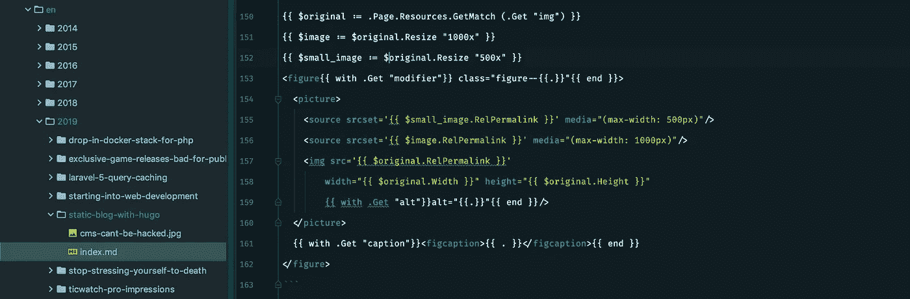
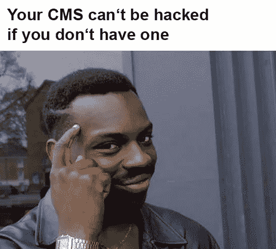

# 用 Hugo 把我的博客重建成一个静态网站

> 原文：<https://medium.com/swlh/rebuilding-my-blog-as-a-static-site-with-hugo-988e6bf6c07f>



我的博客始于 2010 年，从那时起就基于 Wordpress。这是有意义的，因为 Wordpress 基本上是最容易使用的网络软件，它允许你在几分钟内开始你的博客。几年过去了，现在我决定彻底抛弃 Wordpress。跟随我从 Wordpress 到用 [Hugo](https://gohugo.io/) 建立的静态网站的旅程。

# 为什么我为了 Hugo 抛弃了 Wordpress

在过去，Wordpress 非常容易设置。安装了一个好看的主题，我准备发表一些文章。与此同时，围绕系统的经济发生了很大的变化，曾经用来管理你的博客的软件变成了 CMS。2014 年，我开了一个英文版的博客。它最初是通过博客网络创建的。后来我变得雄心勃勃，我想管理我的内容的方式与网络不兼容，所以我把网络分成两个独立的博客子目录。

嗯，成功了。算是吧。但是这很难管理，而且对 Wordpress 作为一个软件越来越大的兴趣吸引了越来越多的黑客。尽管没有被黑客攻击，我还是害怕在将来发现我的博客里有恶意软件或类似的东西。一年前，我完全关闭了评论。大量的垃圾评论花了太多的时间来调节。



安全性是保持博客运行的主要因素之一，维护量也很大，所以我开始考虑其他解决方案。我有博客文章，没有动态内容，一旦访问者打开网站就会改变。那我为什么需要一个动态网站呢？很快我跳上了静态网站生成的列车，仅仅几个星期后我的作品集 [kovah.de](https://kovah.de/) 就被部署成了一个基于 Hugo 的静态网站。

# 哲基尔，盖茨比，雨果，Next.js？！

静态站点生成是最近的一件大事。有几个系统可供你使用，从 good 'ol Jekyll 到 Gatsby 和基于 React 的站点的 Next.js 等特殊解决方案，再到 Gatsby 和 Hugo 等现代生成器。如果你有兴趣，[staticgen.com](https://www.staticgen.com/)可能会为你提供更多的资源。

那么，我现在用哪个系统呢？我已经和 Jekyll 合作过了，但是这个系统看起来对 ma multi-lang 博客系统来说有点太复杂了。Next.js 和 Gatsby 不适合我，因为我不想用 React 做一个简单的博客。这就是为什么我想给 Hugo 一个尝试，作为剩下的最后一个更大的框架之一。知道吗？即使有一些小问题，我对这个系统非常满意。

# 关于我的 Hugo 设置的详细信息

Hugo 入门还是挺容易的。安装它，生成一个新网站，创建第一个内容，瞧，你有一个网站运行，在 10 分钟内完成。接下来是有趣的部分:配置、本地化、设置布局和结构，以及添加前端。

# 基本配置和本地化

老实说，站点配置文件并不是很长，也没有太多要说的。设置网站标题、基本 URL 和其他各种设置，如分页数量。

文档直接介绍了如何设置不同的语言，我只花了几个小时就把博客配置成了我想要的样子。这是语言配置:

```
DefaultContentLanguage = "en"
defaultContentLanguageInSubdir = true[languages]
[languages.en]
  contentDir = "content/en"
  languageName = "EN"
  languageCode = "en-us"
  weight = 1[languages.de]
  contentDir = "content/de"
  languageName = "DE"
  languageCode = "de-de"
  weight = 2
```

我认为这是不言自明的。这里唯一不同寻常的设置是`defaultContentLanguageInSubdir = true`，它将所有指向根目录`https://blog.kovah.de/`的 icoming 请求重定向到`https://blog.kovah.de/en/`，就像旧的 Wordpress 设置一样。感谢 Hugo dev 实现了这个特殊的设置！

# 保持简单，没有主题

创建你的第一个 Hugo 站点的第一步是拉一个主题并在你的配置中启用它。然而，在尝试了一下我的作品集后，我放弃了整个主题结构。事情是这样的，你可以只使用基本的`layouts`文件夹来配置和构建整个站点结构，没有任何主题。主题实际上只有在你想使用外部主题或者重用另一个站点的现有主题时才有用。

抛弃主题使得整个布局过程变得更加容易，因为现在你只需要查看一个目录。索引页、类别页和单篇文章的所有基本布局、所有部分和所有短代码都位于布局文件夹中。

# 前端资产和静态文件

如果你认识 Laravel，你可能已经和 Laravel Mix 合作过了。它基本上是 Webpack 和所有这些复杂的模块捆绑资产编译东西的包装器。我用 Laravel Mix 替换了我的旧的基于 Grunt 的资产工作流，因为它更简单，需要的配置更少。为了让它与 Hugo 和内置的资产处理一起工作，我设置了以下目录结构:

```
/
├─ assets
│ ├─ dist
│ ├─ scripts
│ └─ styles
├─ ...
```

这里没有魔法发生:“脚本”包含所有的基本脚本(如果我有的话)和“样式”所有的 Scss 文件。Laravel Mix 负责管理资产，并将缩小和优化的资产放入“assets/dist”目录。我通过丢下“assetDir =”告诉 Hugo 我的资产的位置。/assets/dist " '添加到配置文件中。

Hugo 提供的一个简洁的特性是资产指纹。我没有用 Laravel Mix 对资产进行指纹识别，也没有试图将这些信息输入 Hugo，而是让 Hugo 为我生成一切。为此，我使用了以下代码，例如用于样式文件的代码:

```
{{ $appcss := resources.Get "app.css" | fingerprint }}
<link rel="stylesheet" href="{{ $appcss.Permalink | relURL }}">
```

`$appcss := resources.Get "app.css" | fingerprint`告诉 Hugo 在资源目录中搜索`app.css`文件，然后对其进行指纹识别。链接中的代码只是告诉 Hugo 输出资产文件的相对 URL。
结果是这样的:`<link rel="stylesheet" href="/app.49b14501b[...]a621f4b.css">`

您可以对 Prism.js 资产使用相同的技术，该资产基于 post front matter 标志有条件地输出:

```
{{ with .Params.hascode }}
  {{ if . }}
    {{ $highlightjs := resources.Get "highlighter.js" | fingerprint }}
    <script src="{{ $highlightjs.Permalink | relURL }}"></script>
  {{ end }}
{{ end }}
```

# 语法突出显示的问题

我真的想使用内置的语法高亮。我真的很想，也尝试了。不幸的是，Chroma，这个用来用语法高亮显示代码块的库，不支持这样的内联 PHP:

```
```php
$some_variable = $a + $b;
```
```

我的博客上有很多代码，很多 PHP，用一行`<?php`开始像上面这样的一行程序没有任何意义。支持者告诉我 Chroma 不支持它，我必须使用 Pygments。Pygments 是旧的代码解析器，比 Chroma 慢，需要安装在 Hugo 使用的路径中。由于我不想尝试，我现在使用我的 Wordpress 博客上的 Prism.js，它工作起来没有任何问题。也许我以后会给 Pygments 一个尝试，但现在 10kb 的 JS 不会伤害任何人，事实上它只在需要时加载，通过在帖子前面使用一个`hascode: true`标志。

# 各种元素的一些短代码

因为我在帖子中有几个非标准降价的元素，所以我为它们创建了一些短代码。短代码的工作方式和 Wordpress 完全一样，但是更容易设置。

为了阻止 Hugo 渲染实际的短代码，我必须在花括号和小于号之间添加空格。要使用短代码，可以这样写:{{ <短代码> }}

## 图像短码

我没有任何脚本，所以图像不是懒惰加载。然而，我想提供基于视口大小的响应图像。由于 Hugo 通常将图片与相应的帖子捆绑在一起，您可以这样做:

**内线**

```
{{ < image img="cms-cant-be-hacked.jpg" alt="Your CMS can't be hacked if you don't have one" modifier="right" > }}
```

**短码**

```
{{ $original := .Page.Resources.GetMatch (.Get "img") }}
{{ $image := $original.Resize "1000x" }}
{{ $small_image := $original.Resize "500x" }}
<figure{{ with .Get "modifier"}} class="figure--{{.}}"{{ end }}>
  <picture>
    <source srcset='{{ $small_image.RelPermalink }}' media="(max-width: 500px)"/>
    <source srcset='{{ $image.RelPermalink }}' media="(max-width: 1000px)"/>
    
  </picture>
  {{ with .Get "caption"}}<figcaption>{{ . }}</figcaption>{{ end }}
</figure>
```

**结果**

```
<figure class="figure--right">
  <picture>
    <source srcset="/en/2019/static-blog-hugo/cms-cant-be[...]0x0_resize_q85_box.jpg" media="(max-width: 500px)">
    <source srcset="/en/2019/static-blog-hugo/cms-cant-be[...]00x0_resize_q85_box.jpg" media="(max-width: 1000px)">
    
  </picture>
</figure>
```

## 警告框

非常有用，目前用于链接到翻译，警告框呈现 HTML divs。关键是:你可以将 HTML 或 Markdown 传递给 shortcode，两者都能完美呈现。

**内线**

```
{{ < alert type="info" > }}
This will be rendered as [HTML](#).
{{ </ alert > }}
```

**简称**

```
<div class='alert{{ with (.Get "type") }} alert--{{ . }}{{ end }}'>
  {{ .Inner | markdownify }}
</div>
```

**结果**

```
<div class="alert alert--info">
  This will be rendered as <a href="#">HTML</a>.
</div>
```

如果你想了解更多关于短码的知识以及你可以用它们做什么，看看 [Hugo 文档](https://gohugo.io/content-management/shortcodes/)。

# 部署:几个命令，没有数据库的麻烦

最后但同样重要的是:部署。当我推到主分支时，我使用 Gitlab CI 来运行自动化部署。然后 Gitlab 基本上运行以下步骤:

```
# Install dependencies for Laravel Mix and build the minified assets
npm install
npm run production# Build the blog which generates everything in the /public directory
hugo# Deploy that to the server
scp -r public user@server:/var/www/blog/
```

就是这样。公共目录包含运行博客所需的一切。

# 结果是:一个苗条，快速和低维护的博客

老实说，我花了一些时间来熟悉 Hugo，因为这是我第一次使用如此复杂的静态站点设置。不管怎样，我对结果很满意。加上作为 web 服务器的 nginx 和作为 CDN 的 Cloudflare，我能够将 TTFB 削减一半，并将页面大小(包括 HTML 和资产，不包括图像)减少大约 30%-40%。该页面现在大约有 100-120 kb 大，加载时间大约为 400-800 毫秒(这已经包括基于 Fathom 的匿名页面跟踪！).灯塔以 100 分的满分证明了我为精简博客所做的努力。

*本文首发于*[*blog . kovah . de*](https://blog.kovah.de/en/2019/static-blog-with-hugo/)