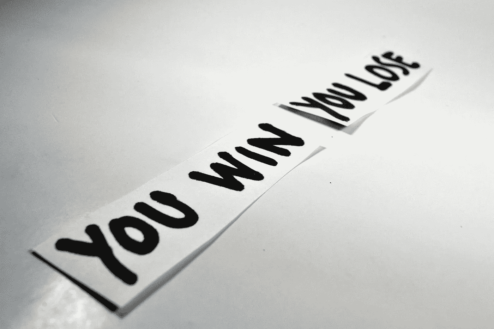

# 识别、阻止和修复威胁到你的团队的压倒性优势

> 原文：<https://medium.com/swlh/recognising-stopping-and-fixing-the-overwhelm-that-threatens-to-ruin-your-team-d6dd00dcf550>

pixabay Ramdlon

## 把你自己从领导熵的黑洞中挖出来

有时候，作为经理或团队领导，你会意识到自己和/或团队正越陷越深，陷入业绩不佳和文化不良的黑洞。

你的团队很惨。没有人在尽最大努力。每天都感觉像是在挣扎。也许你的公司甚至处于危险之中。

如此多的事情是错误的，或者至少感觉是错误的，以至于你开始怀疑是否有可能让团队回到正轨，不仅提高绩效，而且改善文化和氛围。

在这种情况下，领导者倾向于做两件事情中的一件:

*   我们“扮演鸵鸟”，假装一切都很好，继续按部就班地工作，希望事情会神奇地好转(但不会)
*   **我们阅读了亚马逊上十大管理书籍**中的每一本，并立即尝试实施每一本建议的技巧、提示和流程，希望其中一本能神奇地开始解决我们面临的无数问题(它们可能会，但你不会知道是哪一本或为什么)

我已经扭转了几个功能失调、管理不善的大型团队。我直接了解这两种选择及其所有变体的缺陷。

在这种情况下，第一件重要的事情是**停止滑入糟糕绩效管理的黑暗深渊**。其中的首要原因是 ***压倒*** 。

> … [【压倒性】](https://www.dailywritingtips.com/overwhelm-is-a-verb-isnt-it/)可以被描述为当[一切]似乎都失去控制[一下子]时，我们所经历的绝望的麻木感觉。

是时候摆脱麻木的感觉，采取行动了。

当你滑下那个洞的泥墙并挖进去的时候，把你的指甲拿出来。用你的膝盖，用你的脚趾——尽你所能不顾一切地踩刹车，阻止下滑。

你可能认为说起来容易做起来难；没有人选择被压倒，它只是发生了，对不对？

一旦你学会了看清这些迹象，你就可以踩刹车，在事情进一步失控之前抓住机会。每次你都可以越来越早地发现幻灯片。

## 管理中压倒一切的迹象

如果你的团队的表现或你自己的管理尝试被事件所克服，这里有一些迹象表明你会很早就开始注意到(一旦你学会了注意)。

当你看到这些，是时候开始挖掘，停下来，做个总结了:

*   **你开始用小方法避开你的团队**，等到没人在咖啡壶旁，或者直到你听到那个人洗完手并关上身后的门，你才离开浴室隔间。
*   **你开始在很大程度上回避你的团队**:你取消会议，尤其是与员工的会议，逃避问题，因为你不知道你的团队给你的问题的答案。你不想说“我不知道”或承认有问题，所以你躲起来。
*   **你取消了计划和思考的时间**，因为你忙于救火，以至于你认为你没有时间远离问题(大红旗！).
*   **或者，你参加会议**，希望“清谈俱乐部”能帮助你找出原因，并获得一些帮助来解决问题。这实际上是另一种类型的逃避，但是这种逃避让你觉得好像你在采取行动，而实际上你只是在浪费时间。你和其他人在会议上花了太多的时间，却没有努力去应用解决方案，以至于问题变得越来越糟糕。
*   你每天都害怕进来。
*   你尝试了一切，疯狂地想要扭转局面。例如，你开始了一个新的周一早上的 scrum，但是也有一个周五下午的 pizza 和 beer party，一个周三午餐时间的午餐-n-learn 会议，一个周二的投诉大赦，和一个周四的带狗上班日-都在同一个星期，希望其中一个能让事情有所改善。
*   你变得瘫痪，无所事事。你在雾中四处走动。你变得没有能力做决定。顾客和优秀员工离开，合同破裂。你的团队不再向你寻求建议、指导或决策。熵产生了-毁灭的黑洞！

如果你忽视这些迹象中的任何一个，你将继续无法带领你的团队取得更好的业绩和更好的工作日。

但是不用担心。一切都没有失去！

## 停止滑行，开始攀爬

> 你做的第一件事就是祝贺自己认识到这正在发生。

没有这种认识，一切都将不复存在。

然后，深呼吸，挤出一些时间。这是没有商量余地的。

可能必须从午夜到凌晨 2 点(不理想)或者在周日下午，但是你必须有时间*远离办公室、团队、决策、灾难-* 以获得清晰的视野来决定接下来的行动。

这个距离对于迈出正确的第一步至关重要。没有它，整个混乱会离你的鼻子太近，恐慌可能会阻止你在这个阶段做出正确的判断和决定。你很有可能又开始浪费了。

是时候盘点一下自己的处境了。

您的目标是:

1.  **清晰阐述你希望公司和团队走向何方的愿景**。你先做这个。否则很难知道哪些问题是你最迫切的。当你身陷囹圄时，一切都显得紧急而重要。设定你的愿景有助于你分清轻重缓急。
2.  **分析你的关键问题是什么。**一旦你设定了愿景，这就变得容易多了。你的关键问题是阻碍你实现梦想的两三件主要的事情。持续达不到销售目标？难怪，你们没有具备商业开发技能的合适人才。不能让邮件列表增长吗？你的网站上的行动号召是垃圾，你没有一个设计师来让它更好地工作。
3.  **优先解决这些问题。**取决于你在洞里呆了多久，你和你的愿景之间的障碍可能会很长！你不能同时做所有的事情。如果你尝试，你将留在被淹没的毁灭之洞中。最重要的是什么？如果销售不佳，你可能没钱雇佣新的设计师。总是回顾你的愿景，并再次审视你的优先次序。然后…
4.  **选择*下一个动作*！**不是随便什么动作，而是**下一个**动作。一只脚在另一只脚前面是压倒性的和爬出洞的进步之间的区别。一旦你试图一次做太多的事情，熵值又回来了，当你挣扎着决定下一步做什么时，无所作为的迷雾就出现了，你又滑了下来。
5.  **继续走。招募你的团队。求助。通过谦逊和透明表现出强大的领导力。你很快就会爬出那个黑洞的边缘，进入提高绩效和更快乐的团队的光芒中。**

把你的头埋进沙子里，把你自己更深地挖进低绩效的黑洞，或者为了下一个伟大的快速解决方案而在太多 MBA 风格的模型和手册中挖掘你的方法，将会把你和你的团队越来越深地带入毁灭的黑洞。

一旦你意识到这种情况正在发生，停下来，评估一下，重新审视你的愿景，分清问题的轻重缓急，采取行动。

光是做这些简单的事情就能增强你的自信，这会让你走出困境。你的团队会看到你采取行动，参与进来，让绩效重回正轨。

我的第一本书 [*成为一名无畏的领导者:掌控和建立快乐、高效、高绩效团队的简单指南*](https://www.amazon.co.uk/Becoming-Fearless-Leader-productive-performing-ebook/dp/B07B4HBYQQ/ref=sr_1_1?ie=UTF8&qid=1520359967&sr=8-1&keywords=shassere) 已经出版了。你可以在[我的网站](https://www.elizabethshassere.com/)上找到附带的免费 pdf 工作簿。如果你真的读了我的书，我很想听听你的评论。

我写了我 20 多年的领导和管理经验，以及我作为一个没有创业经验的 40 多岁女性，作为一个非技术人员的科技创业公司的创始人所学到的一切。更多 [*这里可以看到*](/@eshassere) *。*

## 这篇文章发表在 [The Startup](https://medium.com/swlh) 上，这是 Medium 最大的创业刊物，拥有+441，678 名读者。

## 在这里订阅接收[我们的头条新闻](https://growthsupply.com/the-startup-newsletter/)。

