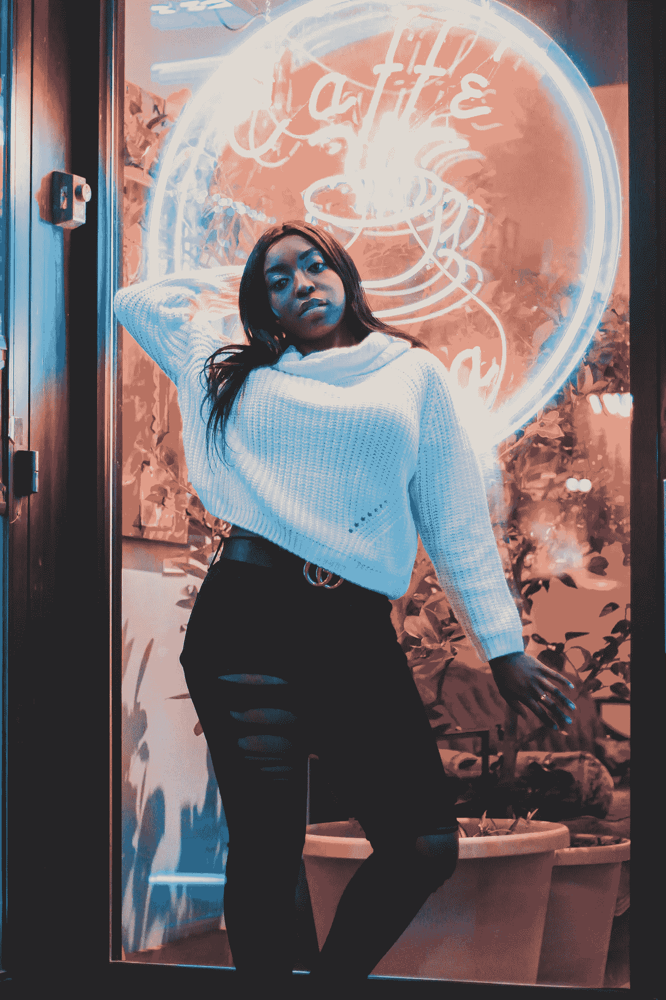

# 与我的有机宇航服协调一致

> 原文：<https://medium.com/swlh/reconciling-with-my-organic-space-suit-93cd24e0f51>

## 多年的欺凌和性虐待导致了我的身体、思想和精神之间的斗争。

Photo by [Liz Weddon](https://unsplash.com/@liz_weddon?utm_source=unsplash&utm_medium=referral&utm_content=creditCopyText) on [Unsplash](https://unsplash.com/search/photos/black-girl-body?utm_source=unsplash&utm_medium=referral&utm_content=creditCopyText)

作为一个孩子，我总是把我的身体看作是我真实自我居住的空间。

我不骗你；有那么几个瞬间，我觉得自己被自己的身体及其不完美、怪癖和弱点背叛了。我一直都知道…