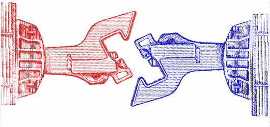

# 需要重新挂钩:如何解决言论与现实之间的歧视脱节

> 原文：<https://medium.com/swlh/recoupling-required-how-to-solve-the-discrimination-disconnect-between-talk-and-reality-4a92a6df33c9>

在我最近的一篇文章中，[“为什么公司不停止歧视？”](/@lilyzheng308/why-dont-companies-just-stop-discriminating-991c80168b20)我认为，现代企业已经进化到不再将职场歧视视为紧迫的道德或商业需要，而是一种可管理的公关投资。我留下了一个大问题——“我们能做些什么？”无人应答。在本文中，我将定义…