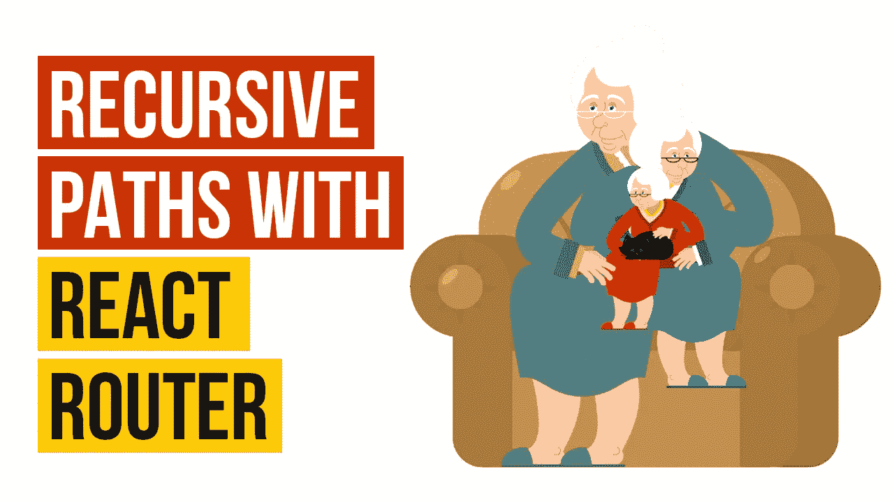

# React 路由器的递归路径

> 原文：<https://medium.com/swlh/recursive-paths-with-react-router-3ebddae98f68>



因为 React 路由器只是组件，所以您可以做一些疯狂的事情，比如拥有递归路由。在本帖中，我们将通过分解 React 路由器文档中的“递归路径”示例来了解它们是如何工作的。

递归路由并不是世界上最实用的东西，但它们确实展示了 React 路由器基于组件的路由方法的好处。

这里的主要思想是，由于 React 路由器只是组件，理论上，您可以创建递归的，因此无限的路由。秘诀在于建立正确的数据结构，这可以导致无限的路线。在这个例子中，我们将使用一组人，他们都有一个 id、一个名字和一组朋友。

```
const users = [
  { id: 0, name: 'Michelle', friends: [ 1, 2, 3 ] },
  { id: 1, name: 'Sean', friends: [ 0, 3 ] },
  { id: 2, name: 'Kim', friends: [ 0, 1, 3 ], },
  { id: 3, name: 'David', friends: [ 1, 2 ] }
]
```

通过这样设置数据结构，当我们渲染一个`Person`时，我们将把他们所有的朋友渲染为`Link` s。然后，当一个`Link`被点击时，我们将把那个人的所有朋友渲染为`Link` s，等等。每点击一次`Link`，应用程序的路径名就会逐渐变长。

最初，我们会在`/`处，用户界面看起来会像这样

```
Michelle's Friends* Sean
  * Kim
  * David
```

如果`Kim`被点击，那么 URL 将变成`/2` (Kim 的 ID ),用户界面将如下所示

```
Michelle's Friends* Sean
  * Kim
  * DavidKim's Friends* Michelle
  * Sean
  * David
```

如果点击了`David`，那么 URL 将变为`/2/3` (Kim 的 id，然后是 David 的 id)，UI 将如下所示

```
Michelle's Friends* Sean
  * Kim
  * DavidKim's Friends* Michelle
  * Sean
  * DavidDavid's Friends* Sean
  * Kim
```

并且只要用户想要点击`Link` s，这个过程就重复

一旦建立了正确的数据结构，下一个重要的步骤就是不断地渲染一个`Route`和一些`Links`,因为我们正在创建无限的路线，所以我们需要确保我们有一个在每次点击`Link`时都会渲染的`Route`。如果没有，我们将不会得到更多的匹配，这意味着 React 路由器将不会渲染任何更多的组件。在我们的`Link`和`Route`中，我们都需要知道应用程序的当前路径名，这样我们就可以在每次点击`Link`时附加到它上面(就像上面的例子，我们从`/2`到`/2/3`，等等)。幸运的是，React 路由器给了我们带有`match.url`的路径名。考虑到这一点，我们的`Link`的初始部分将如下所示

```
<Link to={`{match.url}/${id}}>
```

我们渲染的`Route`将匹配相似的模式，然后渲染相同的组件。

```
<Route path={`${match.url}/:id`} component={Person}/>
```

现在我们已经有了基础，让我们开始构建将要递归渲染的组件，`Person`。

记住，这个组件需要负责几件事情。

1.  它应该为每个特定的人的朋友呈现一个链接组件。
2.  它应该呈现一个与当前路径名+ /:id 匹配的路由组件。

和所有递归问题一样，我们需要以某种方式“启动”递归。通常这涉及到调用函数，但是如果它是一个被递归调用的组件，我们可以通过简单地创建元素来实现。

```
import React from 'react'
import {
  BrowserRouter as Router,
  Route,
  Link
} from 'react-router-dom'const users = [
  { id: 0, name: 'Michelle', friends: [ 1, 2, 3 ] },
  { id: 1, name: 'Sean', friends: [ 0, 3 ] },
  { id: 2, name: 'Kim', friends: [ 0, 1, 3 ], },
  { id: 3, name: 'David', friends: [ 1, 2 ] }
]const Person = ({ match }) => {
  return (
    <div>
      PERSON
    </div>
  )
}class App extends React.Component {
  render() {
    return (
      <Router>
        <Person />
      </Router>
    )
  }
}export default App
```

现在我们需要做的是弄清楚如何从我们的`users`数组中获取特定朋友的信息，这样我们就可以获取他们的名字并呈现他们的朋友。您可能会注意到这里的一个问题。最终`Person`将由 React 路由器渲染，因此它将被传递一个`match`道具。我们将使用这个`match`道具来获取当前路径名以及(在`users`的帮助下)这个人的名字和好友列表。问题是我们在主`App`组件中手工渲染`Person`来启动递归。这意味着第一次渲染`Person`时`match`将是未定义的。这个问题的解决方案比看起来简单。当我们第一次手动渲染`<Person />`时，我们需要像 React Router 一样传递给它一个`match`属性。

```
class App extends React.Component {
  render() {
    return (
      <Router>
        <Person match={{ params: { id: 0 }, url: '' }}/>
      </Router>
    )
  }
}
```

现在，每次`Person`被渲染，包括第一次，它都会被传递一个`match`道具，其中包含我们需要的两个东西，`url`用于渲染我们的`Route`和`Link` s 和`params.id`，这样我们就可以知道哪个人被渲染了。

好吧，回到手头的主要目标。`Person`需要

1.  它应该为每个特定的人的朋友呈现一个链接组件。
2.  它应该呈现一个与当前路径名+ /:id 匹配的路由组件。

让我们解决第一个问题。在我们可以渲染任何`Link` s 之前，我们需要得到这个人的朋友。我们已经从`match.params.id`那里知道了这个人的`id`。将这些知识与`Array.find`方法结合使用意味着获取朋友信息应该非常简单。我们将为它创建一个助手函数。

```
const users = [
  { id: 0, name: 'Michelle', friends: [ 1, 2, 3 ] },
  { id: 1, name: 'Sean', friends: [ 0, 3 ] },
  { id: 2, name: 'Kim', friends: [ 0, 1, 3 ], },
  { id: 3, name: 'David', friends: [ 1, 2 ] }
]const find = (id) => users.find(p => p.id == id)const Person = ({ match }) => {
  const person = find(match.params.id)return (
    <div>
      PERSON
    </div>
  )
}
```

慢慢到达那里。现在我们有了这个人，让我们为他们的每个朋友渲染一些 UI，包括`Link`。

```
const users = [
  { id: 0, name: 'Michelle', friends: [ 1, 2, 3 ] },
  { id: 1, name: 'Sean', friends: [ 0, 3 ] },
  { id: 2, name: 'Kim', friends: [ 0, 1, 3 ], },
  { id: 3, name: 'David', friends: [ 1, 2 ] }
]const find = (id) => users.find(p => p.id == id)const Person = ({ match }) => {
  const person = find(match.params.id)return (
    <div>
      <h3>{person.name}’s Friends</h3>
      <ul>
        {person.friends.map((id) => (
          <li key={id}>
            <Link to={`${match.url}/${id}`}>
              {find(id).name}
            </Link>
          </li>
        ))}
      </ul>
    </div>
  )
}
```

我们就要完成了。现在我们已经为这个人的每个朋友准备了一个`Link`，正如#2 中提到的，我们需要确保我们也渲染了一个`Route`。

```
const Person = ({ match }) => {
  const person = find(match.params.id) return (
    <div>
      <h3>{person.name}’s Friends</h3>
      <ul>
        {person.friends.map((id) => (
          <li key={id}>
            <Link to={`${match.url}/${id}`}>
              {find(id).name}
            </Link>
          </li>
        ))}
      </ul>
      <Route path={`${match.url}/:id`} component={Person}/>
    </div>
  )
}
```

完整的代码现在看起来像这样

```
import React from 'react'
import {
  BrowserRouter as Router,
  Route,
  Link
} from 'react-router-dom'const find = (id) => users.find(p => p.id == id)const users = [
  { id: 0, name: 'Michelle', friends: [ 1, 2, 3 ] },
  { id: 1, name: 'Sean', friends: [ 0, 3 ] },
  { id: 2, name: 'Kim', friends: [ 0, 1, 3 ], },
  { id: 3, name: 'David', friends: [ 1, 2 ] }
]const Person = ({ match }) => {
  const person = find(match.params.id) return (
    <div>
      <h3>{person.name}’s Friends</h3>
      <ul>
        {person.friends.map((id) => (
          <li key={id}>
            <Link to={`${match.url}/${id}`}>
              {find(id).name}
            </Link>
          </li>
        ))}
      </ul>
      <Route path={`${match.url}/:id`} component={Person}/>
    </div>
  )
}class App extends React.Component {
  render() {
    return (
      <Router>
        <Person match={{ params: { id: 0 }, url: '' }}/>
      </Router>
    )
  }
}export default App
```

第一次呈现`Person`时，我们传递给它一个模拟的`match`对象。然后，`Person`呈现一个`Link`列表以及一个与这些`Link`匹配的`Route`列表。当点击一个`Link`时，`Route`匹配将呈现另一个`Person`组件，该组件将呈现一个`Link`列表和一个新的`Route`。理论上，只要用户继续点击任何`Link` s，这个过程就会一直持续下去。

*这篇文章最初发表于*[*tylermcginnis.com*](https://tylermcginnis.com/react-router-recursive-paths/)*作为他们* [*React 路由器*](https://tylermcginnis.com/courses/react-router/) *课程的一部分。*

[](https://medium.com/swlh)

## 这篇文章发表在 [The Startup](https://medium.com/swlh) 上，这是 Medium 最大的创业刊物，拥有+408，714 名读者。

## 订阅接收[我们的头条新闻](http://growthsupply.com/the-startup-newsletter/)。

[](https://medium.com/swlh)