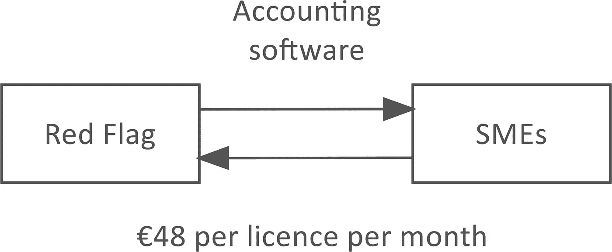
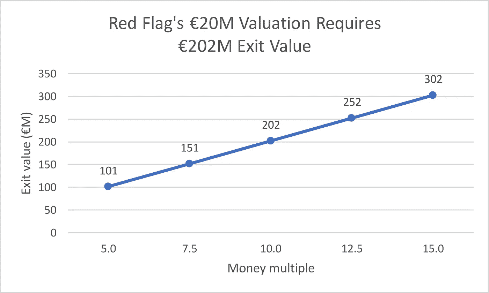
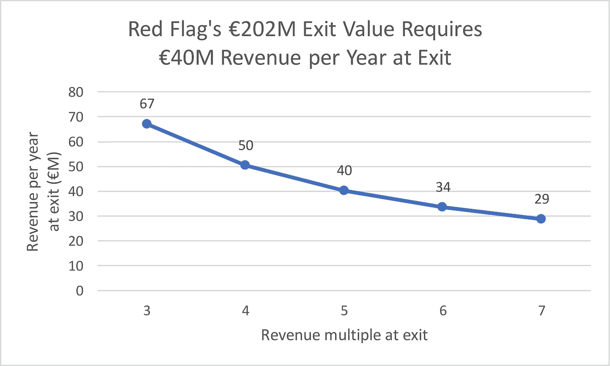

# 红旗每月必须卖出 7.1 万张牌照，才能实现其 2000 万英镑的€估值

> 原文：<https://medium.com/swlh/red-flag-must-sell-71-000-licences-per-month-for-its-20m-valuation-9b58138332a8>

瑞典初创公司红旗向中小企业出售会计软件，每个月的许可证价格为€48 英镑(SEK 498 英镑)。

红旗刚刚从几个投资者那里募集了€160 万([1700 万](https://www.redflag.se/blogg/2019/2/13/red-flag-frstrker-kassan-med-17-miljoner))。

# 估价

[Di Digital](https://digital.di.se/artikel/spotifyveteran-investerar-mr-green-grundarens-app) 报道称，红旗在€2000 万英镑(SEK 2.11 亿英镑)的估值基础上将其€160 万英镑融资。

# 出口

基于可比交易，假设投资者希望从投资中获得 10 倍的回报。

退出价值=估值*货币倍数。

那么红旗的€2000 万估值需要一个€2000 万* 10 =€2.02 亿的退出价值。

为了简化，这忽略了稀释。要在 50%稀释的情况下获得 10 倍，€2000 万的估值实际上需要€2000 万* 10/(1–50%)=€4.03 亿的退出价值。

# 收入

假设，基于可比公司，红旗在退出时每年交易 5 倍的收入。

退出时的年收入=退出价值/退出时的收入倍数。

那么红旗的€2.02 亿退出价值需要€2.02 亿/5 =€4000 万退出时的年收入。

# 许可证

红旗每月向€收取 48 英镑的许可费。

出口时每月售出的许可证=出口时每年的收入/ 12 /出口时每月每个许可证的价格。

那么红旗在€出口时每年 4000 万的收入要求他们在出口时每月向€出售 4000 万/ 12 / 48 = 71，000 个许可证。

显然，红旗不需要在出口时每月向 71，000 名新客户销售。

他们确实需要每月卖出 71000 个许可证。

这是因为每月有很大比例的客户会留下来，他们构成了收入的经常性部分。每月新增客户的比例要小得多。

举个例子:瑞典大约有 70 万家中小企业。

*原载于 2019 年 2 月 18 日*[*venturevalue.com*](https://venturevalue.com/red-flag-must-sell-71000-licences-per-month-for-its-e20m-valuation/)*。*

## 这篇文章发表在 [The Startup](https://medium.com/swlh) 上，这是 Medium 最大的创业刊物，拥有+426，678 名读者。

## 在这里订阅接收[我们的头条新闻](https://growthsupply.com/the-startup-newsletter/)。

