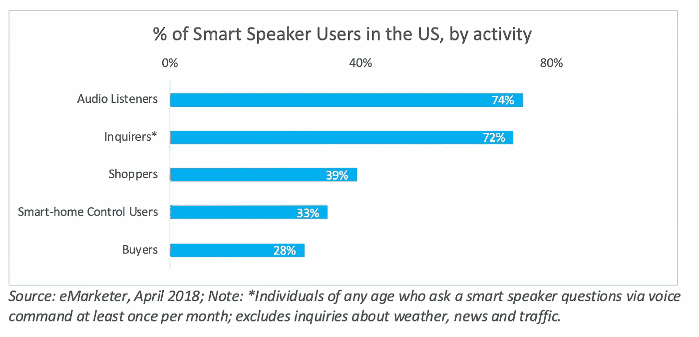
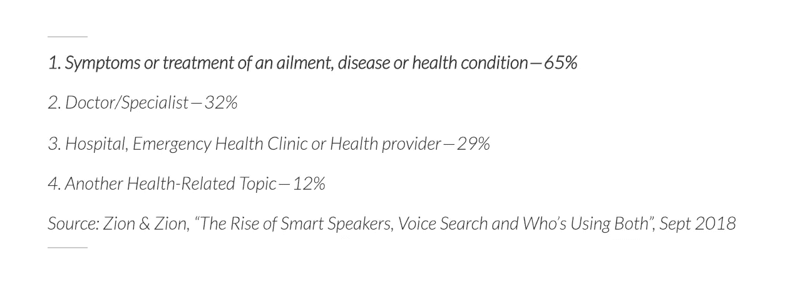

# “亚历山大医生”将如何重塑医疗保健

> 原文：<https://medium.com/swlh/redefining-healthcare-with-dr-alexa-2e053110bee6>

This article was originally published [here](https://www.designandtech.co/redefining-healthcare-with-dr-alexa/).

在许多层面上，语音似乎是让我们的生活变得更轻松的下一个合乎逻辑的步骤。想想看——更少的屏幕时间、更顺畅的沟通和更容易的信息访问。

每一个科技巨头，无论是亚马逊、谷歌、微软还是阿里巴巴、腾讯和小米，都在进行一场竞争战争，以赢得最高的用户份额。

交谈是新的打字方式，为什么不呢？交谈自然而然地来到我们身边，减少了人机交互的摩擦，鼓励了一种近乎“公共”的通信形式。

云计算和人工智能驱动的 NLP 算法解析通用语言，将其转换为文本，推导出含义并采取适当的行动。其中许多非常准确。例如，根据麦肯锡 2016 年的一份报告，百度声称其“语言理解”准确率接近 96%。不久之后，在 2017 年，谷歌声称其产品的语音识别率不仅达到 95%，甚至可以返回有意义的结果。

智能扬声器嵌入到我们的大多数日常设备中——智能手机、汽车、家庭甚至工作场所。我们用它们来搜索信息、提问、听音乐，甚至寻找天气信息。

看到更复杂应用的影响的时机已经成熟——如果我们将智能扬声器的自然使用模式与行业需求相结合，会有什么影响？

就医疗保健行业而言，几乎可以说通用用法已经渗透到了这个行业，因为用例非常多。

作为这项技术的日常使用者，许多结果对我们来说几乎是意料之中的。例如，关于“通过语音辅助进行的健康相关查询”，最近的一项研究显示，美国%的智能音箱用户进行了以下类别的搜索:

这些趋势虽然令人兴奋，但仅仅是用语音搜索取代了网络搜索。真正的创新在于能够使用基于语音的智能交互来简化复杂设置中的系统和流程。

波士顿儿童医院的 IDHA(创新和数字健康加速器)在医院试点语音助手，是一个特别出色的例子。

测试于 2016 年开始。这里，

1.实验室结果是*在模拟门诊环境中告诉*技术人员的，

2.护士们*接到指令*在重症监护室采集特定标本，

3.医生在手术室里用*的声音实时记录下*的内窥镜图像

4.家长通过*语音指令*学会清洗中心静脉导管。

根据反应、成功和结果，试点项目被部署到现实世界中使用。其中最有趣的两个是:

1.ICU: 重点是提高无菌度，保持无感染环境，同时加快流程。使用语音技术询问管理信息，如“今天下午 3 点哪个护士负责？”或者“5 楼有几个病房空着？”可以节省通常用于手动查找信息的关键时间。它还通过“免提”提高了无菌性。

2.**器官移植:**在一个通常繁忙的部门，试行语音引导清单流程以简化术前程序有助于加快流程，实现免提导航，并有助于减少人为错误。

在这种情况下，虽然理解语音的准确性起着重要的作用，但是更重要的特征是搜索结果本身的内容。需要投入大量时间来构建、组织和审查最终内容，以便启用语音功能。功能的好坏取决于它的内容。此外，需要保护患者隐私，该软件需要符合当地患者隐私政策。

很多时候，在这类领域，光靠声音是不够强大的——视觉变得必不可少。因此，对于实际应用来说，在两者之间切换的能力和支持它的硬件也是一个考虑点。

这项技术的整体应用肯定有所改进，但是要想让我们真正以一种颠覆性的方式应用和使用它，还有很长的路要走。虽然在许多情况下，语音搜索可以成为决策的盟友，但医疗保健等敏感领域要求语音搜索更加可靠、安全、可信，并且尽可能不出错。

一位医生甚至提出了对信任的担忧——在医患互动中，如果房间里的智能扬声器抛出了与医生不同的答案怎么办？这会在病人和医生之间产生摩擦和可能的信任问题吗？也许智能扬声器不是这种交互的直接部分，而只是在后台提供帮助，这一点很重要。

然而，补充这一点的是一些使用案例，其中 Alexa 技能已经被建立，以从物流角度使患者的体验更加顺畅。举个例子:纽约的 Northwell Health 让患者使用 Alexa 来查找特定城市或邮政编码范围内急诊室的最短等待时间。波士顿的联邦医疗联盟允许病人用语音预约和提醒。而波士顿的贝斯以色列女执事医疗中心允许病人询问，然后根据饮食要求点餐。

在即将到来的未来，大量的工作正在复杂的语音分析上进行。我们能否希望通过分析说话的节奏、音调和语速来诊断抑郁症？也许语音生物识别可以帮助解决当前的安全问题？我们能在家里通过数字语音和视觉交流得到舒适的治疗吗？

这些问题的答案将会比我们想象的更快揭晓。事实上，发展突飞猛进，虽然挑战依然存在，但随着我们朝着更顺畅的数字通信、更快速、更准确的医疗保健迈进，这些挑战将很快被克服。

## 这篇文章发表在 [The Startup](https://medium.com/swlh) 上，这是 Medium 最大的创业刊物，拥有+406，714 名读者。

## 订阅接收[我们的头条](http://growthsupply.com/the-startup-newsletter/)。

