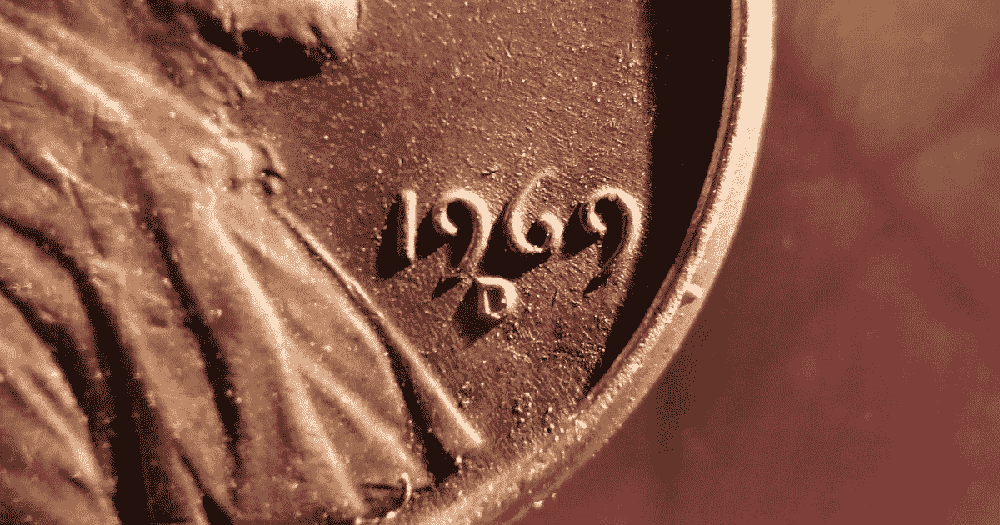

# 在我的半个世纪之际反思技术与文化

> 原文：<https://medium.com/swlh/reflections-on-technology-culture-at-my-half-century-mark-cfd1958326cc>

*1969 penny [photo by author]*

今天是我的 50 岁生日，如果内布拉斯加州奥马哈一家医院的文件可信的话。

有人说年龄只是一个数字。当然，在很多方面，这是完全正确的。就我所见，无论如何，在这个星球上的时间长短与智力、成熟度、创造力、敏感性或洞察力没有关系。我一生都在与人交往…