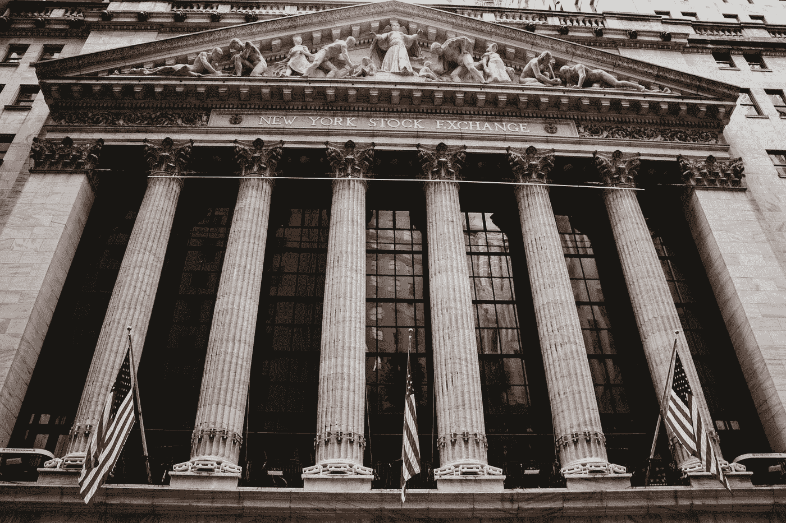

# 法规 D:证券代币发行的爱恨情仇

> 原文：<https://medium.com/swlh/regulation-d-a-love-hate-story-in-american-securities-ee4aead746a2>

## 而 Reg。d 被誉为使比特币交易比银行取款更便宜的机制，同样的监管也是 93.5%的美国投资者基本上无法获得安全令牌的根本原因。在这个早期的[猜想中](https://www.google.com/search?client=safari&rls=en&q=conjectunre&ie=UTF-8&oe=UTF-8)实用性、可伸缩性和可访问性之间，Reg。d 对加密货币的影响仍然是一个鲜为人知的故事。

Photo by [Aditya Vyas](https://unsplash.com/@aditya1702?utm_source=medium&utm_medium=referral) on [Unsplash](https://unsplash.com?utm_source=medium&utm_medium=referral)

# **什么是法规 D？**

条例 D 规定了一些豁免，通过这些豁免，小型私营公司无需在美利坚合众国证券交易委员会登记为证券就能筹集资金。

对于如何解决公司在 SEC 注册证券的问题，该法规有三个具体的豁免:规则 504、规则 505 和规则 506。

然后，规则 506 被分成两部分:506B 和 506C。规则 506 的后两部分对在线众筹最重要。

关于规则 506B 和 506C 的更多信息可以在 **这里找到 [**。**](https://www.manhattanstreetcapital.com/faq/for-fundraisers/what-regulation-d-offering)**

# **法规 D 如何影响加密货币？**

法规 D 现在影响加密货币，因为市场中的一个主要趋势的合规成分…安全令牌。

许多安全令牌产品(sto)正在申请法规 D 豁免。更具体地说，sto 正在申请只向合格投资者提供证券的规则的豁免(我们将在一分钟内简要解释更多关于合格投资者的资格)。

过去 6 个月的一个新兴媒体叙事是，安全令牌是未来的发展方向。就理解安全令牌的好处而言，我还不算太不明智。一般而言，安全令牌提供增强的流动性、更廉价的合规途径、更快速的合规途径以及更多的公司信息披露。

[如果你喜欢你所读的，请关注我的媒体页面**这里**](/@BountyBase) 。

Photo by [Charles "Duck" Unitas](https://unsplash.com/@unitasphotography?utm_source=medium&utm_medium=referral) on [Unsplash](https://unsplash.com?utm_source=medium&utm_medium=referral)

如果更多的公司继续使用规则 D 豁免注册证券，那么更多的证券可能只对合格投资者开放。这又一次忽略了将近 93.5%的美国人，让我们面对现实吧，富人越来越富，穷人越来越穷。这个数字可能只会往北接近 100。

# **为什么说法规 D 的好处？**

这项豁免允许公司不通过公开发行来筹集资金。公开募股可能需要数年时间来计划，非常昂贵，而且会让不必要的外部影响进入公司。另一方面，定期发行更快、更便宜，并为投资者选择提供了更直接的方法。

法规 D 的发行目标是合格的投资者。这些观众被视为一个特别稳定的市场，与普通人群相比，他们的收入高于平均水平，甚至高于平均水平。合格投资者的人均投资比面向公众的[A+](https://www.nyse.com/regulation-a)规定要多。

承销商可以对公开发行收取高达 [13%的费用](https://www.referenceforbusiness.com/small/Qu-Sm/Regulation-D.html)，所以 Reg D .绕过这个中间人，允许被认为是直接公开发行。去掉中间环节可以节省金钱和时间，同时又能控制外来影响。

Photo by [Natalie Chaney](https://unsplash.com/@naaatsnaps?utm_source=medium&utm_medium=referral) on [Unsplash](https://unsplash.com?utm_source=medium&utm_medium=referral)

# **为什么有些人认为法规 D 不好？**

虽然从合规的角度来看，监管 d .被誉为更便宜、更省时的选择，但在某些情况下，它也被视为对收入不高于平均水平的投资者的歧视。这是因为美国境内的 D 类发行只对合格投资者开放。要想成为合格投资者，你需要年收入超过 20 万美元，或者有 100 万美元的存款。又名没多少人。

换句话说，主街输了，这样市场就能被一群超级富豪所控制。

# **法规 D 将如何影响加密货币的未来？**

与通过其他豁免提供的好处相比，法规 D 豁免将允许较小的私营公司以更快、更便宜的速度创建诸如**替代交易系统**之类的技术。注册。这也将导致类似于在 tZero 平台上创建的暗池的增加。反过来，更多的资产将在这些平台上被令牌化和交易，特别是在超级富裕的社区。

这些平台是华尔街、现代银行结构、经纪交易商和机构投资者进入数字化经济的桥梁。例如，向[发行过程](https://link.medium.com/zoOGTch7VT)提供的好处只是众多例子中的一个，说明了为什么令牌化的世界正在到来，以及为什么上述超级富豪群体别无选择，只能加入这个世界。另类交易系统是这两个世界之间的桥梁，是进入点，最终是救生艇。

# 最后

法规 D 将加快技术合规性的到达过程，但它将以获得与华尔街相同的投资为代价。还有什么新鲜的，美国？

注册 D 进行歧视，只在午餐时间坐在酷孩子桌旁，而所有合格的投资者都在那里。除非近百年的旧证券法有所改变，否则这种情况将继续存在。

[康塞斯](https://medium.com/u/6c7078bf7b01?source=post_page-----ee4aead746a2--------------------------------) [博学者](https://medium.com/u/bdf13a23d3e9?source=post_page-----ee4aead746a2--------------------------------)

## 这篇文章发表在 [The Startup](https://medium.com/swlh) 上，这是 Medium 最大的创业刊物，拥有+418，678 名读者。

## 订阅接收[我们的头条新闻](http://growthsupply.com/the-startup-newsletter/)。

