# 重塑数字战略和我们如何记录数据架构

> 原文：<https://medium.com/swlh/reimagining-digital-strategy-and-how-we-document-data-architecture-9c40f94454d8>

## 战略

## 概述我如何创建一个应用程序，让我们的团队更好地沟通和制定战略。

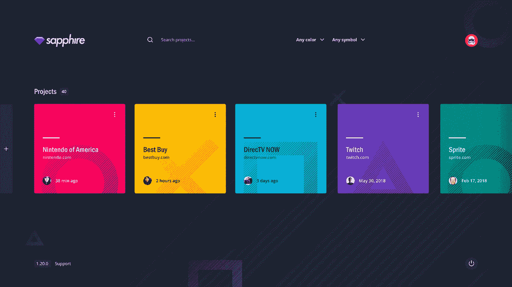

I created an app called **Sapphire** — a slick, powerful tool to help with data architecture and digital strategy

我每天遵循的最有影响力的人生课程之一是关于**计划**——它告诉我们，如果你没有计划，那么你就是在计划失败。你可能想知道规划*真的*那么重要。呃，是的—是的，它是。

作为数字机构的一部分，规划是我们参与的每个项目的核心阶段之一。我们作为一个团队制定战略的能力真的就像一场象棋比赛。每一块都有一个目的，如果你提前计划好，你可能会活着出去。

当涉及到计划、交流和记录数据架构时，我注意到我们的组织有一些效率低下的地方——重复的问题消耗了时间和金钱。在过去的一年里，我试图设计和开发一个工具，将效率融入到我们的流程中——*，并且在做的时候看起来也不错*。

The core value of digital products is about the relationship between **people and information**.

# 数字战略始终是通过信息灵通的导航将人们与信息联系起来。

对于我们参与的大多数项目，都有一些关于研究和数据架构的文档。*这个产品是给谁的？他们在寻找什么信息？他们将如何获得这些信息？*冲洗并重复。我可以有把握地说，数字战略可以归结为三个主要领域:

## 人们。

在机器人末日到来之前(*这只是时间问题*)，我们设计和开发的产品将被人们消费和使用。无论我们是对人物角色进行假设，还是进行用户研究和采访真实人物，记录这些人的特征以帮助我们更好地理解他们都是很重要的。我们理解得越好，我们的建议就越准确。同理心是一种强大的情感，我们可以用它来与人联系。

## 信息。

老实说，人们使用我们产品的主要原因是为了获取信息。信息可以以多种形式出现，如产品或服务。他们还可以讲故事，唤起情感。我们使用内容策略方法来定义和组织受众需要的内容。更具体地说，内容模型帮助记录品牌信息，并定义它们之间的关系。这些关系有助于形成数据类型、分类法和模板等东西。*内容为王，毕竟*。

## 导航。

连接人们和他们渴望的信息的桥梁是通过见多识广的导航。如果人们最终找不到，即使是最想要的信息也会变得毫无用处。我们围绕网站地图设计内容和导航。网站地图帮助我们展示内容之间的联系，并让我们对产品有一个鸟瞰。保持我们的内容井井有条，使我们能够提供更好的设计解决方案。

If you look like this when hunting down documentation — **you’re not alone**. Take a deep breath. Let’s fix this.

# 对我们来说，文档就像炎热夏天超载的 PB&J 一样凌乱。

这引起你的注意了吗？作为我们组织中的创意领导，我可能比我们的工程师审阅了更多的关于研究和数据架构的文档。当文档写得很好时，团队可以更好地完成工作。在无数个小时审查各种项目的文档后，我能够审计我们在记录和为数字战略的成功设置自己方面做得有多好。*剧透警告——这可不太妙*。

每个项目的文档方法几乎完全不同，但它们都有类似的问题，例如:

*   *太多的*文件
*   *太多的*文件格式
*   *过多的*位置
*   *不一致的*品牌
*   *专有*软件或硬件

你在点头吗？这有印象吗？不用说，我们的文档支离破碎，效率低下。

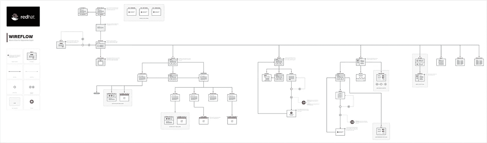

**Visual sitemaps** can be a powerful communication tool for teams.

## 我们的视觉网站地图并不环保。

我们通常在项目中制作的一个文档叫做可视化站点地图。这些是网站或应用程序内容的图形表示，以及它们之间的连接。它们的独特之处在于我们如何应用插图来最好地表达每一页可能包含的信息。可视化网站地图可以让我们一瞥用户旅程、模板架构等等。很多时候，我们在宽格式的打印机上打印这些网站地图，这给了我们一个有形的海报，供团队集体审阅。

正如你所想象的，大型网站或应用程序可以产生一些令人印象深刻的大型可视化网站地图。当您考虑多个修订时，项目可能会为了产生这些修订而浪费大量的纸张和墨水。*不凉。*

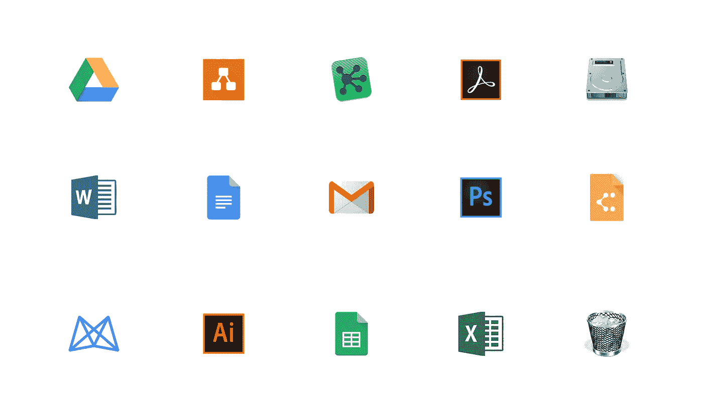

Documentation came in many flavors — Good, Bad, and Ugly.

## 文档充斥着查找、理解和更新信息的功能。

技术中的文化多样性和不适当的治理政策最终使得使用 Google Drive 作为我们的文档库变得无效。基于个人偏好，在各种应用程序中创建文档，项目没有与团队成员适当地共享，似乎没有什么是符合品牌的，等等。开车应该是我们的答案。不是的。

还记得可视化网站地图吗？我们曾经在 [Omnigraffle](https://www.omnigroup.com/omnigraffle/) 中制作这些。就我个人而言，我喜欢 Omnigraffle 制作图表，但是，如果设计者不能进行编辑，我们团队的其他人就帮不上忙了——Omnigraffle 需要 macOS 和付费许可证。*抱歉窗户。*

让事情变得更糟的是文档失控的其他方式。有些是作为活动记录发布在我们的项目管理平台上的(*，它几乎总是会丢失*)，而其他的只是通过电子邮件互相发送。好像这还不够糟糕，我们还碰到过存储在人们桌面上的文件——或者更糟的是——在他们的垃圾桶里。呃，认真地？

如果你从一开始就不是项目团队的一员，参与进来几乎是不可能的。我们记录和存储行动计划的方式是混乱的。当你不能有效地与你的团队沟通，甚至不理解正在发生的事情时，你最终会浪费时间和金钱。游戏结束了。

There’s no greater feeling than bringing ideas to life — through **creative exploration** — and helping people along the way.

# 设计一个包容性的应用程序，促进更好的团队沟通和战略？是的，请吧。

据我所知，解决这些问题感觉微不足道。这就像去每个可识别的问题，并扳动开关。我想设计和构建一个应用程序，它:

*   将文档集中到一个位置
*   允许跨平台访问
*   自动对所有文档应用品牌
*   减少对第三方软件的依赖
*   减少或消除墨水和纸张浪费

通过创建一个可以做到所有这些的应用程序，我们可以减少在寻找文档上浪费的成本，并允许团队花更多的时间来制作出色的产品。

如果我们可以利用技术来帮助我们做出更好的决策，会怎么样？提高计划性？通过允许应用程序显示实时指标，如页面计数、页面标题长度和人物角色分布，我们可以围绕数据架构做出更明智的决策。很可爱，对吧？

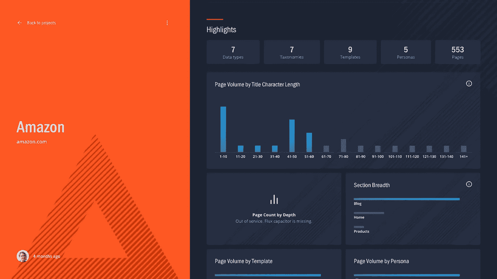

Real-time metrics gives us better insights into projects and potentially uncovers problems sooner.

我将这款应用命名为蓝宝石，因为它清晰、有力、美丽，为我们提供了价值。它也被认为是伪装的隐藏宝石。 Sapphire 的核心价值是成为一个实时数据架构规划工具，可以帮助我们制定任何规模的数字产品战略。

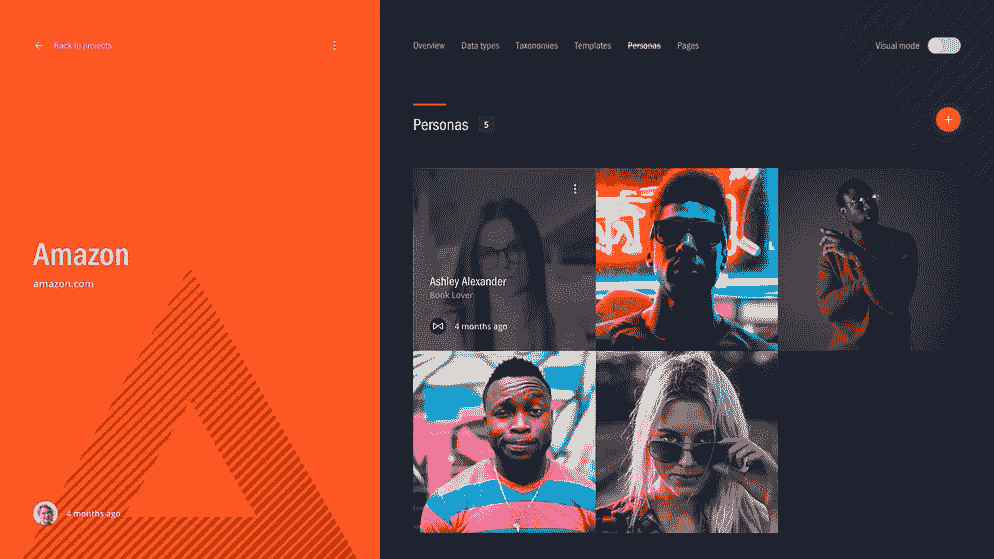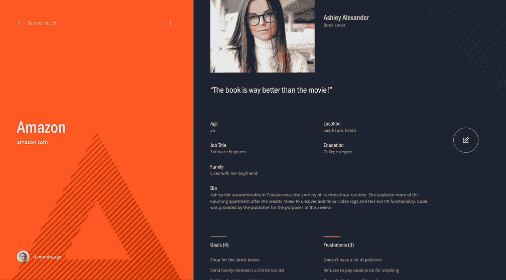

Projects can define as many personas as necessary — conveniently located in one location.

## 对人更有同理心。

Sapphire 使得为项目定义和探索人物角色变得非常容易。每个项目都可以根据需要创建尽可能多的人物角色，只需浏览适量的信息。团队成员——尤其是设计师——很容易理解一个人的目标或挫折。

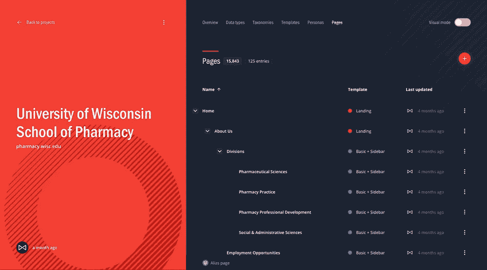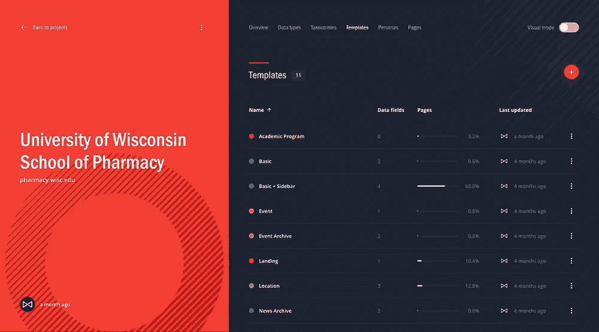

Projects can define a list of pages, hierarchy, template assignments, and more.

## 更好地组织内容。

围绕项目内容创建架构是组织良好且毫不费力的。每个项目都可以将内容分为数据类型、分类法、模板和页面。事实上，你也可以创建页面和人之间的关系。这让我们了解谁是我们真正的目标受众。

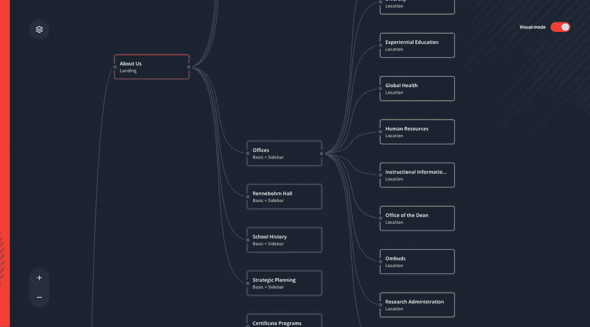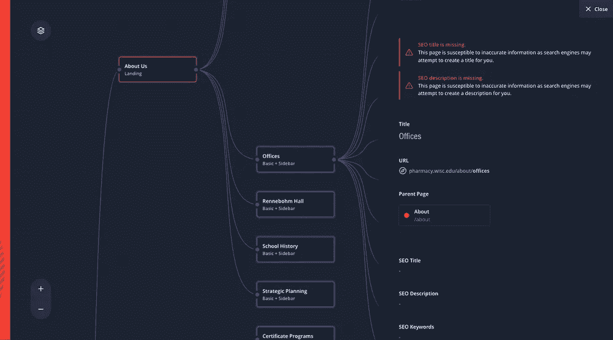

Sitemaps are visualized in real-time with an interactive diagram — highlighting assigned templates.

## 清晰的导航视角。

过去，我们必须多次记录相同的信息。Sapphire 最棒的地方在于，品牌和可视化网站地图都是实时自动生成的。如果我能让人们专注于内容而不是其他，Sapphire 就能处理剩下的事情。可视化网站地图是完全交互式的，允许任何人浏览页面以及每个页面的架构。

Sapphire has improved the way we communicate with one another on making dope $hit.

# 构建一个强调速度和直觉的单页应用程序？真的很神奇。

为了提供如此丰富的体验，我想确保 Sapphire 使用最新的技术。由于性能是一个重要因素，我需要选择为速度而构建的技术。

Reach + Google brought Sapphire™ to life almost effortlessly. #FTW

Sapphire 建立在 React T1 的基础上，既是一个渐进式网络应用程序，也是一个单页应用程序，并使用 T2 的谷歌 Firebase T3 作为其 NoSQL 实时数据库。用户使用谷歌域名认证进行安全认证，并通过[谷歌云托管](https://cloud.google.com/solutions/websites/?utm_source=google&utm_medium=cpc&utm_campaign=na-US-all-en-dr-bkws-all-all-trial-b-dr-1006141&utm_content=text-ad-none-any-DEV_c-CRE_113112111607-ADGP_Hybrid+%7C+AW+SEM+%7C+BKWS+%7C+US+%7C+en+%7C+Multi+~+Google+Hosting-KWID_43700009942847427-kwd-26940695358&utm_term=KW_%2Bgoogle%20%2Bhosting-ST_%2BGoogle+%2Bhosting&gclid=EAIaIQobChMImd728Jy04QIVRFSGCh141QksEAAYASAAEgJMqPD_BwE)进行安全托管。所有这些技术都相对容易掌握并连接在一起。我说过我是独角兽吗？考虑到我为一个如此吹捧亚马逊网络服务的组织工作，很高兴看到如果需要，我们也可以通过谷歌轻松地构建和部署应用程序。

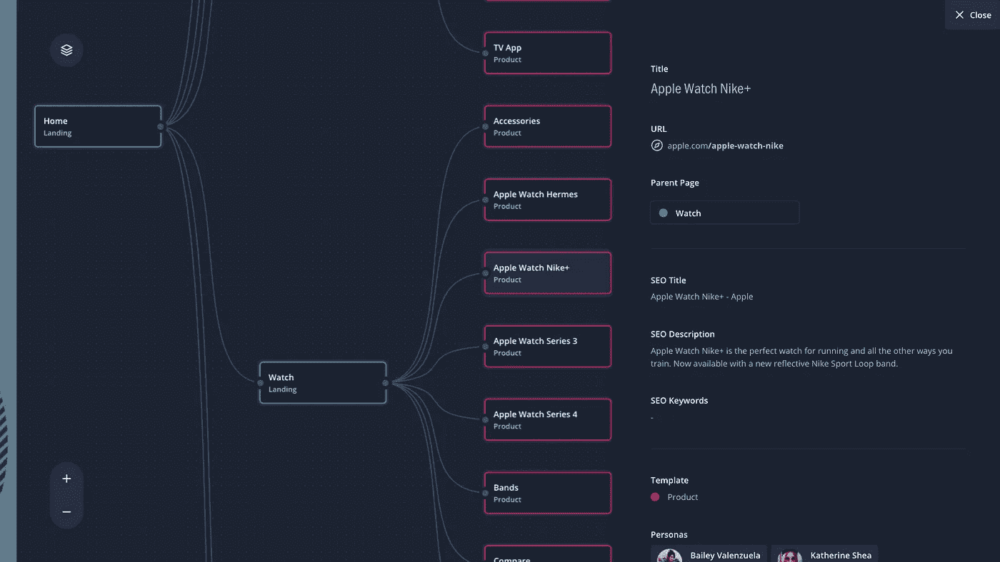

jsPlumb integrated seamlessly with React and Firebase to power our visual sitemaps.

为了支持我们直观的站点地图，我选择了 [jsPlumb](https://jsplumbtoolkit.com/) 框架，而不是像 [D3](https://d3js.org/) 这样的框架——主要是因为时间限制和所需的工作量。我承认，jsPlumb 与 React 集成得非常好，并允许我根据需要进行定制，以匹配所需的功能。

蓝宝石能成为 SaaS 的上市吗？不知道，可能吧。如果我们在内部宣传它是如何帮助我们的——并且人们表现出足够的兴趣——那么也许我们可以向社区开放。让我们知道！如果能听到其他团队如何通过使用它取得成功，那就太好了。

# 关于数字战略的最后思考。

文档允许团队就任何规模的项目进行交流和合作。围绕架构的数字策略在记录产品如何*应该如何*工作方面发挥着重要作用。当我们忽视文档——或者只是让它随着时间的推移而恶化——我们正在伤害我们有效沟通的能力。

通过认识到这些问题，我能够设计、开发和部署一个工具，帮助我们重新想象数字战略以及我们如何记录数据架构。当我们能作为一个团队更好地合作时，一切皆有可能。*做出人们喜欢的东西！*