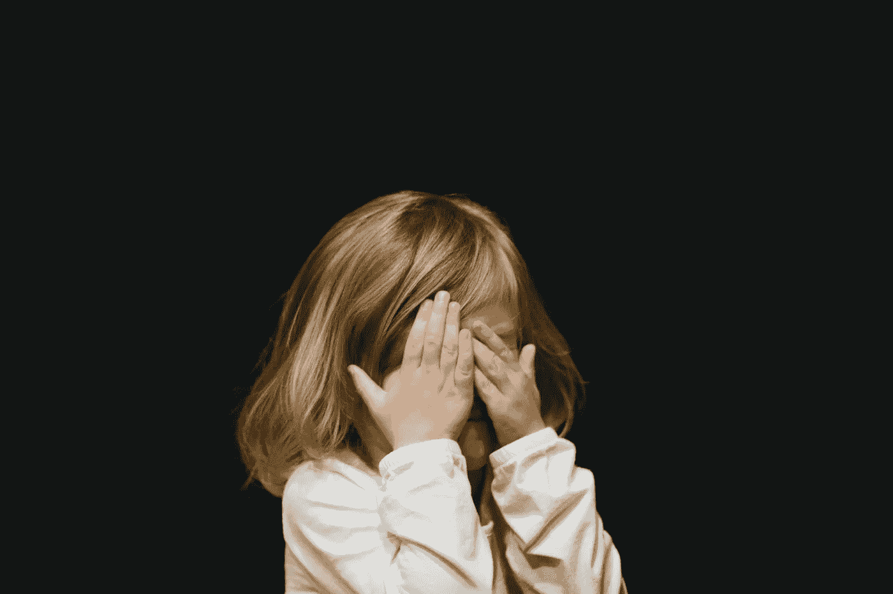
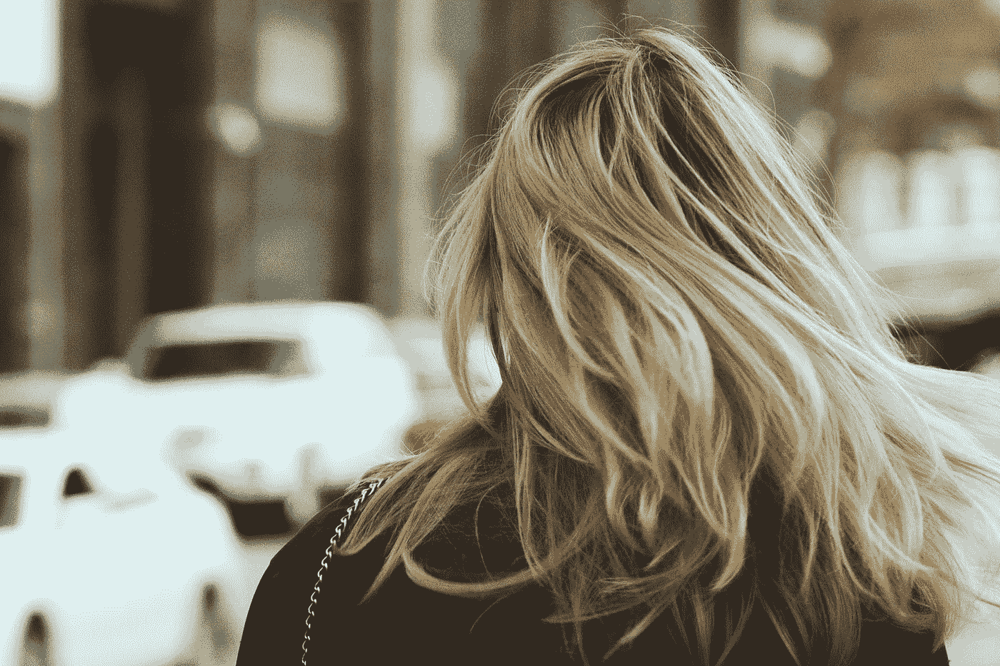

# 重塑自我可能是你做过的最健康的事情

> 原文：<https://medium.com/swlh/reinventing-yourself-might-be-the-healthiest-thing-you-ever-do-c700de77177b>

29 岁时，我从堪萨斯州东北部的一个小镇搬到了芝加哥。我谁都不认识，也没人认识我。那是故意的。

我的高中朋友要结婚了，有了他们的第一个孩子，甚至计划要第二个孩子。另一方面，我离婚了，单身，需要一个更大的就业市场来实现我的职业目标。但不仅仅是这样——我开始不喜欢自己了。

在约会方面，我一遍又一遍地重复同样的错误。我一直希望自己能更自信。我一直想冒一些我永远无法实现的风险。

所以我搬到了一个没有人认识我的大城市，并开始重塑自己。

众所周知，我们小时候会发展出各种各样的应对机制。那些让我们不被吼，不被伤害，不被取笑的。这很好，当你是一个害羞的，无助的 8 岁小孩。

但是一旦你成为一个成年人，你会倾向于坚持你 8 岁时制定的保护你安全的规则。你的大脑不会像你的 Mac 一样自动更新操作系统。大多数时候，你不仅不需要那些旧的应对机制，它们实际上会伤害你和你的人际关系。

Photo by [Caleb Woods](https://unsplash.com/@caleb_woods?utm_source=unsplash&utm_medium=referral&utm_content=creditCopyText) on [Unsplash](https://unsplash.com/search/photos/child?utm_source=unsplash&utm_medium=referral&utm_content=creditCopyText)

以下是一些我在童年时期形成的应对机制，它们在成年后并没有很好地帮助我:

*   小时候我拼命想被人看做“好”。这让我成年后成为了一个讨人喜欢的受气包。
*   我小时候把安静和不惹麻烦联系在一起。这导致长大后的我不会在会议上发言，也不会因为自己的想法而受到赞扬。
*   作为中间的孩子，我知道“随波逐流”更容易。所以我最终没有被认为是职场中的领导者。
*   小时候的我对愤怒的人感到恐惧。所以作为一个成年人，我把所有的愤怒都压了下去——如果它溃烂并变成怨恨的话——而不是表达出来。

这些听起来熟悉吗？很有可能，他们有。它们真的很难摆脱。因为你不仅一生都生活在这些故事中，而且你周围的人也一直在期待你的这些行为。他人的期望对我们的潜意识有着难以置信的强烈影响。

这就是为什么，对我来说，停止生活在童年应对机制基础上的行为的唯一方法是放弃它们，这些行为没有让我得到我想要的生活。

在搬到芝加哥之前，我已经去过那里两次了，所以我对那里相对比较适应。然而，在没有支持系统的情况下搬到那里是一个巨大的风险。有一件事我至今仍感到惊讶——我姐姐当时说这不像是我会做的事。

我就是这样知道这是对的。

我花了一段时间来忘记那些让我保持固定模式的行为。但最终，我认为成功重塑自我归结为两件事:

1.  要在那个城市生存，要真正脱颖而出，你必须愿意去追求你想要的。
2.  没有人告诉我，我的行为“不像我”我可以自由地成为我想成为的任何人。

Photo by [Alex Suprun](https://unsplash.com/@sooprun?utm_source=unsplash&utm_medium=referral&utm_content=creditCopyText) on [Unsplash](https://unsplash.com/search/photos/girl%2C-city?utm_source=unsplash&utm_medium=referral&utm_content=creditCopyText)

如果我想在会议上显得自信，没有人会质疑我为什么表现得如此奇怪。如果我对什么事情生气，我可以说出来——没有人习惯我在沉默中沸腾。它也没有就此停止。如果我想涂上红色口红出去喝酒，或者以某种方式穿着，没有人会指责我试图成为另一个我——一个更大胆、更自信、更愿意成为焦点的人。

几年后，我发现我不仅更快乐了，而且感觉更健康了。不那么焦虑。更能掌控我的生活。我也赚得更多了，粉碎了我的目标，轻松地结束了任何不适合我的约会。

当然，这意味着无论我什么时候回家，家人都会说我看起来“不一样”——事实也的确如此。虽然这对我来说是件好事，但对他们来说却是件不舒服的事。我不再适合他们给我安排的角色。

对我来说，他们的不适和评论是值得的。我成为了我一直想成为的那种人。

好吧，也许你个人不能离开 600 英里之外所有和“过去的你”有关的人和事。但是即使你做不到，你仍然可以审视自己的行为，开始放弃那些你不喜欢的行为。以下是方法。

## 1.少花点时间和那些让你变得更坏的人在一起。

你知道那个总是劝你放弃锻炼计划的朋友吗——你后来会为此感到内疚？还是那个在节日庆典上发表种族主义言论后总是让你陷入盲目愤怒的家庭成员？开始限制你接触这样的人。你可能会觉得你别无选择，但是除非是你的配偶(这完全是另一个问题)，你可以控制你花多少时间和大多数人在一起。

## 2.多花点时间和你想变得更像的人在一起。

也许是导师。也许是一个朋友，他或她似乎总是在一起拉屎。(声明一下，没有人知道，他们只是擅长让自己看起来知道。)也许是某个不讨厌自己身体的人，而你一直很欣赏他们这一点。了解他们的秘密，他们的咒语，他们解决困难的方法。选择那些你觉得真实的。

## 3.尝试一些你一直很好奇的事情，但是不要告诉任何人你正在做这件事。

学习一项新技能或尝试一项新活动可以给你的性格带来积极的变化，帮助你摆脱旧的思维方式。掌握一些棘手的事情，比如放松可以让你更加自信，或者加入一个演讲会可以让你在一群陌生人中更加自在。但是不要声张。分享会让我们觉得我们要对告诉我们的人负责——这让我们比独自面对失败更加警惕。所以，冒一次险，但是在你工作的过程中保持沉默。

## 4.把自己叫出来。

让自己对自己性格中不喜欢的部分负责，并承认它们。如果你讨厌自己总是暴跳如雷，那么下次你这样做的时候，承认这一点，比如说，“对不起，我的反应来自愤怒，这是没有必要的。我应该说的是……”

## 5.感谢你内心的孩子试图保护你。

这听起来可能很奇怪，但它确实在一些场合下帮助了我。比方说，你最终处于一个需要你去面对某人的境地，但是你内心的那个孩子却在尖叫着让你跑去躲起来。想象一下，当你还是个孩子的时候，你就能自言自语了。感谢他们保护你的安全。然后尽可能多的同情，告诉他们你可以从这里开始处理。

最后，改善你的个人行为可能会让那些习惯以某种方式看待你的人感到不舒服。但是记住，这是你的生活。他们只是从旁观者的角度进行彩色评论。