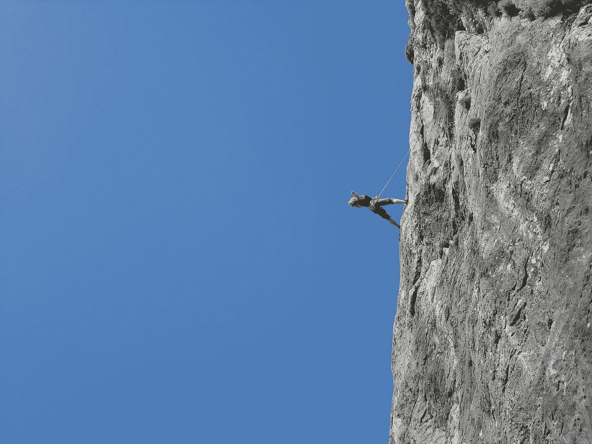

# 相对与绝对风险

> 原文：<https://medium.com/swlh/relative-vs-absolute-risk-e80efd68fa5>

## 如何避免被统计数据误导

Pictured: Risky? Depends how you measure it Source: [Pexels](https://www.pexels.com/photo/man-standing-on-rock-against-clear-blue-sky-256894/)

在科学新闻的混乱中，有几个问题很突出。像我这样的科学家每次报告新的研究时都会抱怨的事情，因为我们对事实和准确性的热爱永无止境。其中最著名的是，多亏了机智的詹姆斯·希斯(James Heathers)的报道，啮齿类动物的研究经常被报道成好像是在人类身上…