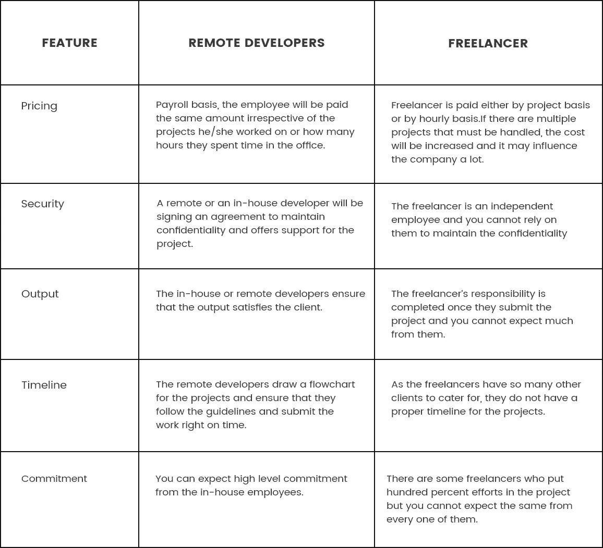

# 远程开发者 vs 自由职业者:哪个最适合招聘？

> 原文：<https://medium.com/swlh/remote-developers-vs-freelancers-which-is-best-for-hiring-eb2a0d666bb0>

Remote Developers vs Freelancers

如今，网络和移动应用程序的开发已经达到了另一个水平。几乎所有的公司都需要一个开发人员，这是整个公司陷入困境的情况。首席执行官和首席技术官经常困惑于为了公司的发展应该雇佣谁。自由职业者更好还是应该和远程开发者一起去？这是一个非常常见的问题，任何一个组织的 CEO 都会想到这个问题。在选择一个选项之前，清楚地了解两者的好处是非常重要的。

在这篇博文中，我们将讨论“为什么企业更喜欢内部开发？”相对于自由职业者来说。许多企业都希望内部开发人员为他们的公司工作，而不是自由职业者。内部开发人员的支持者会建议，我们最好选择远程或内部开发人员，而不是自由职业者。从成本到工作管理，每一个话题都将在本文中讨论，您将对内部开发人员或远程开发人员的优势有一个清晰的认识。

# **与自由职业者相比，远程开发人员的优势**

你可以从任何软件公司 [**雇佣一名远程开发人员**](https://technostacks.com/hire-resources) ，并附带一些条款和条件。任何全职从事网站开发的软件开发公司都会为你提供一名指定的开发人员，以便既快又好地完成任务。公司还可以获得员工签署的[保密协议](https://en.wikipedia.org/wiki/Non-disclosure_agreement) (NDA)。这将使开发商和公司对项目有所了解。从一家公司为一个特定的项目雇佣专门的开发人员，除了开发之外，还会在产品支持方面帮助你。

公司本身投入了大量的精力，使用企业级的软件和工具来巩固任务，交付一个高端的产品。任何公司雇佣远程开发人员都有很多好处。以下是雇佣远程开发人员的一些重要优势。

## **专长**

不管你从事什么行业，专业知识是最重要的。人们在雇佣任何人之前考虑专业知识是很重要的。公司指派的开发人员肯定会有很好的经验，他们可能已经处理过一些和你类似的项目。从在压力下工作到开发顶级产品，开发人员的经验在所有情况下都会派上用场。

## **开发团队和资源**

如果你雇佣了一个特定公司的员工进行网络或 [**移动应用程序开发**](https://technostacks.com/mobile-app-development) ，公司会确保为该员工提供专门的资源来完成你的项目。客户的满意是公司最优先考虑的事情，他们将确保他们的开发人员获得完美的资源和其他要求，这样你就可以得到你想要的产品。

如果你需要的话，这些公司会提供一组开发人员。您可以立即将批量项目分配给他们，而不必担心时间表和及时交付。

## **安全**

商业是关于安全的。你不能雇佣任何开发人员来完成项目，因为与你不认识的人分享细节会导致一些灾难性的情况。他们可能会使用这些细节来开发其他软件或应用程序等。

你和项目的保密性可能会受到损害。这就是为什么你应该从一家公司雇佣一名开发人员的原因，这样你就可以依靠他们来顺利完成项目。这些公司同意保密协议，在任何情况下都必须遵守。这将为您提供保证，您的项目是在安全的手中。

## **质量和承诺**

当你雇佣一个开发者时，你会期待一个高质量的产品。这些公司将确保为你提供你所期望的质量。

他们将有一个质量保证和测试团队，他们将根据需要多次检查产品，并使其成为您一直想要的完美产品。这些开发人员在制作任何产品时所表现出的奉献精神和承诺都是惊人的，这是你只能从远程或内部开发人员那里得到的东西。

## **可用性**

当你在做一个项目时，你会一直期待开发人员的出现，这样你就可以在需要的时候让他们工作。他们会很灵活，在任何需要的时候都可以和你聊天。这是远程开发者最重要的策略之一。

## **通信**

沟通是企业最重要的要求之一。无论你手头有多好的开发人员，如果你没有机会与他们交流，一切都是徒劳的。沟通是一个企业成功的关键，如果远程开发者一定会一直和你保持联系。他们将通过电话或电子邮件或任何其他通信方式随时可用，以便您可以及时与他们讨论任何更新或需求。

## **定价**

当你比较自由职业者和雇员的**成本**时，你会明白内部雇员或远程雇员对你来说是更好的选择。自由职业者通常按小时或按项目收费，但内部员工的情况不同。他们是在工资单的基础上，你会给他们每个月的工资。

这些是你应该雇佣远程或内部员工而不是自由职业者的一些原因。

## **对比表**

如果你对雇佣自由职业者和远程开发人员感到困惑，这个比较图表会帮助你。

Remote Developers & Freelancers Comparisons

# **总结**

如果你刚刚开始创业，雇佣一个远程员工并按月支付薪水比雇佣自由职业者更好。同样可以接洽最好的 [**软件开发公司**](https://technostacks.com/software-development) 。远程员工更倾向于在工作中更专注于组织，并提供更高质量的服务。

## 这篇文章发表在 [The Startup](https://medium.com/swlh) 上，这是 Medium 最大的创业刊物，拥有+442，678 读者。

## 在此订阅接收[我们的头条新闻](https://growthsupply.com/the-startup-newsletter/)。

