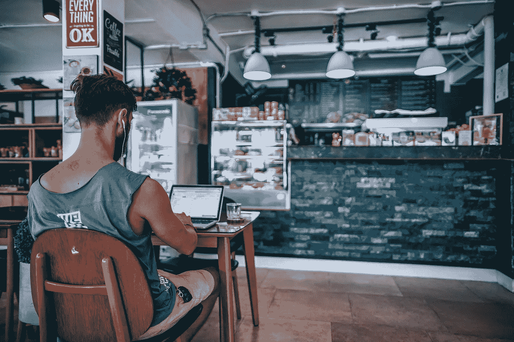

# 在咖啡店远程工作

> 原文：<https://medium.com/swlh/remote-working-from-coffee-shops-20b0174a6c3a>

# 从拖延到高效:从我的家庭办公室搬到当地咖啡店工作我学到了什么

Image by [Igor Ovsyannykov](https://pixabay.com/users/igorovsyannykov-6222956/?utm_source=link-attribution&utm_medium=referral&utm_campaign=image&utm_content=3592108) on Pixabay

在过去的几年里，我成功地将我的职业生涯引向了一个点，这意味着我可以花更多的时间在家工作，而不是花更少的时间与客户面对面交流。六年前，这让我从我的祖国英国搬到西班牙南部，享受适合我的生活方式。

虽然我仍然不得不忍受相当多的国际旅行，但我发现自己有相当长的时间在家里远程处理客户项目。目前，我大约 75%的时间在家里工作，另外 25%的时间在国外。

# 在家工作的挑战

对许多人来说，有机会放弃每天的通勤和平凡的朝九晚五的办公室生活方式，转而在家工作似乎是终极乌托邦。的确，摆脱那种生活方式是我为提高生活质量做过的最好的事情之一，然而，另一边的草很少像我们想象的那样绿。

不要误解我——它的确更环保，但它也有自己独特的挑战。

## 生产力

在家工作时，我面临的最大挑战之一是保持同样的动力和效率。在我的房子里，我有一个单独楼层的家庭办公室，这为我提供了一个安静的工作场所，远离孩子和其他工作日的干扰。有人可能会认为这种排除所有干扰和完全安静的状态有助于工作，但对我来说，这开始变成相反的情况。缺乏任何形式的干扰就像一个现实黑洞。没有人，没有噪音，只有我连续几个小时被锁在我的泡泡里，试图有所作为。

对我来说，缺乏分散注意力本身就变得分散注意力，它让我的思想开小差，拖延症蔓延开来，我开始注意到，对我来说，在任何时间内专注于特定的任务都变得非常困难。当我开始回顾我在办公室环境中的专注程度时，我意识到我在家工作的新生活方式并不像我想象的那么简单。

我试图在我的日常工作中引入更多的结构，试图集中我的注意力，给自己设定严格的时间块来完成某些任务，但这开始感觉我的一天比我只是在办公室工作时更加严格，这反过来导致沮丧和缺乏热情来将我的注意力转向工作。我发现自己陷入了拖延、内疚、沮丧和疲劳的怪圈。

## 隔离

我在家工作面临的第二个问题是孤立。不管喜欢与否，我们都是群居动物。有些人比其他人更合群，这是一个范围，但很少有人喜欢一直完全孤立。每周在家工作一两天与每天工作完全不同，在工作日没有身体接触。

对我来说，我缺少的不是太多的交流。我自己的公司没问题。当我旅行的时候，我可以出去一个晚上，不跟任何人说话，非常满足。然而，这些都是周围有其他人的情况。我在家里的工作环境完全没有其他人，这慢慢开始以我当时不理解的方式蚕食我。

孤立的感觉开始进入我的拖延和缺乏效率的循环，酝酿了一场完美的失败风暴。

# 改变它

经过一段时间的自我反省，以及对去年我想做但因为拖延太久而没有做的事情的自我厌恶，我决定今年需要改变一些事情。

我非常关注的一件事是我的环境。我以前读过关于咖啡店工作文化的文章，在伦敦亲眼目睹了现代数字游牧者在当地的星巴克敲键盘，但以前没怎么想过。

我开始阅读一些人的博客文章，这些人成功地从在家工作过渡到了在不同地点之间流动，比如咖啡店。我读到了挑战和好处。我继续研究，直到我意识到我在拖延如何克服自己的拖延症——够了，我变成谁了？

所以我决定采取行动，看看环境的改变是否有助于集中我的注意力，改善我的精神健康。

## 选择场地

或许，开始我新的咖啡店工作生涯的最大障碍是找到一个合适的工作场所。决定周一不在家办公后，我花了整个周末在镇上寻找当地的咖啡店。

在我生活的地方，这并不容易。大多数西班牙咖啡馆都是熙熙攘攘的地方，盘子叮当作响，浓缩咖啡机嘶嘶作响，喧闹的声音相互淹没。虽然我喜欢在喝酒放松时沉浸在这种环境中，但这一点也不利于工作。在天平的另一端是离海较近的不那么典型的西班牙地方，但这些地方的缺点是游客太多。被龙虾粉包围着的英国人在上午 11 点钟喝着几品脱的淡啤酒，不会给我提供我需要的认真工作的环境。

在寻找合适的场地时，另一个需要考虑的重要因素是你工作所需的基本工具。对我来说，这些都是可靠的 WiFi，也是给我的笔记本电脑充电的地方。许多咖啡店和酒吧试图通过限制或限时访问来阻止人们连续几个小时使用免费互联网。对我来说，确保无论我在哪里工作，都可以免费、无限制地访问互联网，并且我可以给我的笔记本电脑供电，而不必坐在偏僻的地方，这一点非常重要。

最后，我需要找到一个欢迎我的地方。一个太繁忙的地方可能不喜欢我整个上午都占着一张桌子。尽管我完全打算在逗留期间购物，但在每次花费数小时的时候，有些地方比其他地方更方便。

这需要一点时间和耐心，但我最终找到了我第一个也是最喜欢去工作的咖啡店。离我家只有五分钟的步行路程，充足的插座，舒适的座位和惊人的快速、可靠和无限制的互联网。

对我来说，我的场地选择是完美的。这种氛围正是我所需要的，背景中播放一点柔和的音乐，我和咖啡机之间有足够的距离来减轻任何分散注意力的噪音。大开着的窗户在热天提供了舒缓的新鲜微风，还有一个相当大的露台，我可以去伸展我的腿(还可以看到我的笔记本电脑！)

## 跳进来

星期一到了，我决定至少花一个上午的时间来进行新的努力。早上我做的第一件事就是用我的笔记本电脑打包了一个小背包，然后出门了。

当我走进会场时，我注意到的第一件事使我确信我的研究得到了回报，这将会奏效——我并不孤单！咖啡店的后面有四张像电话亭一样的桌子，上面有舒适的座位，每张桌子都有自己的电源插座。其中两个被占用了，一个被某人疯狂地敲着他们的笔记本电脑，另一个被某人拿着咖啡在一堆工作文件中磨来磨去。

我后来发现，那个拿着笔记本电脑的人呆的时间比我长，而且一周要回来工作几次。员工似乎很随和，不是唯一一个带笔记本电脑的远程工作者让我觉得自己不那么古怪，让我可以安心工作。

# 结果呢

从我在新发现的场地坐下来工作的第一天早上起，我就感觉到了一种清晰和专注的感觉，这是我在自制的地牢中一直缺少的。我能够计划好我的一天，并坚持完成我决定要做的任务。

安静，但不是完全安静的环境让我能够引导我的思想，专注于周围有足够运动的活动，以阻止我的思想游离到永久拖延的深渊。咖啡、水和小吃的额外奖励增加了整体体验。

让我周围的其他人安静地做他们自己的事情也消除了我过去遭受的孤立感。当我日复一日一次被关在家里的办公室里几个小时的时候，即使是与咖啡师快速相遇点一杯咖啡也是一种我从未享受过的人际交往形式。

回顾我第一天在咖啡店度过的时光，我决定把它作为我工作生活的一部分。

> …做出改变，将咖啡店工作作为我日常工作的一部分，不仅提高了我的整体效率，帮助我更加专注于手头的任务，而且对我的整体心理健康产生了非常积极的影响。

并非我的所有工作都适合离开我的家庭办公室，偶尔我需要为培训课程材料进行录音或参加长时间的客户视频会议，但我的大部分日常工作可以在任何地方完成。在一周开始的时候，我会计划接下来几天的工作，尝试安排我的时间表，这样我就可以有几个早上在我的第二个办公室远程工作。

我不认为拥抱数字游牧的一面和在咖啡店工作适合每个人。对于一些人来说，在家办公的孤立和安静促使他们更有效率，我们都是不同的。然而，对我来说，做出改变并将咖啡店工作作为我日常工作的一部分，不仅提高了我的整体效率，帮助我更加专注于手头的任务，而且对我的整体心理健康产生了非常积极的影响。

这并不能解决我所有的问题，但现在它无疑是我的自助策略工具箱中的一个永久性的补充，用来战胜拖延症，让我有能力改善我的生活，我会建议任何有类似问题的人至少尝试一下。

# 规则

如果这篇文章已经激励你冲出去开始尝试咖啡店的工作方式，那么我非常高兴。然而，我觉得列出一些我所遵循的基本规则是很重要的，这些规则使这种经历对每个人都是有益的。

有三类人都在不同程度上参与其中——你、商店的老板和员工，以及你的顾客伙伴。重要的是要考虑到他们的所有需求，而不仅仅是你自己的需求。

## 买东西

这是第一条规则！不言而喻，如果你打算为了工作连续几个小时占据咖啡店的一张桌子，你需要购买食物和饮料。

你在别人的公司工作。为了给你提供你的工作环境，他们支付租金，互联网，电力和更多。当你坐下来工作时，你就进入了一个不成文的合同，成为一个付费的顾客。这并不意味着在一天开始的时候点一杯咖啡，然后在你的桌子前呆上五个小时，或者一整天只喝一瓶水来证明你已经买了一些东西。

对于你应该购买多少，并没有什么神奇的规则，你需要衡量你需要投资多少，才能让你全天的现金流为企业带来积极的影响。就当是公平租金吧。

我倾向于早上第一件事就是到达，点我的早餐咖啡和羊角面包。随着时间的推移，我可能会点几瓶苏打水来保持水分，也可能点一杯上午咖啡。在我的疗程快结束的时候，我通常都很饿，所以我也会留下来吃午饭。我觉得这不仅仅是对我的存在的补偿，当我回来的时候，我总是受到热烈的欢迎。

## 在家开电话会议

你可能选择了特定的地点，因为这是一个安静的地方，能让你完成一些工作。你周围的其他人几乎肯定会因为类似的原因选择去那里，不希望他们放松的环境被打断，因为你需要参加一个重要的电话会议，并向你周围的人广播会议。

尊重你咖啡店的其他用户，他们也是付费顾客，就像你对店主一样有价值，如果六七个付费顾客被一个人的行为打扰了，就更有价值了。

## 给小费，友好一点

善待你的服务器，从长远来看，这将使你受益。世界各地的小费文化各不相同，在西班牙，小费只在旅游景点才真正流行。当我在咖啡店工作一个上午或一天时，我会给小费。

主人可能会从你的出现中获利，但却是服务员整天给你送咖啡，拿走你的盘子，准备你的食物。一份体面的小费将有助于确保他们总是给予你最好的关注。

友好礼貌，试着记住他们的名字，毕竟你几乎每天都会看到他们！