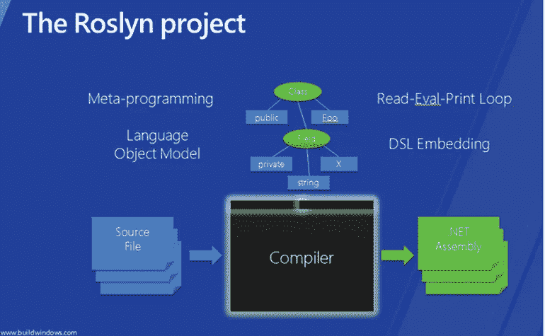

# 将 CodeDom 替换为 Roslyn，但“找不到 bin\roslyn\csc.exe！”

> 原文：<https://medium.com/swlh/replace-codedom-with-roslyn-but-bin-roslyn-csc-exe-not-found-6a5dd9290bf2>

大多数的。NET 开发者，尤其是那些试图在 ASPNET MVC 中使用 [**C#6 或更高版本的开发者，可能已经面临这个错误，并且已经知道如何修复它，但是如果我告诉你这篇文章不是关于 **ASPNET MVC** 的，而是关于 **WPF** 、 **WinForms** 或**控制台应用程序**的，请不要感到惊讶！**](https://cpratt.co/using-csharp-6-or-7-with-mvc-5/)

[CodeDom](https://docs.microsoft.com/en-us/dotnet/framework/reflection-and-codedom/using-the-codedom) 是关于运行时的动态编译。我在几个项目中使用过它。对于…