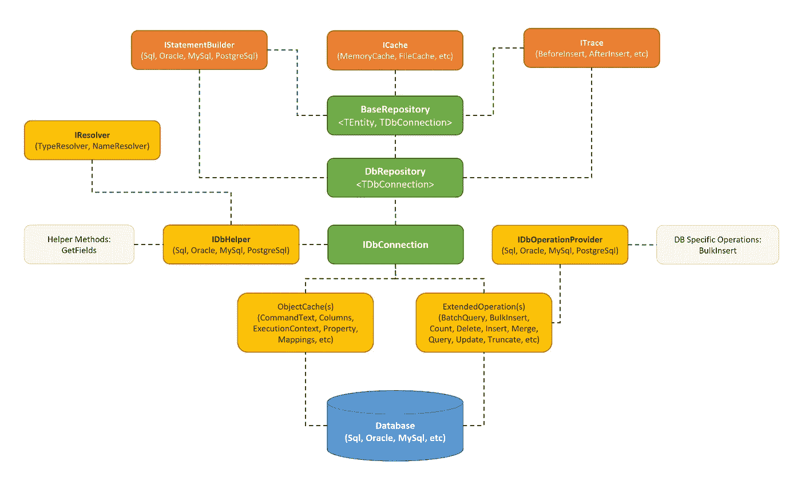
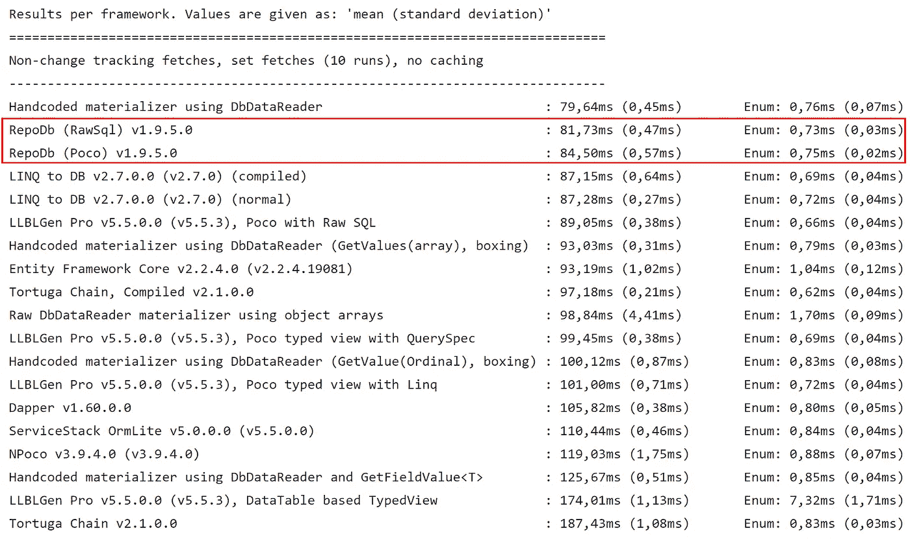
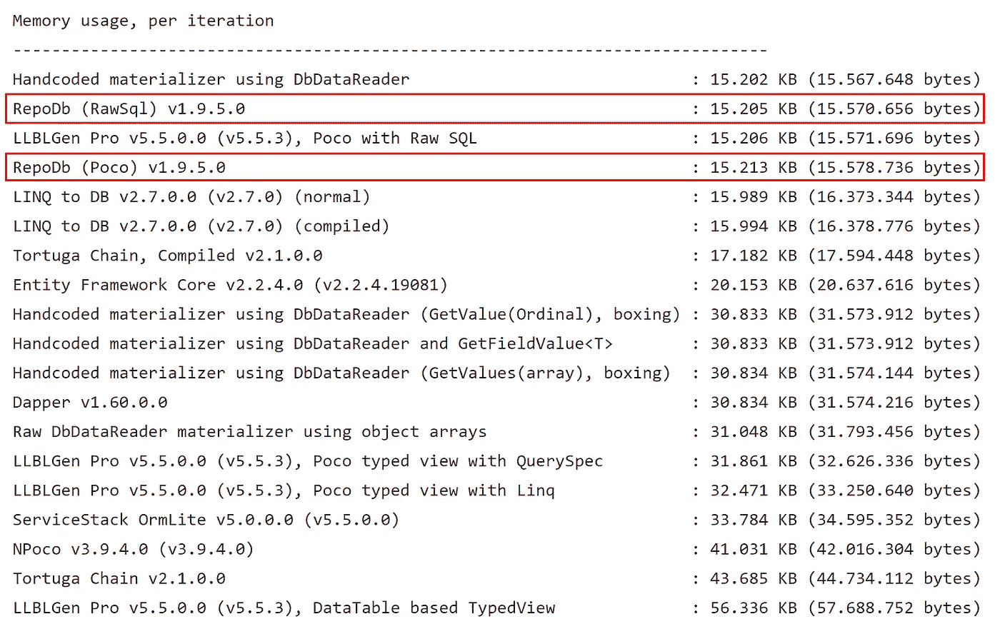
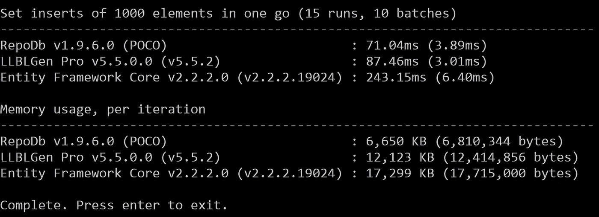
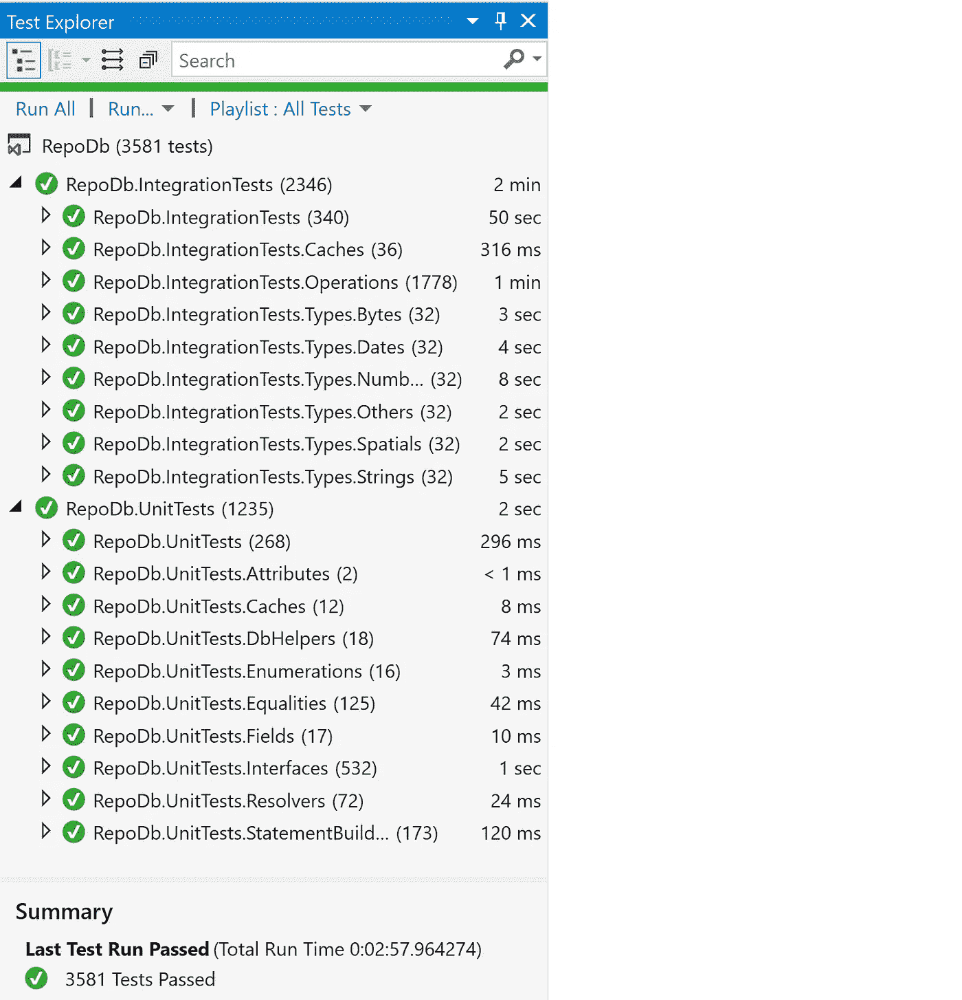

# RepoDb，一个混合 ORM 库。网

> 原文：<https://medium.com/swlh/repodb-a-hybrid-orm-library-for-net-904b02ecdb07>

众所周知，数据库访问在产品和软件开发中起着不可或缺的作用。它是应用程序中最关键的部分之一，因为它需要具体化，或者需要设计得更好以变得更加可插拔。

因此，对象关系映射(ORM)开始发挥作用。这是大多数开发人员在数据可访问性方面的共同点。ORM 库有助于简化和巩固实现，同时有助于加速开发。在我们使用它的过程中，它一直在做着复杂的工作。但是当然，我们应该知道在我们的应用程序中使用 ORM 的“优点”和“缺点”。

如今，在 C#世界里(或者。NET 作为一个整体)，市面上有很多 ORM 库，有开源的，也有商业的。最流行的是 Entity Framework(微软的一个数据建模框架)，其他的如 NHibernate、Dapper(stack overflow 的一个微表单)和 LLBLGen Pro 也可以使用。

有了这些，我们作为开发人员有责任选择最适合我们需求的(开发时间、简单性、效率、性能等)。

# **为什么要使用 RepoDb？**

这是一个面向. NET 的动态、轻量级、高效和高性能的混合 ORM 库。

1.  “高性能”一词指的是“多快”这个 ORM 将原始数据转换成类对象，并将类对象作为实际数据传输到数据库中。
2.  “高效”这个词指的是在整个过程中操作对象时，这个 ORM 对计算机内存的“管理有多好”。

它被认为是“混合 ORM ”,因为它同时提供了微 ORM 和全 ORM 的功能。它为开发人员提供了灵活性，以简化开发期间何时使用“微”和“完整”操作的“切换”。

这个库支持 micro-ORM 的全部特性，因为它可以通过“原始 SQL”进行 CRUD 操作。它还支持 full-ORM 的专门特性，允许开发人员通过基于方法的操作来操纵数据。

以下是原始 SQL 的示例代码:

下面是等效的基于方法的调用:

通过基于方法的调用(即: *BatchQuery、BulkInsert、Delete、DeleteAll、Insert、InsertAll、Update、UpdateAll、Merge、MergeAll 等*)，full-ORMs 的其他特性也可以在这个库上使用。

# **批量操作**

这个库的批处理操作都是打包语句。也就是说，单个 *DbCommand* 对象用于一次执行多个 SQL 语句。过程是[酸](https://en.wikipedia.org/wiki/ACID_(computer_science))；如果调用者不提供隐式事务，它就在内部使用它。默认情况下，它在每批中使用 10 条压缩语句。请参见下面的示例代码。

上述语句通过*InsertAll*packed-statements 创建*客户 10045* 的 *2 个订单*记录。如果任何批处理失败，那么此操作的所有更改都将回滚。

这些功能也适用于 *MergeAll* 和 *UpdateAll* 操作。

# **批量操作**

另一方面，批量操作使用由*ADO.NET*提供的“批量操作”。默认情况下，库使用 *SqlBulkCopy* 类对 SQL Server 数据库进行“批量插入”操作。

尽管批量操作比批量操作快得多，但它也有自己的缺点。开发人员必须知道*何时*和*何处*才能在应用程序中正确使用批量操作。

## **通过批量插入复制大数据**

使用批量操作的一个常见场景是在将数据从一个数据库复制到另一个数据库时最大限度地提高性能。让我们说从 *Oracle* 数据库进入 *SqlServer* 数据库，或者反之亦然。参见下面的示例。

上面的脚本从名为 *Person* 的 *Oracle* 数据库表中检索 100 万行，其中 *Id* 大于 *10000* ，并且被 *1* 分页*，并将数据插入到 *SqlServer* 数据库的 *Person* 表中。*

比方说，开发人员希望通过类进行复制；假设一个名为*客户*的类在 *Oracle* 和 *SQL Server* 的两个数据库中都有一个等价的表。这可以通过下面的脚本来完成。

请注意，上面的脚本没有经过测试。

# **执行存储过程**

要执行存储过程，必须调用 *IDbConnection* 对象的扩展 *Execute* 方法。命令的类型也必须设置为 *CommandType。在调用*期间存储过程*。*

## **执行方法列表:**

1.  *ExecuteQuery* —执行一条 SQL 语句，并将结果转换成。NET CLR 类型。
2.  *ExecuteNonQuery* —执行 SQL 语句并返回受影响的行数。
3.  *ExecuteReader* —执行 SQL 语句并返回 *DbDataReader 的实例。*
4.  *ExecuteScalar —* 执行 SQL 语句并返回第一行的第一列。
5.  *ExecuteQueryMultiple —* 执行多个打包的 SQL 语句，并允许开发人员通过 *QueryMultipleExtractor* 类控制结果的提取。

假设数据库中有一个名为 *sp_get_customer_orders* 的存储过程。

然后，可以通过下面的代码调用它。

# **通过 MultipleQuery 得到多个结果集**

引入这个特性是为了帮助开发人员最大限度地减少客户端应用程序和数据库之间的往返调用。它允许开发人员在一次调用中执行多个 SQL 语句。

有两种方法可以做到这一点，通过本地的 *ExecuteQueryMultiple* 方法，另一种是通过基于方法的 *QueryMultiple < T1，T2 >。*

## **ExecuteQueryMultiple**

*ExecuteQueryMultiple* 要求调用者发出多个 SQL 语句。请参见下面的示例代码。

这些调用也可以与存储过程相结合。

## **查询乘数< T1，T2>**

*QueryMultiple < T1，T2 >* 方法的工作方式与 *ExecuteQueryMultiple* 方法类似，只是要求开发人员通过泛型。NET CLR 类型。

开发人员还需要为查询表达式传递基于 Linq 的参数。

这个方法返回一个*系统。元组*对象。请参见下面的示例代码。

*ExecuteQueryMultiple* 和 *QueryMultiple* 方法都支持直到*的 7 元组。*

# **动态对象**

这个库非常支持动态对象。本库的大多数操作接受对象*动态*和*系统。expand object*作为参数。

下面的示例代码使用了*动态*对象作为表达式。

它返回所有来自西班牙的顾客，其中姓氏是圣地亚哥。返回值的类型为*IEnumerable<expand object>。*

此外，如果在操作数据库中的数据时“不”创建“模型”类，开发人员可以利用这个特性。请参见下面的示例代码。

或者更新现有的*客户*记录*。*

这同样适用于其他操作，如 *BulkInsert、* *Delete、Merge、DeleteAll、MergeAll、UpdateAll、*等。

**注意**:从 1.9.7 版本开始，库不支持 *BulkInsert 中的*expand object*，Insert* ， *InsertAll* ， *Merge* ， *MergeAll* ， *Update* 和 *UpdateAll* 操作。

下面的代码将会工作，因为*实体*变量的类型是*动态*。

下面的代码对*更新*操作无效，因为*查询*操作的返回类型是*扩展对象*。在*更新*操作中会抛出异常。

但是下面的代码将适用于*更新*操作。

# **储存库**

该库有两个内置存储库，名为 *DbRepository* 和 *BaseRepository* ，用于数据分层。开发人员可以立即抽象和实例化这些存储库。

## **数据库库<数据库连接>**

该存储库用于创建一个更高级别的存储库，该存储库由数据库的整个模型共享。

上述存储库使用数据库的*客户*和*订单*模型。它由所有其他模型共享。

要使用它，请使用下面的代码。

开发人员也可以通过直接实例化 *DbRepository* 类来简化调用。

## **BaseRepository < TEntity，TDB connection>**

该存储库用于创建特定于模型的存储库。它是作为抽象实现的，不能立即实例化。

# **性能和效率**

这个功能是图书馆的“心脏”。这也是这个库最初存在的主要原因。目前，该库已经在 Frans Bouma 的 RawDataAccessBencher 最近的“正式运行”中，无论是“性能”还是“内存效率”测试中都名列前茅。

下面的截图是“性能”测试的结果。

下面的截图是“内存效率”测试的结果。

官方结果可以在[这里](https://github.com/FransBouma/RawDataAccessBencher/blob/master/Results/20190520_netcore.txt)找到。

## 包装插入试验

图书馆爆满声明不是官方 *RDAB 的一部分。*根据 *RDAB* 的作者 Frans Bouma 的说法，这是一个*苹果*和*橙子*的对比。那个测试中包括的 ORM 是那些只做变更/状态跟踪库的人，而这个库不做那件事。

然而，在我的开发环境中，这个库也超过了“打包插入”执行。 [*RDAB*](https://github.com/mikependon/RawDataAccessBencher) 的修改版可以在我的 [Github](https://github.com/mikependon) 账号上找到。任何人都可以克隆存储库并执行 bencher 来本地查看结果。

# 贮藏

这个特性允许开发者缓存*查询*和*查询所有*操作的结果。默认情况下，库正在使用 *MemoryCache* 内部类。缓存项目到期时间为 *180 分钟*。

要缓存结果，只需向*查询*或*查询所有*操作的 *cacheKey* 参数传递一个值。请参见下面的示例代码。

在上面的代码中，返回的*产品*对象列表被缓存在计算机内存中。下次执行这段代码时，引擎将在接下来的 3 个小时内从缓存中而不是从数据库中选取结果。

对于希望缓存“不变”或“查找”数据的开发人员来说，这个场景非常有用。

开发人员也可以通过简单地实现接口 *ICache 来创建*缓存类*的定制版本。关于这方面的更多信息，请访问这里的官方文档[。](https://repodb.readthedocs.io/en/latest/pages/cache.html)*

# **扩展性**

该库已经完全支持 SQL Server。也支持其他数据库提供程序，但仅当使用“RawSql”操作时。原始 SQL 操作包括以下方法: *ExecuteQuery、ExecuteNonQuery、ExecuteReader、ExecuteScalar* 和 *ExecuteQueryMultiple。*

为了扩展对“基于方法”的调用的“流畅”支持，开发人员需要通过所需的接口实现必要的类。

## 支持其他数据提供者

为了完全支持 Oracle 数据提供者，开发人员需要实现以下内容。

1.  *实现 *IStatementBuilder* 接口的 OracleStamentBuilder* 。
2.  *实现 *IDbOperationProvider* 接口的 OracleDbOperationProvider* 。
3.  *实现 *IDbHelper* 接口的 OracleDbHelper* 。

一旦实现，开发人员就可以通过调用以下映射来映射对象。

要完全支持其他数据提供者，必须完成相同的过程。

# 图书馆质量

实际开发的方法是 TDD，在某个时间点，通过后期代码单元测试开发来保护代码。在撰写本文时，该库有 2300 多个集成测试和 1200 多个单元测试。

每个测试覆盖不同的场景，并被编写为测试*同步*和*异步*操作。

一些测试场景可能同时存在于 *IDbConnection* 、 *DbRepository* 和 *BaseRepository* 中，但是针对不同的代码库。

# **链接**

以下是该库的访问链接。

1.  项目:[https://github.com/mikependon/RepoDb](https://github.com/mikependon/RepoDb)
2.  套餐:【https://www.nuget.org/packages/RepoDb 
3.  文档:【https://repodb.readthedocs.io/en/latest/ 

# 摘要

这个库非常简单和轻量级。它仍然被认为是一个微 ORM，因为它不具备大 ORM 的任何高级功能，如*变更跟踪*、*状态跟踪*等。

这个库是为那些习惯于使用微表单特性并愿意使用完整表单中的操作的开发人员准备的。

这个库的构建考虑了性能、效率、可扩展性和质量。

作为本库的作者，我将非常感谢通过这个[链接](https://github.com/mikependon/RepoDb/issues)接收任何反馈、建议甚至是错误。我期待着更多的合作。网络社区。

非常感谢您阅读这篇文章。/迈克尔