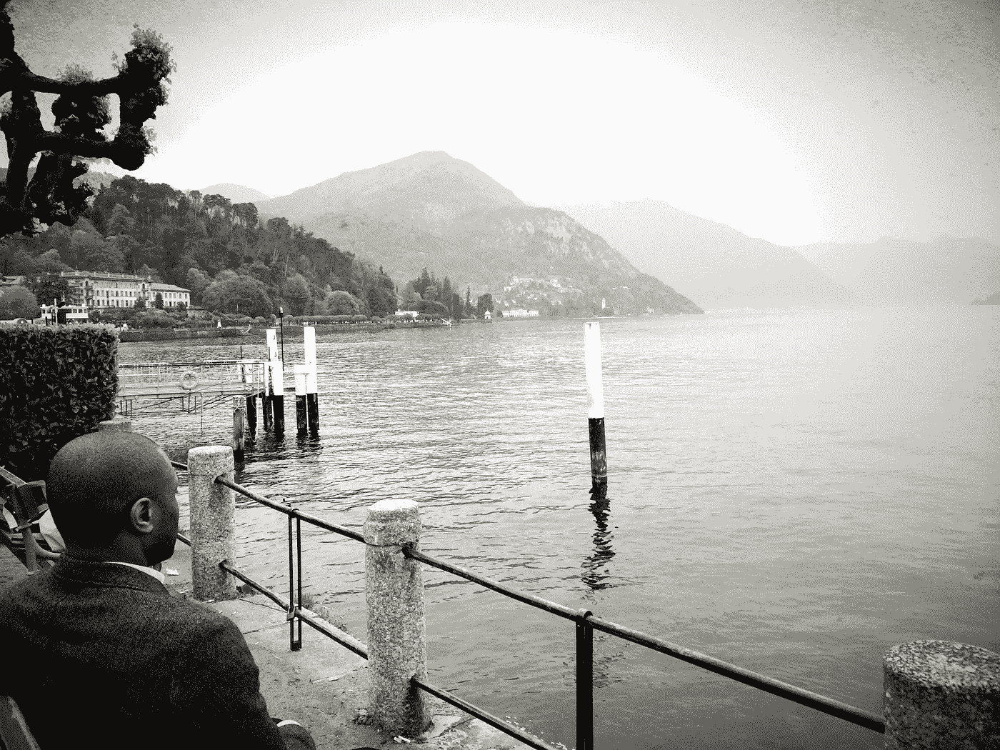

# 来自抑郁状态的现场报道

> 原文：<https://medium.com/swlh/reporting-live-from-the-state-of-depression-c3f960af58da>

# 我很沮丧

这句话可以概括我一生的经历，但是现在，让我们先处理好当下的事情。在过去的六周里，我越来越意识到自己的状态在恶化。不安的夜晚应该是第一条线索，但这很容易被视为像纽约这样的大城市的生活。从来没有人因为吃得太多，失去…