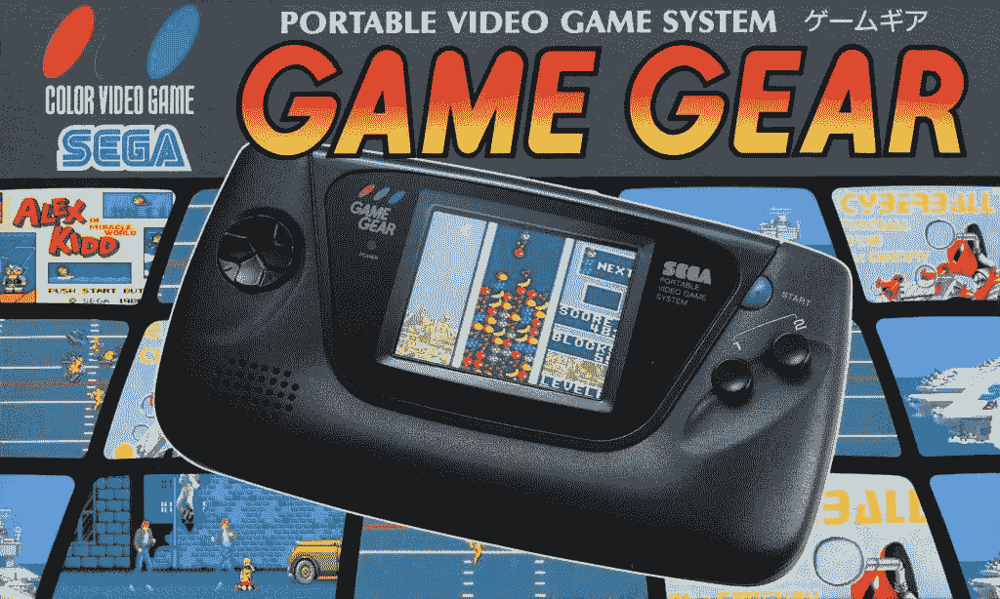

# 游戏装备的安魂曲

> 原文：<https://medium.com/swlh/requiem-for-a-game-gear-c932ab77be66>

Source: [Sega Does](https://segadoes.com/2017/01/31/sega-game-gear/)

*本文原载于*[*Gamasurta*](https://www.gamasutra.com/blogs/JanessaOlson/20190508/342221/Requiem_for_a_Game_Gear.php)*。*

我倾向于认为，在 80 年代，世嘉看着任天堂在他们从游戏& Watch 和不久之后的 Game Boy 中积累的巨额资金上打滚，并对他们自己思考一个从时间的黎明开始就推动商业的问题:“我们如何才能进入其中？”