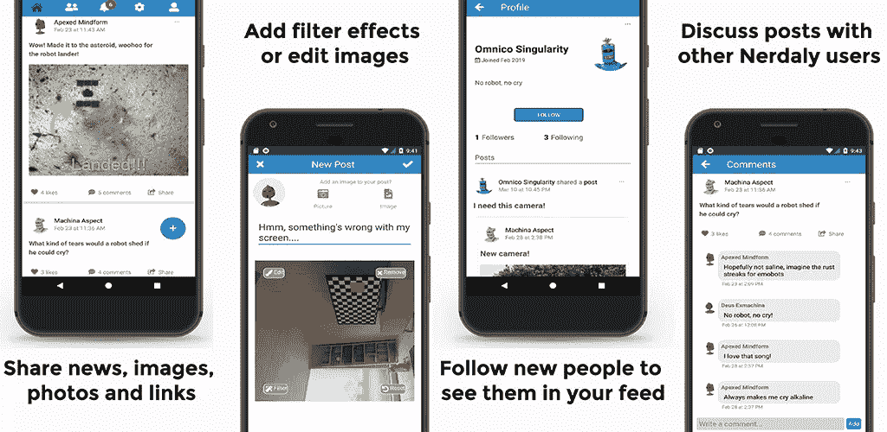

# 在 Nativescript 中调整图像大小

> 原文：<https://medium.com/swlh/resizing-images-in-nativescript-d9bb513ef5c9>

我开始使用 Nativescript Vue 已经有几个月了，所以我想为新的 Nativescript 开发人员分享一些更多的技巧。我在[最后两篇](https://blog.angelengineering.com/vue-firebase-login/) [博文](https://blog.angelengineering.com/nativescript-vue-firebase-profile/)中讨论了我的一些初步开发实验，使用 Firebase 和 Nativescript Vue 创建了一个基本的社交媒体应用框架。从这个基础开始，我创建了 [Nerdaly](https://nerdaly.com/) ，一个用 Nativescript Vue 编写的社交媒体应用，有一个 NodeJS 后端。大图像导致上传新帖子的延迟和渲染缓慢，所以我决定限制客户端发送的图像的大小。在这篇文章中，我将讨论通过减少像素尺寸来控制 Nativescript 中的图像文件大小，以产生更小(更快)的图像文件上传。



Final application built using Nativescript Vue

起初，我首先尝试了一些更高级的方法，例如在将图像保存到文件时使用另一个插件和 [ImageAsset 选项](https://github.com/NativeScript/nativescript-imagepicker/issues/185)[，但是这两种方法都无法在两个平台上(以及模拟器和真实设备上)一致地将最终图像宽度限制为 400 像素。Nativescript 根据与设备无关的像素对图像对象进行了抽象，并针对 Android 和 iOS 设备进行了缩放，从而为程序员提供了一个 Nativescript 中的通用界面，但我需要对最终尺寸进行更细粒度的控制。使用每个平台的本地代码，我能够在上传之前将图像文件调整到精确的尺寸。](https://discourse.nativescript.org/t/how-can-i-resize-images/1336)

让我们从上一篇文章中的[基本配置文件应用程序开始，来说明控制来自 ImagePicker 和 Camera 插件的图像的已保存图像尺寸所需的更改。克隆并运行应用程序，使用:](https://blog.angelengineering.com/nativescript-vue-firebase-profile/)

```
git clone https://github.com/drangelod/nsvfbprofile nsvfbresize 
cd nsvfbresize 
npm i 
tns platform remove ios 
tns run ios --bundle
```

自从最初的帖子发布以来，已经有了一些重要的更新(特别是 ImagePicker 插件，以避免变通办法并修复一些 iOS 错误)，我们将在进入新代码之前首先[更新应用程序](https://docs.nativescript.org/releases/upgrade-instructions)。

```
npm install -g nativescript
```

这将把你的主要 Nativescript CLI 更新到 4.3 版。

```
tns update
```

这将把你的核心模块以及 Android 和 iOS 平台更新到 5.3.x。我们还需要更新这个应用程序中使用的 NPM 包和 Nativescript 插件。我一般使用 [NCU 工具](https://www.npmjs.com/package/npm-check-updates)扫描`package.json`，让我知道哪些模块有可用的更新。*注意:使用* `*-a*` *标志将告诉 NCU 将所有包更新到最新版本，即使是主要的版本更改，但是要小心，因为这可能会由于重大更改而引入错误。*对于这个应用程序，更新 webpack 相关的模块确实会导致问题，需要您使用最新的 Nativescript Vue 模板重新创建您的项目。相反，我们将只更新 Nativescript 插件和平台声明，暂时忽略与 Vue 相关的更新。

```
ncu 
npm install nativescript-plugin-firebase@latest tns-platform-declarations@latest nativescript-camera@latest nativescript-imagepicker@latest
tns run ios --bundle
```

# Firebase 初始化修复

另一个重要的变化应该是对使用 Firebase 和 Nativescript Vue 的应用程序进行修改，以避免 Firebase 认证插件和 NSVue 应用程序`watch`在 Firebase 登录状态下的竞争情况。从`/main.js`中删除或注释掉`firebase.init()`代码块。将带有 firebase 初始化代码的新的`mounted()`属性添加到`LoginPage.vue`中的`export default`对象，看起来如下:

```
mounted() {
    let that = this;
    firebase
      .init({
        onAuthStateChanged: data => {
          console.log(
            (data.loggedIn
              ? "Logged in to firebase"
              : "Logged out from firebase") +
              " (firebase.init() onAuthStateChanged callback)"
          );
          if (data.loggedIn) {
            that.$backendService.token = data.user.uid;
            console.log("uID: " + data.user.uid);
            that.$store.commit("setIsLoggedIn", true);
          } else {
            that.$store.commit("setIsLoggedIn", false);
          }
        }
      })
      .then(
        function(instance) {
          console.log("firebase.init done");
        },
        function(error) {
          console.log("firebase.init error: " + error);
        }
      );
  },
```

这将确保 NSVue 准备好从 Firebase Auth 插件中查看登录状态更改，并将登录用户正确重定向到仪表板页面。

# 控制图像尺寸

下面是原始的`chooseImage()`功能，用于处理从设备中选择的新个人资料图像。由于用户可以上传他们设备上的任何图片，所以我最终选择了各种尺寸和大小的图片。这导致了 Nerdaly 应用程序的存储、显示和延迟问题，所以我添加了一个尺寸检查来调整大图像的大小。如果你目前的 iOS 模拟器上没有任何图像，可以用 Safari 从类似 [NASA](https://images.nasa.gov/) 这样的网站下载一些高分辨率的图像，稍后进行测试。

```
chooseImage() {
      try {
        context
          .authorize()
          .then(() => {
            return context.present();
          })
          .then(selection => {
            loader.show();
            const imageAsset = selection.length > 0 ? selection[0] : null;
            imageAsset.options = {
              width: 400,
              height: 400,
              keepAspectRatio: true
            };
            imageSourceModule
              .fromAsset(imageAsset)
              .then(imageSource => {
                let saved = false;
                let localPath = "";
                let filePath = "";
                let image = {};
                const folderPath = knownFolders.documents().path;
                let fileName =
                  this.$store.state.profile.id +
                  "-" +
                  new Date().getTime() +
                  ".jpg";
                if (imageAsset.android) {
                  localPath = imageAsset.android.toString().split("/");
                  fileName =
                    fileName +
                    "_" +
                    localPath[localPath.length - 1].split(".")[0] +
                    ".jpg";
                  filePath = path.join(folderPath, fileName);
                  saved = imageSource.saveToFile(filePath, "jpeg");
                  if (saved) {
                    this.pictureSource = imageAsset.android.toString();
                  } else {
                    console.log(
                      "Error! Unable to save pic to local file for saving"
                    );
                  }
                  loader.hide();
                } else {
                  const ios = imageAsset.ios;
                  if (ios.mediaType === PHAssetMediaType.Image) {
                    const opt = PHImageRequestOptions.new();
                    opt.version = PHImageRequestOptionsVersion.Current;
                    PHImageManager.defaultManager().requestImageDataForAssetOptionsResultHandler(
                      ios,
                      opt,
                      (imageData, dataUTI, orientation, info) => {
                        image.src = info
                          .objectForKey("PHImageFileURLKey")
                          .toString();
                        localPath = image.src.toString().split("/");
                        fileName =
                          fileName +
                          "_" +
                          localPath[localPath.length - 1].split(".")[0] +
                          ".jpeg";
                        filePath = path.join(folderPath, fileName);
                        saved = imageSource.saveToFile(filePath, "jpeg");

                        if (saved) {
                          this.pictureSource = filePath;
                        } else {
                          console.log(
                            "Error! Unable to save pic to local file for saving"
                          );
                        }
                        loader.hide();
                      }
                    );
                  }
                }
              })
              .catch(err => {
                console.log(err);
                loader.hide();
              });
          })
          .catch(err => {
            console.log(err);
            loader.hide();
          });
      } catch (err) {
        alert("Please select a valid image.");
        console.log(err)
        loader.hide();
      }
    },
```

在上传到服务器之前，我们需要检查所选图像的尺寸。Nativescript ImagePicker 插件返回一个`ImageAsset`(以设备无关像素表示的图像的内存表示)。在使用`ImageAsset`创建`ImageSource`之前，我们不会知道实际的图像尺寸。在 ImageSource 准备好之后，保存和上传之前，我们将首先检查图像宽度。如果宽度超过 400 像素，我们将应用平台本机代码来调整图像的大小，并将其保存到设备的文件系统，然后可以上传到 Firebase。

更新后的 chooseImage()函数代码部分将如下所示:

```
getSampleSize(uri, options) {
      var scale = 1;
      if (isAndroid) {
        var boundsOptions = new android.graphics.BitmapFactory.Options();
        boundsOptions.inJustDecodeBounds = true;
        android.graphics.BitmapFactory.decodeFile(uri, boundsOptions);
        // Find the correct scale value. It should be the power of 2.
        var outWidth = boundsOptions.outWidth;
        var outHeight = boundsOptions.outHeight;
        if (options) {
          var targetSize =
            options.maxWidth < options.maxHeight
              ? options.maxWidth
              : options.maxHeight;
          while (
            !(
              this.matchesSize(targetSize, outWidth) ||
              this.matchesSize(targetSize, outHeight)
            )
          ) {
            outWidth /= 2;
            outHeight /= 2;
            scale *= 2;
          }
        }
      }
      return scale;
    },
    matchesSize(targetSize, actualSize) {
      return targetSize && actualSize / 2 < targetSize;
    },
    chooseImage() {
      let pickcontext = imagepicker.create({ mode: "single" });
      try {
        pickcontext
          .authorize()
          .then(() => {
            return pickcontext.present();
          })
          .then(selection => {
            const imageAsset = selection.length > 0 ? selection[0] : null;
            imageAsset.options = {
              width: 400,
              keepAspectRatio: true,
              autoScaleFactor: false
            };
            loader.show();
            imageSourceModule
              .fromAsset(imageAsset)
              .then(imageSource => {
                var ratio = 400 / imageSource.width;
                var newheight = imageSource.height * ratio;
                var newwidth = imageSource.width * ratio;
                if (imageSource.width > 400) {
                  console.log(
                    "Resizing original image dimentions from : " +
                      imageSource.height +
                      " x " +
                      imageSource.width +
                      " to " +
                      newheight +
                      " x " +
                      newwidth
                  );
                  if (isIOS) {
                    try {
                      let that = this;
                      let manager = PHImageManager.defaultManager();
                      let options = new PHImageRequestOptions();

                      options.resizeMode =
                        PHImageRequestOptionsResizeMode.Exact;
                      options.deliveryMode = PHImageRequestOptionsDeliveryModeHighQualityFormat;
                      manager.requestImageForAssetTargetSizeContentModeOptionsResultHandler(
                        imageAsset.ios,
                        { width: newwidth, height: newheight },
                        PHImageContentModeAspectFill,
                        options,
                        function(result, info) {
                          let saved = false;
                          let filePath = "";
                          const folderPath = knownFolders.documents().path;
                          let fileName =
                            that.$store.state.profile.id +
                            "-" +
                            new Date().getTime() +
                            ".jpg";
                          console.log(
                            "saving image " +
                              fileName +
                              " to path " +
                              folderPath
                          );
                          console.log(
                            "Original image dimentions: " +
                              imageSource.height +
                              " x " +
                              imageSource.width
                          );
                          filePath = path.join(folderPath, fileName);
                          let newasset = new imageAssetModule.ImageAsset(
                            result
                          );

                          imageSourceModule
                            .fromAsset(newasset)
                            .then(newimageSource => {
                              saved = newimageSource.saveToFile(
                                filePath,
                                "jpeg"
                              );
                              if (saved) {
                                that.pictureSource = filePath;
                                that.newFilename = fileName;
                                console.log(
                                  "Resized image imensions: " +
                                    newimageSource.height +
                                    " x " +
                                    newimageSource.width
                                );
                              } else {
                                console.log(
                                  "Error! Unable to save image to local file for saving"
                                );
                              }
                              loader.hide();
                            });
                        }
                      );
                    } catch (e) {
                      console.log("err: " + e);
                      console.log("stack: " + e.stack);
                    }
                  } else if (isAndroid) {
                    try {
                      var downsampleOptions = new android.graphics.BitmapFactory.Options();
                      downsampleOptions.inSampleSize = this.getSampleSize(
                        imageAsset.android,
                        { maxWidth: newwidth, maxHeight: newheight }
                      );
                      var bitmap = android.graphics.BitmapFactory.decodeFile(
                        imageAsset.android,
                        downsampleOptions
                      );
                      imageSource.setNativeSource(bitmap);

                      let filename =
                        this.$store.state.profile.id +
                        "-" +
                        new Date().getTime() +
                        ".jpg";
                      let folder = knownFolders.documents();
                      let fullpath = path.join(folder.path, filename);
                      let saved = imageSource.saveToFile(fullpath, "jpeg");

                      if (saved) {
                        this.pictureSource = fullpath;
                        this.newFilename = filename;
                        console.log(
                          "Resized image imensions: " +
                            imageSource.height +
                            " x " +
                            imageSource.width
                        );
                      } else {
                        console.log(
                          "Error! Unable to save image to local file for saving"
                        );
                      }
                      loader.hide();
                    } catch (err) {
                      console.log(err);
                      loader.hide();
                    }
                  }
                } else {
                  let saved = false;
                  let filePath = "";
                  const folderPath = knownFolders.documents().path;
                  let fileName =
                    this.$store.state.profile.id +
                    "-" +
                    new Date().getTime() +
                    ".jpg";
                  console.log(
                    "saving image " + fileName + " to path " + folderPath
                  );
                  filePath = path.join(folderPath, fileName);
                  saved = imageSource.saveToFile(filePath, "jpeg");

                  if (saved) {
                    this.pictureSource = filePath;
                    this.newFilename = fileName;
                  } else {
                    console.log(
                      "Error! Unable to save image to local file for saving"
                    );
                  }
                  loader.hide();
                }
              })
              .catch(err => {
                console.log(err);
                loader.hide();
              });
          })
          .catch(err => {
            console.log(err);
            loader.hide();
          });
      } catch (err) {
        alert("Please select a valid image.");
        console.log(err);
        loader.hide();
      }
    },
```

我们需要修改脚本部分顶部的导入，删除全局`context`变量(现在在`chooseImage`函数中局部声明)并添加一个新的导入来使用`ImageAsset`模块。如果你运行 iOS 版本，用一些小的和大的图片进行测试，你应该会看到大的图片被应用程序调整了大小。

还增加了两个新功能来帮助 Android 维度计算，因为它可以对缩放的分辨率稍微挑剔一些。现在，您可以运行 Android 版本来验证这些设备的图像大小调整是否正确:

```
tns platform remove android 
tns run android --bundle
```

# 调整相机图像的大小

对于 Android，在上传到 Firebase 之前，您可以将相同的更改应用到`takePicture()`函数，以调整大型相机照片的大小。然而，对于 iOS 来说，使用这种方法有一个问题，它无法访问源图像来调整大小。由于 iOS 相机插件可靠地在最大尺寸要求内产生调整大小的图像，我没有深入挖掘这一失败的确切原因，但我猜测这与 iOS 上对照片库图像的沙盒访问有关，以防止平台调用的直接操作。如果您真的需要完全控制这种情况，那么添加一些额外的代码来将图像保存到一个可访问的临时文件中，然后在调整大小之前重新加载它应该是可行的。

新的 takePicture()函数将如下所示:

```
takePicture() {
      cameraModule
        .takePicture({
          width: 400, //these are in device independent pixels
          keepAspectRatio: true, //    keepAspectRatio is enabled.
          saveToGallery: false //Don't save a copy in local gallery, ignored by some Android devices
        })
        .then(imageAsset => {
          imageAsset.options.autoScaleFactor = false;
          imageAsset.options.keepAspectRatio = true;
          imageAsset.options.width = 400;

          //save to file
          imageSourceModule.fromAsset(imageAsset).then(
            imageSource => {
              var ratio = 400 / imageSource.width;
              var newheight = imageSource.height * ratio;
              var newwidth = imageSource.width * ratio;
              if (imageSource.width > 400) {
                console.log(
                  "Resizing original image dimentions from : " +
                    imageSource.height +
                    " x " +
                    imageSource.width +
                    " to " +
                    newheight +
                    " x " +
                    newwidth
                );
                if (isIOS) {
                  console.log("Ignoring resize for camera images on iOS");
                  let filename =
                    this.$store.state.profile.id +
                    "-" +
                    new Date().getTime() +
                    ".jpg";
                  let folder = knownFolders.documents();
                  let fullpath = path.join(folder.path, filename);
                  let saved = imageSource.saveToFile(fullpath, "jpeg");
                  if (saved) {
                    this.pictureSource = fullpath;
                    this.newFilename = filename;
                    console.log(
                      "image imensions: " +
                        imageSource.height +
                        " x " +
                        imageSource.width
                    );
                  } else {
                    console.log(
                      "Error! Unable to save photo to local file for upload"
                    );
                  }
                } else if (isAndroid) {
                  try {
                    var downsampleOptions = new android.graphics.BitmapFactory.Options();
                    downsampleOptions.inSampleSize = this.getSampleSize(
                      imageAsset.android,
                      { maxWidth: newwidth, maxHeight: newheight }
                    );
                    var bitmap = android.graphics.BitmapFactory.decodeFile(
                      imageAsset.android,
                      downsampleOptions
                    );
                    imageSource.setNativeSource(bitmap);

                    let filename =
                      this.$store.state.profile.id +
                      "-" +
                      new Date().getTime() +
                      ".jpg";
                    let folder = knownFolders.documents();
                    let fullpath = path.join(folder.path, filename);
                    let saved = imageSource.saveToFile(fullpath, "jpeg");

                    if (saved) {
                      this.pictureSource = fullpath;
                      this.newFilename = filename;
                      console.log(
                        "Resized image imensions: " +
                          imageSource.height +
                          " x " +
                          imageSource.width
                      );
                    } else {
                      console.log(
                        "Error! Unable to save image to local file for saving"
                      );
                    }
                    loader.hide();
                  } catch (err) {
                    console.log(err);
                    loader.hide();
                  }
                }
              } else {
                let saved = false;
                let filePath = "";
                const folderPath = knownFolders.documents().path;
                let fileName =
                  this.$store.state.profile.id +
                  "-" +
                  new Date().getTime() +
                  ".jpg";
                console.log(
                  "saving image " + fileName + " to path " + folderPath
                );
                filePath = path.join(folderPath, fileName);
                saved = imageSource.saveToFile(filePath, "jpeg");

                if (saved) {
                  this.pictureSource = filePath;
                  this.newFilename = fileName;
                } else {
                  console.log(
                    "Error! Unable to save image to local file for saving"
                  );
                }
                loader.hide();
              }
            },
            err => {
              console.log("Failed to load from asset");
            }
          );
        })
        .catch(err => {
          console.error(err);
        });
    },
```

# 搞定了。

这就是我的建议。如果你想下载最终的源文件，你可以在 [Github](https://github.com/drangelod/nsvfbresize) 上找到。

*原载于 2019 年 4 月 3 日 blog.angelengineering.com*[](https://blog.angelengineering.com/resizing-images/)**。**