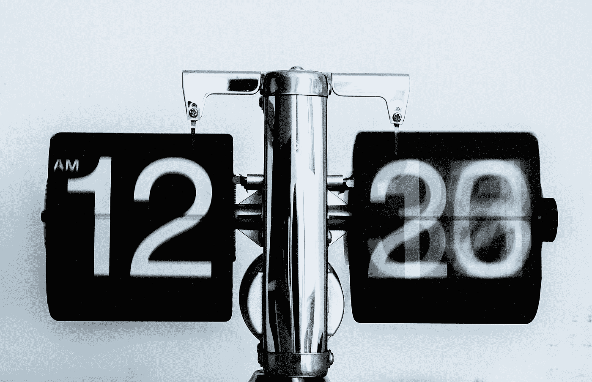

# 尊重他人的工作时间

> 原文：<https://medium.com/swlh/respecting-others-time-at-work-9c489ecf3aac>

Originally published on [**JOTFORM.COM**](https://www.jotform.com/blog/respecting-time/)

工作中浪费了多少时间？据工人说，很多。

最近的研究表明，89%的人每天在工作中浪费时间，前 10%的人浪费时间超过三个小时。想想那损失的生产力和潜力。

其中一些时间肯定是用来查看社交媒体、给朋友发计划短信，以及偶尔做做白日梦…