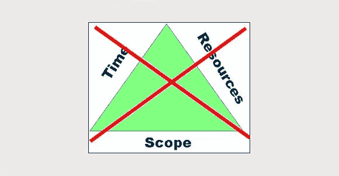

# 重新思考三重约束:五个项目维度

> 原文：<https://medium.com/swlh/rethinking-the-triple-constraint-five-project-dimensions-b3593c364b11>

Graphic adapted by author

也许你在一家汽车修理店看到过这样的标语:“你想要什么:好的、快的还是便宜的？挑两个。”虽然幽默，但这个标志也是明智的:它承认权衡的现实。通常情况下，你无法优化给定情况下的每一个预期结果。

这种“三重约束”或“铁三角”的概念出现在整个项目管理中…