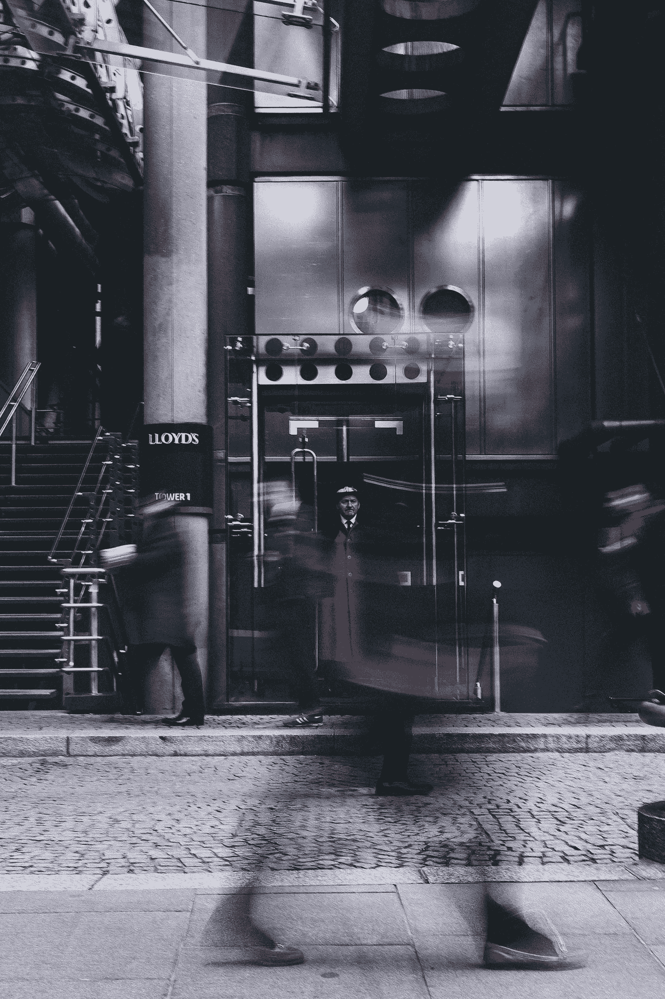

# 重新思考你的电梯推销

> 原文：<https://medium.com/swlh/rethinking-your-elevator-pitch-1d2bac9a6c30>

Images thanks to Boris Stefanik, Johanna Buguet, and Martin Pechy via Unsplash

你可能已经知道“电梯推销”或“电梯演讲”，这是一个紧凑的小独白，你应该能够在社交机会和偶然相遇时发表。该理论认为，在你乘坐电梯的时间内，你应该能够有效地向一个完全陌生的人展示自己。换句话说，你应该提取你是谁的本质…