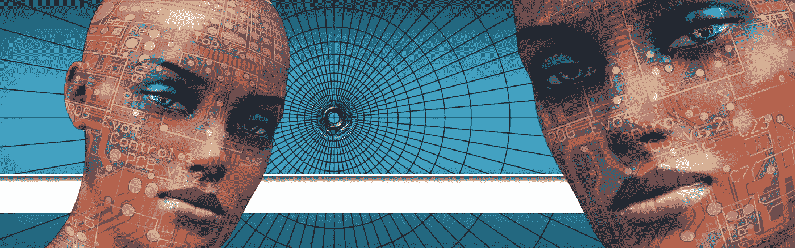

# 深渊假货的崛起

> 原文：<https://medium.com/swlh/rise-of-the-deepfakes-bc407ac5bde1>

简单，不可察觉，而且可怕。现在任何人都可以创建一个任何人说任何话的完全真实的假视频，会发生什么？

(photo: [geralt / 19928 bilder](https://pixabay.com/no/users/geralt-9301/))

Deepfakes 在这里，而且[男孩他们是可怕的](https://observer.com/2019/06/ai-deepfake-videos-mark-zuckerberg-joe-rogan/)。

社交媒体巨头 Instagram 最近发布了一段经过无缝编辑的假视频，显示脸书创始人马克·扎克伯格发表了一场关于脸书无限力量的令人不寒而栗的邪恶演讲。