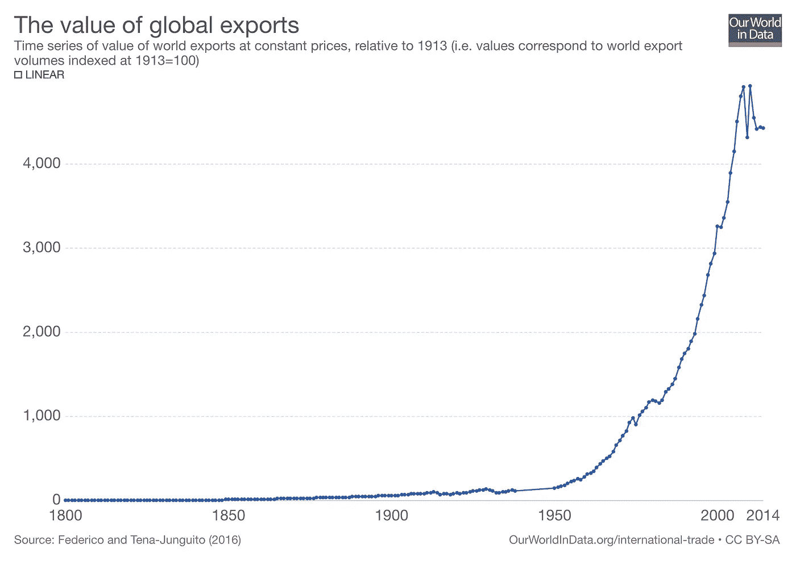

# 变压器启动

> 原文：<https://medium.com/swlh/rise-of-the-transformers-db7887c26689>

Not ordinary biplanes. (Credit: [Transformer Toys](https://reflector.tfw2005.com/))

## 早期投资的颤抖、呻吟和肥尾未来

几年来，创始人的决策框架已经指向了一个大致真实的方向:增长。你怎么知道某件事是对的？“问问你自己，它是否创造了增长。如果有，那就去做。如果不是……何必呢？”

那个可靠的指南针的指针最近开始跳动了。“不惜一切代价的增长”作为一个贬义词进入了时代思潮。作为对增长中的黑客国家[的一种相反的——但绝不是平等的，还不是——反应，新一波创始人和投资者已经出现。他们的战斗口号？通过利润实现可持续增长:](/swlh/the-new-bootstrappers-how-alternative-funding-models-are-embracing-founder-lifestyles-bd66a6656120)

就连《创业=成长》(Startup = Growth )一文的作者保罗·格拉厄姆也在不断进步，该文成为了一份行业宣言，并为成长而合理化了风险投资:

## 走进雾中

对于一些创始人来说，这种投资者焦点的转移会让他们感觉一切如常——不确定性一直伴随着他们；还有一些人，烧钱追逐梦想，相信下一轮就在眼前，可能找不到安全的地方着陆。

[弗雷德·威尔逊](https://medium.com/u/9d9e7084d6cb?source=post_page-----db7887c26689--------------------------------)——一位早期投资 Twitter、Zynga 和 Kickstarter 等独角兽公司的风险投资人，花了一些时间研究客户增长、收入和利润之间的百慕大三角，并写道:

> “这让我想到，科技，尤其是风险投资支持的科技，让我们似乎可以永远运营下去，而不需要产生自我维持的利润。”—弗雷德·威尔逊，[利润动机](https://avc.com/2018/12/the-profit-motive/)

弗雷德继续说道:“当机会足够大时(谷歌、亚马逊、脸书、Twitter 等)，这可能是一种创造价值的绝佳方式。但当机会受到限制时，这不是一种创造价值的好方法，无论是受到较小的市场规模(TAM)还是大量竞争对手(几乎没有进入壁垒)或许多其他因素的限制。”

弗雷德选择做出这种区分的路线——机会大小——很有见地，甚至可能是一个创始人可以用来告知一种新的思维方式的规则的开始。然而，就目前而言，他的结论有点悬:“在科技/风险投资/创业领域，我们似乎不太看重(利润)。也许我们应该。”

Wistia 的联合创始人兼首席执行官克里斯·萨维奇(Chris Savage)也表达了同样的观点，他是一位经历过风险投资的创始人:

当弗雷德沉思着机会受到限制时，克里斯[概述了风险投资](https://savagethoughts.com/why-i-invested-in-sparktoro-72c101ff753d)的陷阱，但没有提到机会的限制。换句话说，放弃风险投资[并不是因为适度的野心](/swlh/the-new-bootstrappers-how-alternative-funding-models-are-embracing-founder-lifestyles-bd66a6656120)。

[Rand Fishkin](https://medium.com/u/10e7e9d0a0af?source=post_page-----db7887c26689--------------------------------) ，拥有超过 4500 万资产的 Moz 公司的创始人和前首席执行官，创办了一家名为 SparkToro 的新公司。兰德解释了他和他的联合创始人在为他们的最新企业寻找合适的资金时所面临的挑战的症结所在:

> 我们花了很多时间讨论经典科技创业模式令人沮丧的二元模式(要么大规模成功，要么拼命尝试)，以及我们如何打造一个创造性的结构，在不强迫不健康的增长率或破坏性的急躁方法的情况下，允许巨大的成果的潜力。

**那么外卖是什么？**“风险投资并不适合所有人”？这是真的，但它对最近曝光的故事造成了伤害，令人痛苦的是，像 Joel Gascoigne 这样的创始人达到了令人难以置信的高度，但仍然选择离开风险投资列车，选择通过回报投资者的有机增长道路。

这个简洁的口号也滑入了阶级歧视，导致了不健康的摩擦。想必，哈佛也不适合所有人。然而，克里斯、兰德和乔尔只是少数感到风险行业不能满足他们作为企业家需求的世界级创始人。这不可能是关于有问题的创业公司的血统。

> 如果 VC 不适合所有人，为什么不呢？什么是？

## 原地跑步

像“风险投资并不适合所有人”这样的观点很难继续下去，因为这是字面意义上的负面说法，制造了更多的问题而不是答案。如果 VC 不适合所有人，为什么不呢？什么是？

有可能风险投资并不适合所有人，因为风险投资没有跟上企业家的需求。

2010 年 9 月，保罗·格拉厄姆称赞了可转换票据，想象着“高 res 融资将会给投资者世界带来什么。”

八年后，我们通过天使辛迪加提高了效率，验证了众筹等新的融资技术，并尝试了外管局等新的结构……但风险投资的游戏规则基本保持不变:创始人准备、实践和推销；风投的武断和利润——或者不要，然后一笔勾销。

有人认为，这种做法是唯一合乎逻辑的，即。[贝比鲁斯效应](http://cdixon.org/2015/06/07/the-babe-ruth-effect-in-venture-capital/)——60%的风险投资回报来自 6%的投资。投资者努力摇摆，因为大满贯比双打和三连冠的回报要丰厚得多。这是风险投资的简单数学。

这就是 VC 不适合所有人的原因吗？在目前的情况下，是的。但这应该是故事的结局吗？*(此处插入行业)是一个点击驱动的行业！”*是过时的商业模式的老生常谈。参见:玩具反斗城，巴恩斯&诺布尔，好莱坞，音乐。将书架或工作室空间分配给那些长尾小众玩具、书籍或艺术家，而不是马里布芭比、奥普拉的最新选择或本季最热门的人，是没有意义的。我将依靠权力法则，打赌泰勒·斯威夫特为她的制作人返还的现金比他们历史上任何一位艺术家都多，其差额打破了图表。(事实核查:[结果是](https://www.spin.com/2018/10/taylor-swift-label-300-million-bidding-war/)她负责他们收入的 34.6%)。

虽然大多数现任者继续指出不可避免的分布数学，一些金融创新者已经公开思考长尾理论。最近， [Rob Walling](https://medium.com/u/bb46c9d797d8) 称 [TinySeed](https://tinyseed.com/) 为“我们其他人的风险投资”尽管他和 Einar Vollset 的新基金的条款和结构仍不为人知，但这种情绪在方向上是正确的，与行业传统大相径庭。

那么，如果“全垒打”是一种过时的(互联网出现之前的)商业模式，为什么它仍然是风投公司做生意的方式呢？[2]

## 将 VC 转移到网上

正如许多潜在的破坏一样，罪魁祸首是 VC 运作所需的精神和物质空间。货架空间是一个有用的比喻，因为它意味着销售点的稀缺，而支票书写至今仍主要是一个离线的手工过程。这意味着风险投资与汽车、洗碗机和 iPhones 等制成品的共同点多于平台(讽刺的是，这正是风险投资者喜欢投资的行业)。

与平台相反，风险投资公司是定制的制造商——名副其实的花匠，挑选、修剪初创公司的花朵，并把它们排列成组合花束。他们每年下相对较少的赌注，花费人力和时间寻找资源并努力完成每一笔赌注，并致力于每一笔投资的高水平接触(董事会席位、增值活动)。

谨慎，是的，但是缺乏速度并不是内在的美德。大多数公司缓慢的新陈代谢对需要快速回答的创始人来说是一个障碍。[1]但是这种循环之所以存在并延续下去，是因为像今天的许多手工操作一样，挑选物品所需的灵巧性超出了机器的能力范围。换句话说，价值链的第一个环节——给合伙人会议发冷冰冰的电子邮件——还没有实现机械化。或者如果你更喜欢[马克·安德森](https://medium.com/u/fa65e64cf273?source=post_page-----db7887c26689--------------------------------)的提法，“软件还没吃呢。”

**软件如何吃掉风投？**第一步是标准化包装和协议。正如 Rob Pike [观察到的](https://users.ece.utexas.edu/~adnan/pike.html)，“数据结构，而不是算法，是编程的核心。”再次考虑实物供应链:实物供应链中的全球贸易随着[采用标准的 53 英尺集装箱](http://info.plslogistics.com/blog/the-history-of-containers)而呈爆炸式增长。在那之前，袋子和桶填满了大帆船的肚子，码头工人用钩子和滑轮把它们拖走。现在，世界上 90%的货物都装在有严格宽度、长度和重量限制的集装箱里运输，这使得起重机、港口以及国家之间能够以前所未有的效率进行价值交换。

Containerization (1956) both enabled and supported a global trade value boom.

**风险投资呢？** [Bryce Roberts](https://medium.com/u/510b99e51849?source=post_page-----db7887c26689--------------------------------) 强调了过去十年里[种子阶段投资规模](/@bryce/why-seed-scaled-f6c64646c59c)的四个原因；所有这些都要求熟悉标记、互动、构建和分期资本的标准方式。换句话说，提供和接受早期资本的认知开销减少了。当创始人和投资者分享对交易的预期时，对话会进行得更快。假设要达成一项交易，手头的任务就缩减为将关键数字填充到一份标准的、被广泛接受的文件中。

**当今生态系统中存在的另一个催化剂是朝着更大的** [**透明度**](https://baremetrics.com/open-startups) **的运动。**创始人发现了许多与世界分享他们的 KPI 和财务的积极原因:从 HR(员工保留和招聘)到 PR(在创业公司的海洋中曝光)。然而，这种在生态系统层面上的透明度的副产品可能更有趣。创业公司对自身透明的同等和相反的反应将不可避免地是投资者——尤其是那些想要讨好这类创业公司的投资者——也变得更加透明。我们看到这方面的证据了吗？是的。自 2015 年以来， [Indie.vc](https://medium.com/u/2932d151e989?source=post_page-----db7887c26689--------------------------------) 一直带头公开发布他们的术语，以及这些术语背后的思维过程。[更多的](https://sparktoro.com/blog/raised-a-very-unusual-round-of-funding-were-open-sourcing-our-docs/) [投资者](https://earnestcapital.com/)已经在跟风，这种趋势还会继续。

随着越来越多的人在交易完成前分享信息，预期将会趋同，预测和投资的新标准和新结构[将会为了方便和加快速度而出现。飞轮在旋转。](https://usesummit.com)

## 变压器定位

随着资本的最后一英里交付变得更加有效，市场将变得越来越适合初创公司和投资者，此前他们因缺乏信号和交易流而被拒之门外——无论是感知的还是真实的。正如 Instagram 打开了新的 pro-am 摄影师供应的闸门一样，以指数级速度交付资本的方式将释放新的天使供应。据估计，美国目前有超过 400 万获得认证的个人没有参与天使投资，但他们可以参与。与此同时，美国证券交易委员会通过 [Reg CF](https://www.sec.gov/info/smallbus/secg/rccomplianceguide-051316.htm) 放松了限制——第一笔 100 万美元的启动资金不再需要认证，还没有得到大规模利用。

其中一些金融家会用他们的现代投资组合理论来武装自己，通过交易量、对冲和投机来寻找快速的阿尔法。但持久的创新将来自投资者，他们寻找方法让这些初创公司的潜在价值[升值，以便在与创始人相同的长期内低买高卖。与他们的 moonshot 同行相比，那些公开并持续展示他们在可预测的收入和/或可靠的利润方面的价值的初创公司将获得最多的关注。](https://www.fool.com/investing/2018/05/26/9-key-principles-of-value-investing.aspx)

正如唱片公司继续寻找下一个明星，独角兽狩猎将继续存在，由 [FAANG 对用户和参与的](https://www.investopedia.com/terms/f/faang-stocks.asp)无止境的渴望支持。但在长尾理论中，精明的投资者将放弃火箭的高风险建设，转而浏览一系列新的坚固、成熟的飞机。

虽然不是异国情调，他们的飞行员不担心跑道。他们中的许多人并不像看上去那么简单。充满了选择，他们能够[从强大转变为强大](https://hackernoon.com/the-get-rich-slow-exit-strategy-fc3e301cb7c3?gi=ac93ec4a034c)，而不是从虚弱中旋转出来。

如果他们想的话。

*感谢阅读。可以在 Medium 这里关注我，也可以在 Twitter*[*@ mattwensing*](https://twitter.com/mattwensing)*。如果你喜欢这篇文章，看看*[*Summit*](https://usesummit.com)*，这款应用可以帮助创始人和投资者预测许多可能的未来。*

注意事项:

1.  这种迟钝的节奏如此浪费，以至于反常的激励开始出现。风险投资者无法拍摄大量照片，这与创始人希望尽可能长时间不要再次融资的强烈愿望是一致的。通过一个相互了解，“你需要多少钱？”变成了“你能拿多少钱？”
2.  长尾巴公司的创始人可能会认为他们仍然投资不足，因为某些贵族不希望他或她成功，或者就是不明白。风险投资确实错误地传递了独角兽，利己主义可能会碍事，但作为一般情况，这是[把不该](https://en.wikipedia.org/wiki/Hanlon%27s_razor)的事情归因于恶意。投资者*有*赚钱的动机。如果他们有办法通过追求长尾理论而不是全垒打或者除了全垒打之外赚同样多的钱，那么他们就会这么做。

## 这篇文章发表在[《创业](https://medium.com/swlh)》上，这是 Medium 最大的创业刊物，有+406，714 人关注。

## 在这里订阅接收[我们的头条新闻](http://growthsupply.com/the-startup-newsletter/)。

