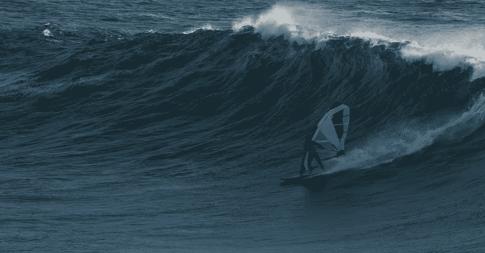

# 风险是创新的催化剂

> 原文：<https://medium.com/swlh/risk-is-a-catalyst-for-innovation-5702ee9f61ca>

…如果你失败了。

我们迟早都会死。除了年老，我认为 ***愚蠢*** 和 ***恐慌*** 是两种最常见的死因 ***。*** 通常用在组合词中并按此顺序排列。我应该知道。我太傻了。幸运的是，我活着讲述了这件事。所以，在这里。一个关于冒险的力量和愚蠢的危险的故事。

达文波特码头是加利福尼亚州北部一个美丽的海滩，位于圣克鲁斯以北 12 英里处，楔入 40 至 60 英尺高的悬崖之间。海滩的两边是礁石，可以产生完美的、令人生畏的波浪。持续强劲的海风从北到南穿过达文波特，使其成为帆板运动(或者更确切地说，“波浪航行”)的天堂。

Wavesailing Davenport, California

15 年来，达文波特一直是我最喜欢的冲浪胜地。我知道这个地方，见过所有可能的情况，犯过很多错误，学会了掌握它的力量。这一经历应该会降低犯更多错误的风险，但是达文波特仍然是一个本质上不安全的环境。

我不再航海了，也不再航海了。海滩是逆风的，所以我不得不逆风航行，来回跑了几圈。看到海岸几乎触手可及，我拼命顶着风，试图避免再跑一圈。我清除了最后一个障碍，海滩触手可及。我现在只需要处理一个相当大的海岸断裂。我想去的地方有看起来很黑的水。这是腐烂的海带汤被推到海滩上的迹象。我想无论如何都会没事的。当波浪冲击海岸，我离开时，我感觉到了冲击我双腿的反冲。海带汤明显比普通的水浓，因此对我的身体和我的装备造成了很大的压力。我失去了立足点，向前摔倒，被推到水下，船帆压在我身上。我突然发现自己的脸埋在沙子里，被帆顶上一吨的海带汤压住。

我记得当时想“好吧，这就是你的死法。请不要惊慌！”。

生活充满了危险。我们每天都在冒险。在商业中，风险是成功的强大催化剂，但是愚蠢的风险会让你失去一切。创新通常先于成功，并包含大量的风险。创造一种创新文化可以帮助一家公司在任何行业中竞争并成为领导者。创新来自内部，来自你的团队。如果你允许冒险。

创新迫使你步入未知，承担风险，并经常失败。如果你愿意坚持下去，你成功的可能性很大。作为领导者，你可以通过创造一个 ***的安全环境来培养创新。*** 之所以安全，是因为你允许合理的冒险(避免愚蠢)。你庆祝失败，同时总是从失败中学习(避免恐慌)。你通过认可那些使成功成为可能的人来奖励成功。这一切都始于你愿意承担的风险和你处理失败的能力。

关注一个安全的环境可以让你避免我们经常看到的典型功能障碍:缺乏信任、责任感、承诺和结果(参见帕特里克·兰西奥尼的“[团队的五大功能障碍](https://en.wikipedia.org/wiki/The_Five_Dysfunctions_of_a_Team)”)。

好了，回到海滩。当第一次逆流把我的脸推进沙子里，把空气挤出肺部时，我意识到恐慌开始了。我把它放在一边一会儿，想着下一波浪可能会再次把我上方的水柱提起来，减轻压力，可能会让我从下面滑出去。我等待着，屏住我仅剩的一口气。感觉像是永恒。果然有效！

你问外卖是什么？ ***失败的时候，不要慌。快速学习、恢复、纠正并继续学习新获得的见解。***

有人称之为“快速衰退”。