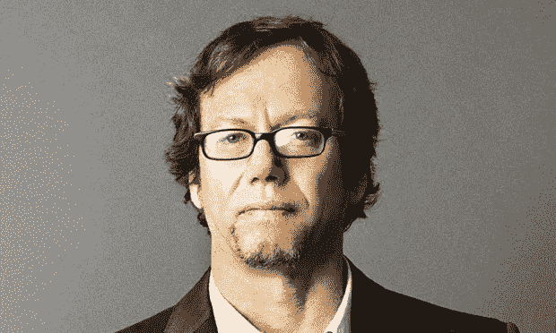
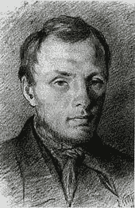
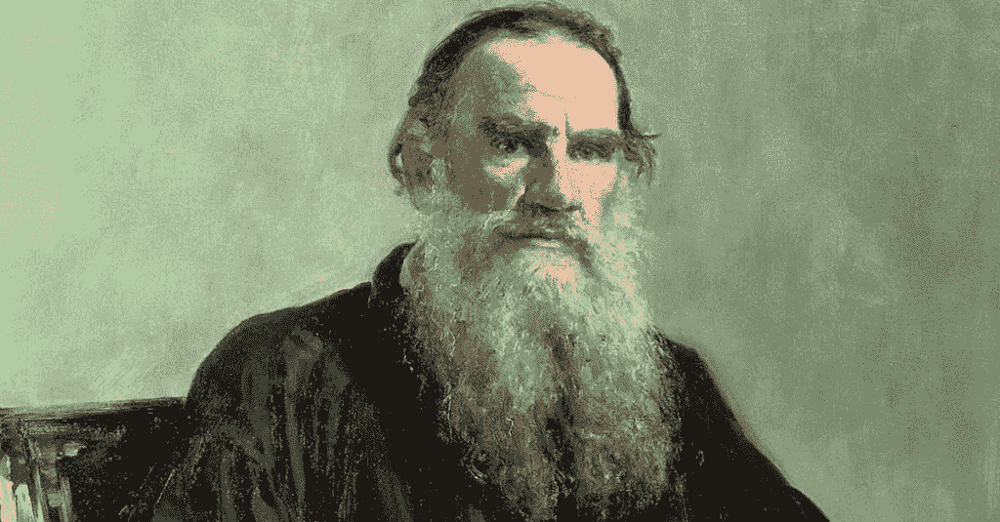
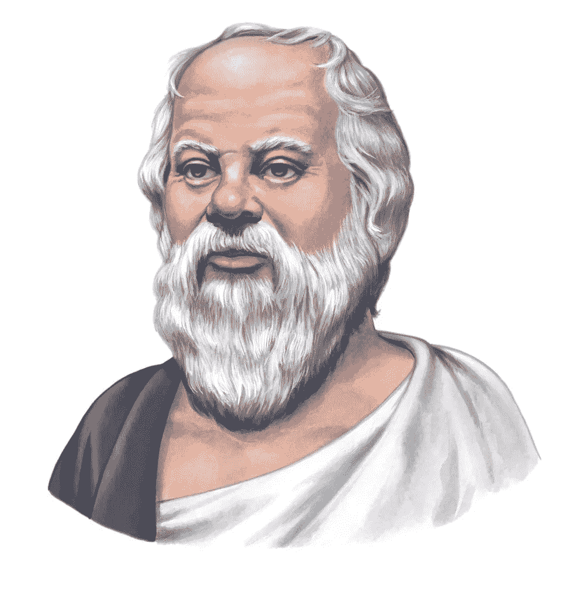
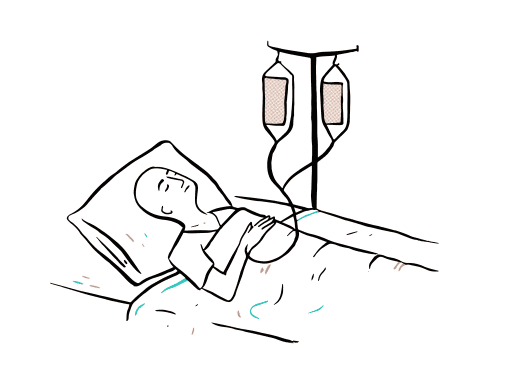

# 罗伯特·格林的《实现眼前目标和美好生活的策略》

> 原文：<https://medium.com/swlh/robert-greenes-strategy-for-immediate-purpose-and-a-great-life-3c6733442481>

> “让我们摆脱死亡的陌生感，了解它，习惯它。让我们不去想任何事情，就像死亡一样。每时每刻，让我们在想象中描绘它的方方面面……死亡在哪里等着我们是不确定的；让我们在任何地方等待它。对死亡的预谋就是对自由的预谋……学会了如何去死的人，却没有学会如何做一个奴隶。知道如何死亡让我们从所有的服从和约束中解放出来。米歇尔·德·蒙田

我每天都在思考死亡。

“是什么让生命值得活下去？”

“生命没那么神圣。”

所有这些会让我有自杀倾向吗？

但是后来我读了罗伯特·格林的*人性的法则，了解到它其实对你有好处。*

*如果你经常想到死亡，你通常会好奇和沉思，并且高度警觉。你现在要做的就是学会利用这种自我意识。*

# *为什么思考死亡对你有好处*

**

> *“生活不应该是一次去坟墓的旅行，目的是带着一个漂亮的、保存完好的身体安全到达，而是在一团烟雾中侧身滑行，彻底耗尽，完全筋疲力尽，并大声宣布‘哇！多好的旅程啊！—亨特·S·汤普森*

*在《人性的法则》一书中，格林分享了陀思妥耶夫斯基与死亡擦肩而过的故事——他从中学到了什么，以及它如何影响了他的生活。陀思妥耶夫斯基被认为是有史以来最伟大的作家之一，著有《罪与罚》、《白痴》、《卡拉马佐夫兄弟》等书。*

**

*27 岁时，他因参与反对沙皇的阴谋而被监禁。一开始的监禁突然变成了快速而令人震惊的死刑判决。*

*格林发现后描述他:*

*在那几分钟里，他从未有过的情感涌上心头。他注意到光线照射在大教堂的穹顶上，发现所有的生命都像这些光线一样转瞬即逝。对他来说，一切都显得更加生气勃勃。他注意到他的狱友们脸上的表情，以及他是如何看到他们勇敢的外表背后的恐惧。在最后一刻，沙皇的代表骑马来到广场，宣布他们的判决已经被减刑为在西伯利亚做几年苦役。陀思妥耶夫斯基完全被自己与死亡的心理擦肩而过所淹没，他感到重生了。这段经历在他的余生中一直深深地印在他的脑海中，激发了他新的同情心，增强了他的观察能力。”*

*格林对此的解释如下:*

*“通常情况下，我们会在一种非常分心、像做梦一样的状态下度过一生，我们的目光转向内心。我们大部分的心理活动都围绕着幻想和怨恨，它们完全是内在的，与现实没有什么关系。当我们的整个身体对威胁做出反应时，死亡的临近突然吸引了我们的注意力。这将注意力集中到一个更高的层次，我们会注意到新的细节，以新的眼光看待人们的面孔，并感受到我们周围一切的无常，加深我们的情感反应。我们无法在不冒生命危险的情况下重现这种体验，但我们可以通过较小的剂量获得一些效果。我们必须从冥想我们的死亡开始，并寻求将其转化为更真实、更物质的东西。”*

# *结论*

*现代许多最伟大的思想家都建议将死亡作为过好生活的工具。*

**

*托尔斯泰说，要理性地生活，一个人必须活着，这样死亡才能摧毁生命。*

**

*苏格拉底说:*

> **没有人知道死亡是否会成为人类最大的幸福；然而，人们害怕它，好像他们肯定知道这是最大的邪恶。**

*作为当今在世的最深刻的思想家之一，格林自己的解释似乎也同意这一点。*

*在《T4》的《人性法则》中，格林建议想象我们死亡的那一天，它可能在哪里，如何到来——让它尽可能的生动。*

*每天做一次死亡冥想，提醒自己生命短暂，随时可能结束。吸气，承认死亡，直视死亡。然后呼气，把注意力集中在你想避免临死前后悔的事情上。因为记住，总有一天你会真的躺在你的死亡床上，而你躺在床上最不想要的就是后悔。*

**

> *[*点击接收我个人用来赢得一天的晨间例行电子表格和愿景板。多年来我一直在改进它，它改变了我的生活。每周日早上你还会收到我的最佳每周文章。*](https://betreatedhowyouwanttobetreated.com/optin-main)*

**

## *这篇文章发表在[《创业](https://medium.com/swlh)》上，这是 Medium 最大的创业刊物，有+414，678 人关注。*

## *在这里订阅接收[我们的头条新闻](http://growthsupply.com/the-startup-newsletter/)。*

**