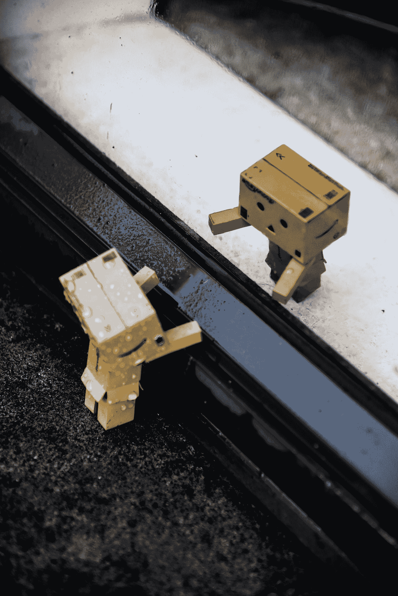

# 机器人也需要爱

> 原文：<https://medium.com/swlh/robots-need-love-too-de44735c1b8>

Photo by [Zane Lee](https://unsplash.com/@zane4004?utm_source=medium&utm_medium=referral) on [Unsplash](https://unsplash.com?utm_source=medium&utm_medium=referral)

## 程序员调试代码；治疗师调试大脑的复杂性。

想象你自己在一个过去时代的布满灰尘的旧治疗室里。皮革沙发床。留着胡子的心理学家，眼镜在鼻梁上跳动。他问的问题包括:**“被称为对人类的生存威胁是什么感觉？”**