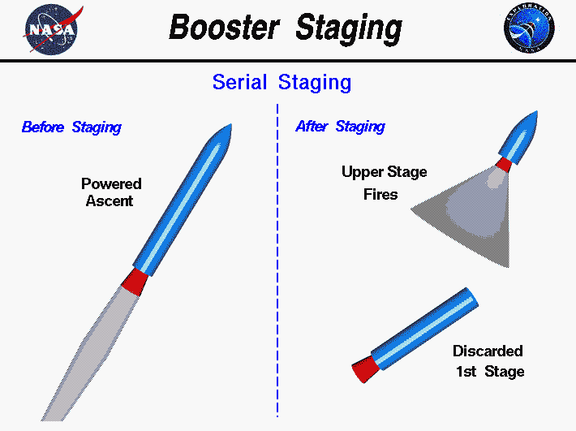
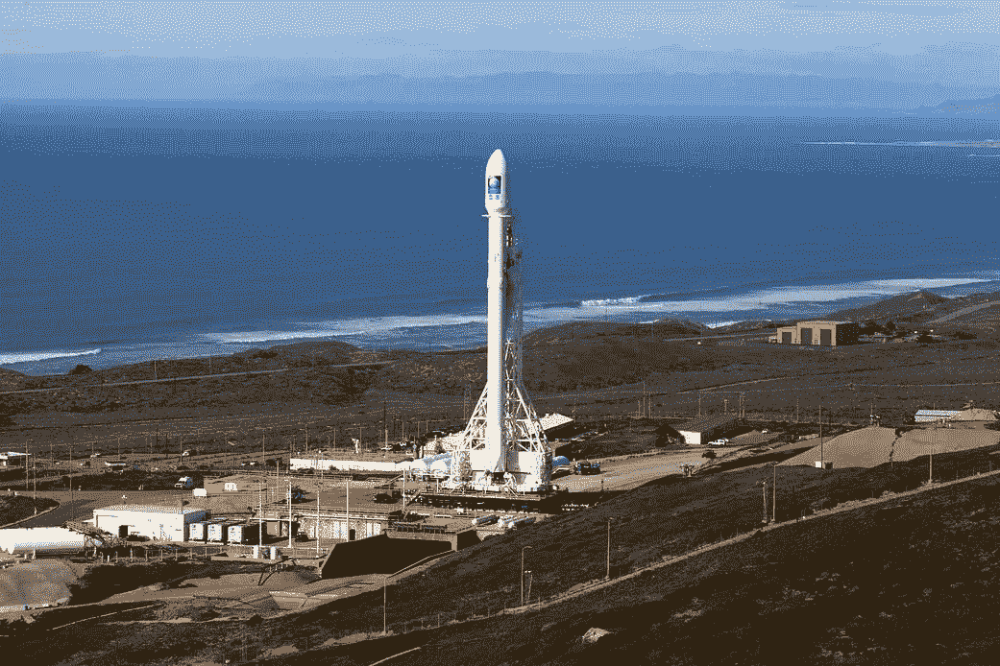

# 火箭和航天飞机是如何工作的？第一部分

> 原文：<https://medium.com/swlh/rockets-and-space-shuttles-part-1-e9fb4e36c2a4>

Delta Rocket, Space Shuttle, Soyuz Rocket

新闻里全是关于新火箭和任务的故事。虽然大多数人对太空项目感到兴奋，但他们对细节有点粗略。这是故意的，这样像我这样的人听起来会比我们实际上更聪明，并把所有那些利润丰厚的火箭科学工作留给我们自己😊。

每个人都应该知道火箭如何工作的一些关键原理。作为一名前航天飞机工程师，我决定将航天飞机的工作原理与人们所认为的“火箭”进行比较和对比。

虽然有许多系统对火箭的工作至关重要，但在这个故事中，我主要关注的是推进系统。

那么什么是火箭呢？

“火箭”这个词可以有不同的意思。我们使用非常小的火箭向空中发射爆炸性的烟花或发出信号。许多人驾驶小型模型火箭。像联合发射联盟(ULA)和 SpaceX 这样的公司发射巨大的火箭将卫星、星际飞船和科学仪器送入太空。有一系列不同尺寸的火箭。

它们的共同点是，它们通常在顶部有一个小的有效载荷，并有一个或多个部分或阶段。各级都有液体或固体推进剂，它们提供燃烧的燃料和氧气，并通过喷嘴将燃烧后的物质推出。

Clip Art Library image: Sir Isaac Newton

多亏了艾萨克·牛顿爵士和他的第三定律——离开火箭的废气力使它向相反的方向运动。燃料和氧化剂的类型，它们被点燃的方式，以及发动机的复杂程度在不同的火箭之间有很大的不同。

我们都知道燃料是什么。但是什么才是真正的氧化剂呢？氧化剂是允许燃料燃烧的化学物质。在地球上，我们通常使用氧气来达到这个目的，因为它在我们周围的大气中。然而，在太空中没有大气层提供氧气，所以火箭需要携带自己的氧化剂。

大多数火箭使用几种类型的发动机。例如，航天飞机使用了四种不同类型的发动机和三种不同类型的燃料/氧化剂组合。

**航天飞机升空——恐怖的八分半钟**

Photo by [NASA](https://unsplash.com/@nasa?utm_source=unsplash&utm_medium=referral&utm_content=creditCopyText) on [Unsplash](https://unsplash.com/search/photos/space-shuttle-launch?utm_source=unsplash&utm_medium=referral&utm_content=creditCopyText)

虽然占航天飞机宇航员队伍主导地位的大多数战斗机飞行员不愿意公开承认自己受到了惊吓。我听到一些人说发射和进入轨道是可怕的——无论是航天飞机还是俄罗斯的联盟号火箭。我不怪他们。

**为什么这么恐怖？因为火箭里的乘客正坐在受控爆炸的顶部。**

从主引擎点燃到不到 9 分钟后关闭，航天飞机损失了约 94%的质量——主要是通过将燃料和氧化剂转化为受控爆炸，通过喷嘴将轨道飞行器送入它需要的准确位置。那是能量的 ALOT。

**7..6..5..“主引擎启动”…**

NASA Image: Space Shuttle Main Engine

倒计时的最后几秒钟在任务控制中心非常令人兴奋，因为如此多的系统必须上线并显示良好的状态。由于任务控制人员无法对异常情况作出反应，所以在必要时，自动程序可以停止发射。

发射前大约 7 秒，当 SSMEs 点火时，事情真正进入了高潮——一次一个。在这一点上，自动化程序在发布最终 SRB 点火之前验证一切正常。在穿梭机历史中，多次发现问题，SSMEs 在 SRB 点火前关闭。

如果你看航天飞机发射的录像，你可以看到燃料和氧化剂通过发动机喷嘴释放时点火器产生火花。

一旦确定三个固体火箭助推器运行良好，轨道器两侧的两个长固体火箭助推器(SRB)就被点燃。一旦这两个地狱之火的庞然大物被点燃，航天飞机就停止了运行。没有办法关闭这些。此外，在 SRBs 运行的两分钟内，机组人员没有办法在紧急情况下安全逃生。

**一旦固体火箭发动机点火——航天飞机就要起飞了。**

由于 SRBs 不能关闭，自动发射控制系统有许多检查和平衡，以确保在点火信号发出之前一切准备就绪。

Pexels: Space Shuttle during powered ascent.

SSMEs 的氢/氧燃烧产生干净的、几乎透明的废气。效率较低但威力更大的固体火箭在上升过程中产生了大部分的污染废气。

**一些数字**

Photo by JESHOOTS.com from Pexels

由于火箭必须携带所有的推进剂，所以在发射时它们确实很重。航天飞机包括一个轨道飞行器、两个 SRB 和一个装满燃料和氧化剂的油箱，起飞时重约 450 万磅。

一个任务就绪的轨道器，包括有效载荷、供给、推进剂、乘员等，重量不到 300，000 磅。通常情况下，火箭只能将发射质量的 5%送入轨道。(这一点，以及重复使用的经济学，就是为什么 SpaceX 回收和重复使用助推器的能力是如此重要的突破。)

每个航天飞机的 SRB 都有 280 万磅的推力。)，而所有三个 ssme**加在一起** 有大约 120 万磅的推力。总而言之，航天飞机有 680 万磅的推力将其推离发射台。由于它在发射时只有 450 万磅重，一旦 SRB 被点燃并迅速加速，它就从发射台上跳下。

正如科学家和工程师喜欢说的——当你的推力大于重量时——你走得很快。

**分期**

NASA image: Space Shuttle SRB Staging

两分钟后，SRBs 燃尽，并与轨道飞行器和外部油箱分离。一旦 SRB 离开，乘客会感觉好一点！然而，他们还没有回家。

三个 SSMEs 仍然能输出 120 万磅的推力，而且轨道飞行器和燃料箱要轻得多。随着越来越多的推进剂燃烧，飞行器变得更轻，航天飞机加速更快——最终达到 3 g。

此时，制导计算机将发动机减速，以防止加速过快。超过三个 g 被认为不利于宇航员拍照(没有人喜欢那种下垂的塑料脸)，并防止科学仪器和有效载荷受到损坏。三个 SSMEs 最终在点火后大约八分半钟关闭。任务控制中心喜欢吸引人的缩写。当 SSMEs 关闭时，我们称之为“主引擎关闭”，或 MECO。

**还没到休息的时候**

虽然乘客们在 MECO 松了一口气，但事情还没完。在 MECO，轨道器在绕行星运行时，将把轨道器带回大气层。为了获得任务所需的最终轨道，航天飞机必须分离(但不是重新接触)外部油箱，然后使用另一个推进系统。

*NAA Image: Three SSMEs and two OMS engines on Space Shuttle*

我注意到三个 SSMEs 位于轨道飞行器的尾部。轨道机动系统(OMS)有两个较小的火箭发动机，位于垂直尾翼两侧的吊舱中，在称为轨道机动系统或 OMS 发动机的 SSMEs 上方。只需要几分钟的运行时间就可以将航天飞机送入稳定的轨道。加速度水平比上升时低得多。这使得 OMS 飞行比动力爬升要轻松一些。

虽然 SSMEs 使用低温(超冷)液态氧和氢，SBR 使用固体混合物[高氯酸铵](https://en.wikipedia.org/wiki/Ammonium_perchlorate) ( [氧化剂](https://en.wikipedia.org/wiki/Oxidizer))和雾化[铝粉](https://en.wikipedia.org/wiki/Aluminum)([燃料](https://en.wikipedia.org/wiki/Fuel))，但 OMS 发动机使用单甲基肼(MMH)作为燃料，四氧化二氮(N2O4)作为氧化剂。选择最后一种组合是因为这些推进剂在接触时非常可靠地点燃。虽然这些推进剂在地面上非常危险，但在太空中却非常可靠。事实上，由于这个原因，今天大多数宇宙飞船和卫星都使用这些推进剂。

**微型推进器**

NASA Image: RCS Thrusters on the nose of the Shuttle Orbiter

然而，第四个推进系统被用来保持航天飞机始终指向正确的方向。航天飞机轨道器有 44 个小型液体燃料反应控制系统(RCS)推进器。

“小推进器”使用了与 OMS 系统相同的推进剂。除了将轨道器指向正确的方向，RCS 推进器还允许轨道器保持在轨道上，在与另一艘飞船或空间站对接时缓慢机动，并在 OMS 失败时为脱轨燃烧提供备份。

**“常规”火箭 Vs 航天飞机**

航天飞机是独一无二的交通工具——算是吧。苏联人建造了一架可重复使用的航天飞机，名为 Buran(俄语中为“暴风雪”或“暴风雪”)。而轨道飞行器、燃料箱和助推器的带子看起来可疑地像航天飞机。然而，相似之处是表面的。这个系统实际上在很大程度上是不同的。

*Buran* during launch in 1988

Buran 只飞了一次，但是无人驾驶——并且成功降落在跑道上。关于俄国人为什么放弃了布兰，有很多故事。它可能就像资金一样简单。布兰没有经受住——航天飞机相当独特，飞行了 135 次。传统火箭看起来不同，但本质上有相同的系统，做相同的事情将有效载荷送入太空。

一个关键的区别是航天飞机轨道器实际上相当于火箭上的有效载荷。可重复使用的轨道飞行器的缺点是，大约 300，000 磅的大部分重量被送入轨道的航天飞机带回来。所以投放的有效载荷要小得多。正因为如此，在轨道上使用的实际有效载荷只是我们上面提到的 5%的一小部分。

航天飞机做了许多令人难以置信的事情，但作为一辆运输卡车，它的效率远远低于传统火箭。这就是为什么花费了超过 40 次航天飞机任务将空间站的美国部分送入轨道。

**大型火箭**

更大的火箭有多级。通过加速到高速，以及目前使用的结构、机械、发动机和燃料箱的下降部分，火箭的上面级可以更容易地将有效载荷送入轨道。

已经有很多尝试要发展单一国家的轨道航天器(包括我几十年前航空工程的大四设计项目！)，但对于传统的化学推进系统(这是我们所有的)，这是数学和物理如何工作。

**潜在的游戏规则改变者**

我饶有兴趣地关注着反作用发动机 Sabre 发动机的发展，因为它有可能使单级入轨变得可行。Sabre 是一种混合吸气式火箭发动机。听起来很矛盾？Sabre 改变了它在飞行中的操作方式。最初，它是一种空气助燃式发动机，使用大气中的氧气进行燃烧。在大气层中将航天器加速到高超音速后，它就像一个使用内部存储氧化剂的火箭发动机。

**航天飞机和常规火箭的区别**

NASA image: Rocket staging

传统火箭有时在固体或液体火箭助推器上使用皮带，以在携带更重的有效载荷时获得额外的性能。像航天飞机一样，当它们耗尽或耗尽时就会分离。

然后，当火箭的第一级几分钟后变干时，它也分离了——上面一级的发动机点燃。

航天飞机的不同寻常之处在于，轨道飞行器(有效载荷)悬挂在一个大型燃料和氧化剂箱的侧面，这个燃料和氧化剂箱为轨道飞行器末端的发动机提供燃料(火箭在顶部携带有效载荷)。在 SRBs 燃尽并分离后，轨道飞行器和燃料箱继续运行，直到一起进入轨道。

一些有效载荷如果需要到达高轨道，或者预定用于星际飞行任务，则携带第三级推进级。同样，航天飞机在许多情况下携带有自己的推进系统的有效载荷。

火箭和航天飞机的相似之处

传统火箭也有反作用控制推进器来保持火箭指向正确的方向。然而，与航天飞机不同，一旦有效载荷被送入轨道，火箭的工作就完成了。

火箭在飞行过程中使用烟火(爆炸)分离系统来快速安全地分离助推器和火箭级上的滑索——就像航天飞机一样。

所有火箭都依赖计算机航空电子系统，配有复杂的制导、导航和飞行控制系统——航天飞机也是如此。事实上，通过 MECO 的上升阶段对宇航员来说是放手的，除非需要紧急程序。

所有的火箭都依靠通信系统来提供最新的实时指令和信息。

所有的火箭都带有靶场安全系统。如果火箭偏离了预先编程和批准的飞行计划，地面操作人员有能力在火箭接近居民区之前将其炸毁。航天飞机也有类似的系统。

所有大型火箭都有某种推力矢量控制装置，利用发动机推力来控制火箭飞行。航天飞机的主引擎和 SRB 也是如此。

所有的大型火箭都有电力系统并使用电池。

**火箭革命**

NASA/Kim Shiflett: Falcon 9 Ready for Launch

火箭世界正在发生一场革命。如今有更多的火箭可供选择，而且价格也大幅下降。

SpaceX 在很大程度上负责设定新的商业基调，并从传统火箭公司手中抢走业务。

蓝色起源增加了更多的竞争，有许多较小的火箭公司。甚至日本和欧洲的太空机构也开始了新的大型火箭开发，旨在降低价格。古老的联合发射联盟也在重新装备以应对这一威胁。尽管 Atlas 和 Delta 火箭有着出色的记录，但在这个新的市场现实中，它们太贵了。ULA 希望用新的 Vulcan 火箭取代 Atlas，重新确立他们的市场主导地位。

这是一个在航天工业工作的激动人心的时刻。

美国宇航局也在建造一种新的“大火箭”。然而，美国宇航局似乎在遵循老学校的方法。空间发射系统(SLS)将具有巨大的提升能力，但其运营成本非常高，需要一个大型的后勤支持基地来执行有限的任务。随着运载火箭供应商令人兴奋的扩张，以及发射到太空的多种选择，很难理解这种方法。