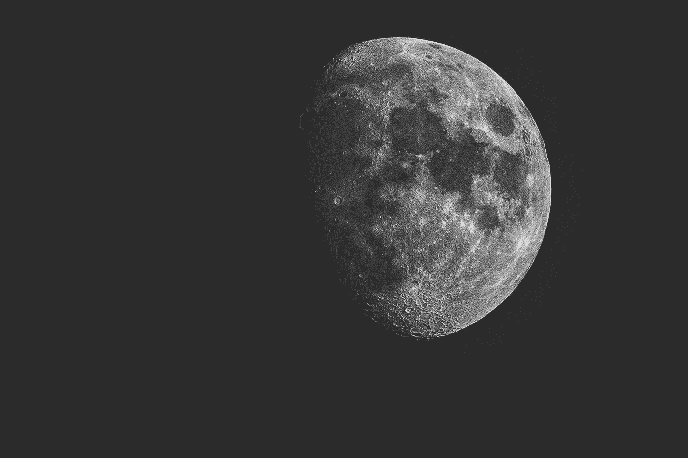
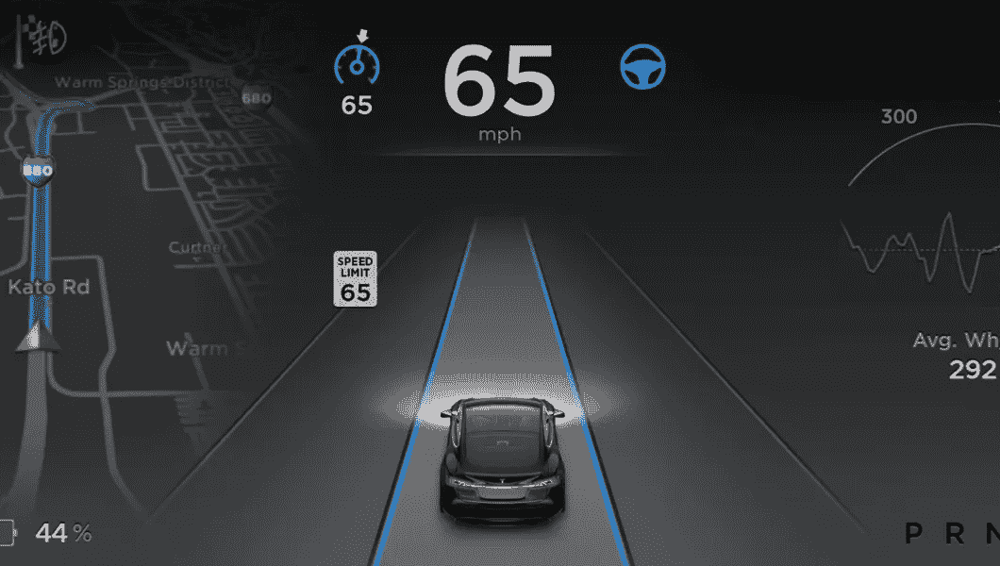

# 如何成功运营一家真正创新的公司——同时实施 Roofshot 和 Moonshot 项目

> 原文：<https://medium.com/swlh/roofshot-and-moonshot-how-to-successfully-run-a-truly-innovative-company-9f85eb312f46>

**Moonshot** projectsare extraordinary visionary stuff, and disruptive to the fullest, like the Apollo 11 mission to the moon. Photo by [Andrea Sonda](https://unsplash.com/@andreasonda?utm_source=unsplash&utm_medium=referral&utm_content=creditCopyText) on [Unsplash](https://unsplash.com/search/photos/lunar-moon?utm_source=unsplash&utm_medium=referral&utm_content=creditCopyText)

我们都听说过苹果、特斯拉、脸书、谷歌(Alphabet)和亚马逊(Amazon)等非常成功的公司是如何以几乎可以想象的速度创新的。

完全自主的自动驾驶汽车，飞行中的无人机在几小时内将新鲜果汁送到门垫上，以及即将为肯尼亚偏远农村地区带来快速互联网接入的巨型气球网络。

所有这些惊人的发明都被大多数人称为**登月**；鼓舞人心，雄心勃勃，挑战可能的极限，改变世界。所有这些都是在假定的非常短的时间内实现的。

**所有这些都是登月照片，对吗？还是？**

# 满足屋顶拍摄。

我第一次知道**这个词是在阅读了谷歌前首席执行官埃里克·施密特和乔纳森·罗森博格写的《[谷歌如何工作](https://www.amazon.co.uk/How-Google-Works-Eric-Schmidt/dp/1444792490)》之后，乔纳森·罗森博格是谷歌前产品 SVP，现在是 Alphabet 首席执行官兼创始人拉里·佩奇的顾问。**

> 在不知道的情况下，我已经做了十多年的屋顶拍摄项目，所以终于有了一个合适的术语来全面标记这些项目，这感觉棒极了。

虽然 **moonshots** 是非凡的有远见的东西，并且具有最大的破坏性，如果成功的话可以实现 10 倍的飞跃，但 **roofshots** 则是一个系统而不懈的过程，一个季度接一个季度，一年接一年地持续提高 1.3-2 倍。

> **Roofshots** 是持续改进 1.3-2 倍的有条不紊的过程，一个季度接着一个季度，一年接着一年。

Most inventions within medicine are based upon roofshot projects. Photo by [Louis Reed](https://unsplash.com/@_louisreed?utm_source=unsplash&utm_medium=referral&utm_content=creditCopyText) on [Unsplash](https://unsplash.com/search/photos/medical?utm_source=unsplash&utm_medium=referral&utm_content=creditCopyText)

做一些数学计算告诉我们，不到三年的屋顶拍摄的价值等同于一次月球拍摄，与极少失败的屋顶拍摄相比，大多数月球拍摄最终会失败，因为对它们投入了巨大的雄心。

**还有用屋顶拍摄的加成；**第一季度已经有了 30%的提高——而 moonshots 的结果要等到三年后才能出来— *如果他们成功的话。*

# 那么，我们每天听到的那些伟大的创新呢？他们是屋顶射击还是月亮射击？

当阅读新闻时，特斯拉和他们的汽车的自动驾驶能力听起来绝对像登月计划。然而，这“只是”一个屋顶拍摄项目，工程师和其他聪明人日复一日，年复一年地出现在工作中，开发，优化，测试，调整，研究，反复迭代，一次一小步地不断优化自动驾驶功能。此外，许多其他公司也在研究无人驾驶汽车。

Tesla's self-driving capabilities are based upon roofshot projects, continuously improved over time.

另一方面， [**特斯拉机器人项目**](https://www.bbc.com/news/business-48021380) 允许任何人租一辆特斯拉汽车，让它自动开到你所在的地方，然后带你去你想去的任何地方并返回，最后自动将它还给它的主人，并让它自动停在车库里——这是一个不可能的事情。

**谷歌搜索**，以其惊人的准确率和速度？屋顶拍摄。

**亚马逊的商品推荐引擎？这至少听起来像是一个真正的 moonshot 发明，因为无论我在哪里点击网站，它总是弹出非常相关的产品推荐。同样基于屋顶拍摄发明。从 90 年代开始。**

> 正如我们所看到的，大多数真正的发明是一长串的屋顶拍摄，一个引人注目的创新模式，对于“我们其余的人”来说，它们只是出现在工作中并完成任务。日复一日，直到伟大的事情开始发生。

# 好吧，那什么是登月计划？

> 至少从技术角度来看，登月是一个雄心勃勃、探索性和突破性的项目，通常在没有任何近期盈利预期的情况下进行，也没有对未来所有潜在风险和收益进行全面调查。

Moonshots 解决了巨大的问题，提出了激进的解决方案，并使用了前所未有的突破性技术。

确切的术语来源于阿波罗 11 号航天计划，众所周知，该计划于 1969 年将第一个人送上了月球。

其他 moonshot 项目包括 Alphabet(谷歌)旗下的公司[**Project Calico**](https://www.calicolabs.com/)，其目标是全面了解人体的生物学，并进一步尝试延长人类寿命。

# 好的，我想我知道屋顶拍摄和月球拍摄项目的区别了。让我试着总结一下。

如果年复一年坚持不懈地迭代和优化，项目仍然雄心勃勃，但非常容易实现。

另一方面，登月计划是雄心勃勃的项目，从未尝试过，最前沿，从历史的角度来看，有可能在相对较短的时间内改变世界。

# 那么，作为一家雄心勃勃的公司，我们应该怎么做呢？

1.  在任何给定的时间里，只要有几个(一个，最多三个)moonshot 项目在进行，由一小群人来运行，这些人通常会带着*非凡的*热情来追逐 roofshot 项目。
2.  所有其他(仍然雄心勃勃的)项目应该被定义为屋顶拍摄项目，逐季不断改进。

> 屋顶拍摄项目是进化的，月球拍摄项目是革命性的。历史已经证明，从长远来看，进化会战胜一切。

# 将公司 80%的资源用于屋顶拍摄项目。

一定要把你总资源的 80%用在屋顶拍摄项目上，目标是让它们产生总收入的 80%的持续收入，而月球拍摄项目最多获得 20%的资源，产生高达 20%的收入，如果其中任何一个项目成功的话，还有 10 倍的潜力。

# 我个人应该做些什么？

**对于我们 80%的人来说；**走出去，大胆梦想，每天早上去上班，坚持不懈地逐步完成通往持续成功的漫长旅程中的每一步。

**还有 20%的登月者；**努力尝试。努力失败。总有一天你也会成功的。

Dream big, no-matter what. Photo by [Denys Nevozhai](https://unsplash.com/@dnevozhai?utm_source=unsplash&utm_medium=referral&utm_content=creditCopyText) on [Unsplash](https://unsplash.com/search/photos/dreaming?utm_source=unsplash&utm_medium=referral&utm_content=creditCopyText)