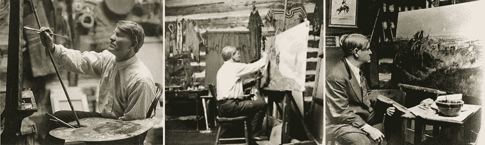

# 成为创造者的规则

> 原文：<https://medium.com/swlh/rules-for-being-a-creator-28ce6b180261>

My favorite artist, Charlie M Russell, at work.

我们都是创意人员。脑科学揭示了这一点。创造是根植于我们大脑的反应部分的。然而，大多数美国人并不锻炼我们的这部分头脑。由于我们几乎所有人都来自移民背景，我们有很多社会规划来使用逻辑，理性，解决问题。这些被认为比创造力更重要，更有价值。创造力通常被视为过去的时间或爱好。你工作，然后如果你…