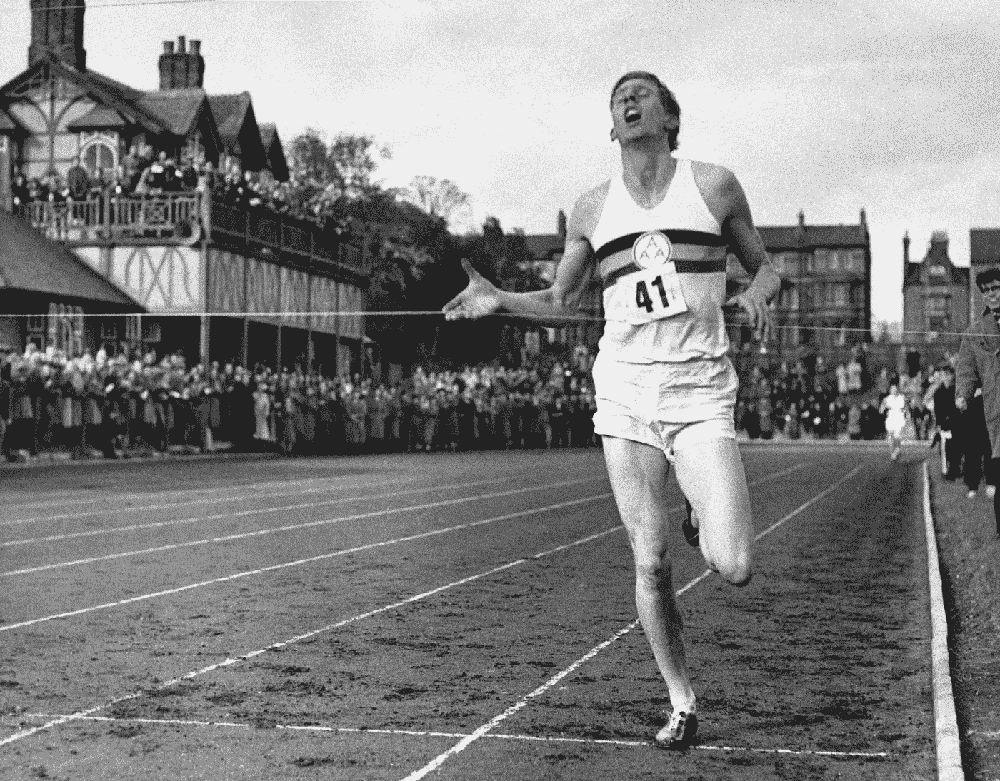

# 奔向不可能

> 原文：<https://medium.com/swlh/running-towards-the-impossible-d2fb09bc43fc>

## 性格上的教训——弗兰克·威廉·布伦南

## 如何成功地想象成功

Associated Press — Roger Bannister becomes the first person to run the mile under four minutes.

在 1954 年 5 月 6 日之前，人们普遍认为在 4 分钟内跑完一英里是一个无法实现的目标。一些专业运动员和生理学家同意这个观点，因为没有人跑得那么快。这是一个…