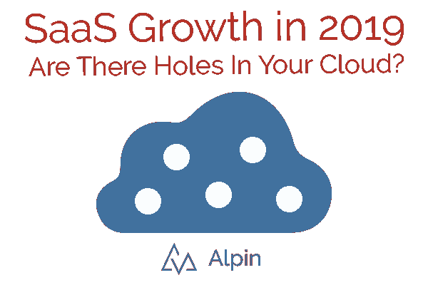

# 2019 年 SaaS 的增长:我们可以从 2018 年的数据中学到什么

> 原文：<https://medium.com/swlh/saas-growth-in-2019-what-we-can-learn-from-2018-data-57564399b603>

云软件(SaaS)继续快速增长。

向云过渡这样的大规模变化可能会在知识、解决方案或可见性方面留下缺口。

How is your SaaS looking lately? Our customers have been surprised at what they discovered in their cloud, even when they thought they knew.

在本帖中，我们将查看[一些 2018](https://www2.deloitte.com/insights/us/en/topics/leadership/global-cio-survey.html) 德勤[调查数据](https://www2.deloitte.com/us/en/pages/operations/articles/global-outsourcing-survey.html)和一些来自 Alpin 客户的汇总信息。

如果您正在考虑转向 SaaS 产品或评估您的数字化转型工作，这些统计数据可以提供一些背景和经验法则。我们希望它们能够增强您的云提议、规划或项目。

*德勤 2018 年的数据说明了 SaaS 什么？*

德勤进行了一项全球首席信息官调查和一项全球外包调查。这些调查分别有 1，400 多名和 500 多名受访者。以下是我们最大的收获和原因:

**增长:93%的首席信息官** **表示他们正在采用或考虑云**，大多数(54%)预计在未来 3 年内将云软件用于**任务关键型应用**。那些由于担心云的安全性和可靠性而对采用 SaaS 犹豫不决的人现在是少数吗？

**预算:首席信息官预计在未来 3 年内，他们在基于云的服务上的支出将翻一番**,从 22%增至 44%。但如果像一些人预测的那样，经济衰退在 2019 年或 2020 年来袭，该怎么办？公司可能会在 2022 年之前将云服务作为其 IT 预算的主要部分，以此作为降低成本的有效方式。

**动机:降低成本和提高安全性是云服务的积极因素。**可扩展性和敏捷性仍然是使用云技术的首要原因(超过 70%的首席信息官将这些作为动力)。然而，降低成本(44%)和增强安全性(34%)也得分较高。[一半的网络攻击是针对中小企业的](https://www.techrepublic.com/article/almost-half-of-cyberattacks-are-directed-at-smbs-heres-how-to-stay-safe/)，与大公司相比，它们对抗这些攻击的工具或协议较少。中小型企业能否推动云增长以增强其网络安全？我会的。

*企业如何使用 SaaS？*

我们与各种规模的公司合作，有些公司的用户不到 50 人，有些超过 10，000 人。以下是我们在 2018 年观察到的一些有趣趋势:

**每位用户 0.5 到 1 个独立应用—** 如果您在估算您拥有的 SaaS 应用数量，假设您公司的每位用户有 0.5 到 1.5 个独立应用。当公司规模较小时，这一比率更接近 1。例如，对于拥有 50-99 名员工的公司，我们平均看到 110 个应用程序。对于较大的公司来说，它更像是一个针对其他用户的独特应用程序。拥有超过 10，000 名用户的企业平均拥有超过 5，000 个云应用。

**热门应用类别—** 我们研究了哪些类别的应用在公司中拥有最多条目。有些结果可能会让你大吃一惊。

**手机游戏**——我们发现，在云环境中，公司平均拥有 99 种不同的手机游戏订阅。希望这表明有很多游戏可供选择，而不是人们把时间花在游戏上！对于安全性来说，这是一个重要的类别，因为即使是小游戏也可能需要大的、有风险的权限，比如访问整个收件箱。

**·项目管理/任务管理** —我们在这些类别中看到 7 到 9 个应用。这通常是整合或成本优化的成熟领域。

**文件共享和备份—** 平均 6 个应用。从 infosec 的角度来看，这是一个整合云文件存储提供商非常有帮助的领域。敏感数据可能隐藏在多个平台中，而不仅仅是一个——1 比 6 更容易管理。

如果你想更认真地了解 SaaS，我们有十几种方法来发现 SaaS 应用，以及金融、合规和安全工具；联系我们观看 10 分钟的演示。你会看到 Alpin 如何为你工作。通过发送电子邮件 info@alpin.io 开始。

## 这篇文章发表在 [The Startup](https://medium.com/swlh) 上，这是 Medium 最大的创业刊物，拥有+408，714 名读者。

## 在此订阅接收[我们的头条新闻](http://growthsupply.com/the-startup-newsletter/)。

