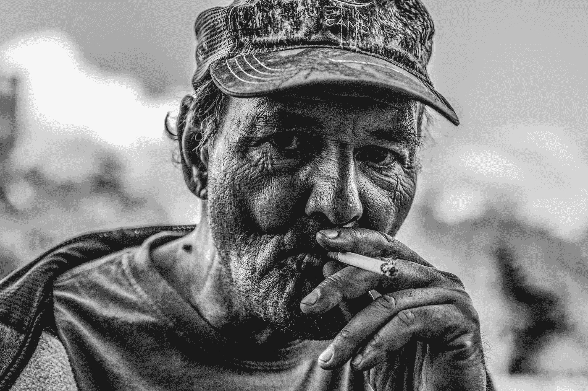

# 一个无家可归者的销售 101 课

> 原文：<https://medium.com/swlh/sales-lessons-101-from-a-homeless-guy-4392c232d84a>

## 我刚给了一个流浪汉 8.5 美元。

Photo by [Patrick Hendry](https://unsplash.com/photos/jCimF7LYlKE?utm_source=unsplash&utm_medium=referral&utm_content=creditCopyText) on [Unsplash](https://unsplash.com/search/photos/homeless?utm_source=unsplash&utm_medium=referral&utm_content=creditCopyText)

为什么？

因为我很好？

因为我累了？

因为我一个人旅行，想和你聊聊天？

可能是上述原因的结合，但它们不是真正的原因。