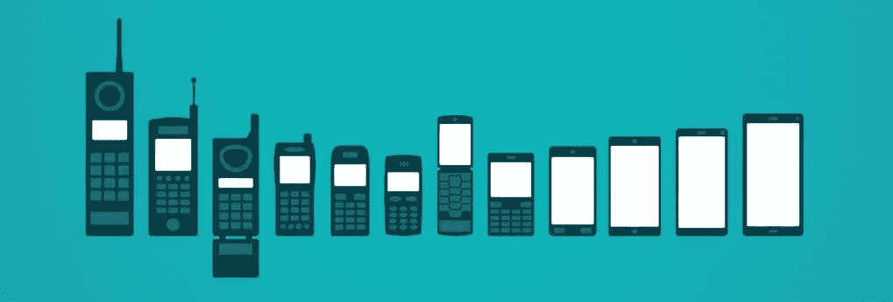

# 三星 Galaxy 开箱——让消费者重新回到一切的中心

> 原文：<https://medium.com/swlh/samsung-galaxy-unpacked-putting-consumer-back-in-the-heart-of-everything-b32a8a2a9>

在 Galaxy S 系列十周年前夕，三星在旧金山的 unpacked 活动中发布了几个主要的产品发布会、演示和技术展示。

Galaxy UNPACKED 2019 [Source](https://youtu.be/ISjiJQGJ72o)

这一事件是科技公司和 OEM 制造商的心态正在慢慢转变的一个例子。到目前为止，你已经看到了 Galaxy Fold、多个 S10、耳塞和在活动中宣布的可穿戴设备。这不是我们在这里要谈的。

> 整个主题演讲的重点是消费者的体验。从这个产品可以做这个，到这个产品让你做那个。

这个主题演讲只是一个受欢迎的明显趋势的例子，至少在智能手机领域是如此。从传感器的数量，到相机的数量，再到摄影。从更好的显示到增强的观看体验。故事发生了变化，从你可以放在口袋里的一块魔砖，变成了你口袋里的一块让你施展魔法的砖。

这不一定*只是*营销谈话。这反映了现在产品的生产方式。这并不意味着用户在之前的开发周期中从未被关注过。这仅仅意味着技术和人已经成熟到用户是产品开发的积极部分的程度。反馈会立即收到，产品周期比人们购买升级设备的速度更快，周围的技术发展如此之快，以至于人们可以用智能手机做的事情数量每年都呈指数级增长。

这也是恐惧的反映。并不是 iPhone 进化到了巅峰。推动这一领域发展的不是三星。事实是，整个智能手机生态系统现在处于一个更高的水平。在越来越多的竞争者中脱颖而出已经够难了，但在一个“停滞不前”的行业中就更难了。但令人振奋的是，这种恐惧蔓延的不仅仅是噱头，它还鼓励制造商横向扩展产品线，认真思考如何为用户的生活增加价值，这让他们迫切需要重新思考他们的产品战略。

# 我们是如何到达这里的？

像黑莓这样的公司最初的目的是简化忙碌的职业人士的生活。让她更有效率更容易接近。移动电话仍然牢牢扎根于商业领域。

最初的 iPhone 延续了一个纯产品创新的时代。向公众定义和巩固智能手机的类别，每一次迭代都以指数方式建立在产品的功能上。将移动体验带给普通人突然打开了一个巨大的市场、竞争、增长空间，基本上是将蛋糕做大。

The evolution of smartphones. [Source](https://www.cashify.in/blog/the-last-decade-evolution-of-smartphones/)

其他制造商纷纷效仿。Android 使整个智能手机市场民主化——现在你可以看到智能手机几乎掌握在任何人手中。应用程序成为智能手机业务的主流部分。社交媒体巨头逐渐成型，并决定了用户在手机上的大部分行为。

随着产品创新时代的成熟，技术的飞跃变得越来越快，而不是呈指数增长，功能之战随之而来。将一个你熟悉并使用的设备系好，在这里或那里增加一点功能，你可以用它做一系列额外的事情。

# 接下来呢？

智能手机制造商已经开始稳步构建一个沿着其横向产品系列发展的生态系统。联网设备、可穿戴设备和物联网已经开始塑造大型制造商的产品线。人工智能、增强现实和虚拟现实已经开始成为家喻户晓的缩略语，我们正处于一个智能手机成为一个人与其他人、互联网和整个世界联系的主要门户的时代。

这并不是说为了创新，智能手机将经历惊人的转变。但它将经历一系列根本性的后端转变，以及面向消费者的增量更新。我们将再次到达一个地方，希望智能手机的所有无关方面都将被剥离价值。重点将再次回到它让你做什么，而不是成为最新的型号，品牌 X，或者，有 4 个摄像头。

然而，事实证明，智能手机的下一个十年发展肯定会是一个更加复杂的旅程，如果不像上一个十年那么浮华的话。

*您可以关注我们的* [*推特*](https://twitter.com/monsoonfishy)*/*[*insta gram*](https://www.instagram.com/monsoonfish/)*/*[*脸书*](https://www.facebook.com/monsoonfish)*/*[*LinkedIn*](https://www.linkedin.com/company/13404751/)

## 这篇文章发表在 [The Startup](https://medium.com/swlh) 上，这是 Medium 最大的创业刊物，拥有+427，678 名读者。

## 在这里订阅接收[我们的头条新闻](https://growthsupply.com/the-startup-newsletter/)。

