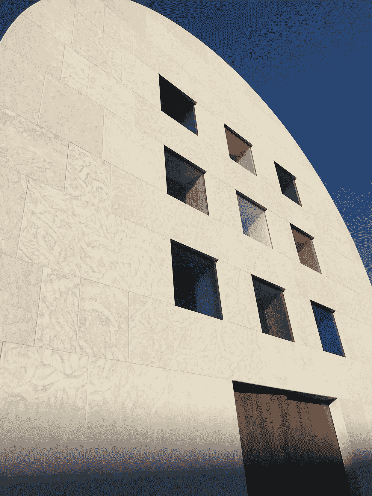

# 避难所技术:超越监控资本主义

> 原文：<https://medium.com/swlh/sanctuary-technology-transcending-surveillance-capitalism-492626954bbd>

**Austin***, Ellsworth Kelly. All photos courtesy the authors.*

近二十年来，监控资本主义模式一直主导着互联网经济，给个人和社会带来了巨大的代价。人类正在觉醒，意识到监视资本主义的做法以无数种方式侵入他们的生活，干涉他们的关系，并颠覆他们的目标。世界各国政府都在采取行动遏制监控资本家的…