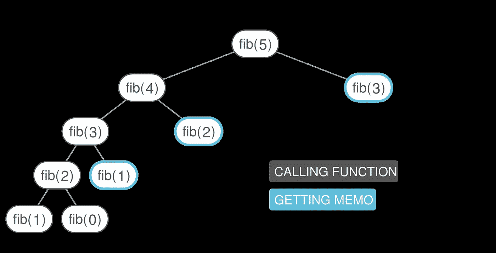

# JavaScript 记忆化节省能量和时间

> 原文：<https://medium.com/swlh/save-energy-and-time-with-javascript-memoization-5167bc36e8b7>

## 学会使用和应用记忆来节省 JS 调用的时间

Image from [Interview Cake](https://www.interviewcake.com/images/svgs/fibonacci__binary_tree_memoized.svg?bust=203)

除了考虑时间复杂度来优化运行时间，**记忆化**是另一个降低代码运行速度的有效策略。对我们来说幸运的是，这种技术很容易理解，应用起来也很简单，从中级到高级理解…