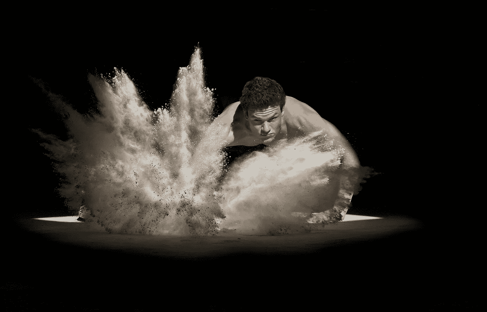
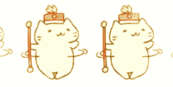

# 救猫，已经！

> 原文：<https://medium.com/swlh/savethecatalready-f3dc4028ce10>

## 我们为什么要救这只猫？

## 拯救猫方法简评

Photo by [Art Lasovsky](https://unsplash.com/@artlasovsky?utm_source=unsplash&utm_medium=referral&utm_content=creditCopyText) on [Unsplash](https://unsplash.com/search/photos/writer?utm_source=unsplash&utm_medium=referral&utm_content=creditCopyText)

布雷克·斯奈德向世界介绍了拯救猫的方法。此后，它被广泛应用于电影行业和散文行业。

【他指的是长篇小说和短篇小说。]

我要给你粗略地看一下这个方法，它包括一个节拍表和十个通用课程。【戏剧性。]你可以从 Snyder 的书里读到更多，我不打算宣传这本书……我已经在其他文章里介绍过了。

我也会尽量保持简短；我知道你是个大忙人。好吧，就像创可贴一样，让我们把它撕掉。

【哎哟。]

抱歉。

# 十大通用课程

在宇宙中，有十个普遍的教训。你可以在自己的时间里争论这是真是假。]

Photo by [Nils Stahl](https://unsplash.com/@nilsjakob?utm_source=unsplash&utm_medium=referral&utm_content=creditCopyText) on [Unsplash](https://unsplash.com/search/photos/lesson?utm_source=unsplash&utm_medium=referral&utm_content=creditCopyText)

1.  宽恕
2.  爱
3.  接受
4.  信任
5.  害怕
6.  信任
7.  幸存
8.  无私
9.  责任
10.  救赎

这些是英雄在他/她的旅程结束时学到的教训。在某种程度上，这是故事的主题，也是你的观众从故事中得到的东西。

现在，这可以以任何方式和形式被塑造，导致许多可能性。不要觉得你被迫只使用一个。将这些经验融入你的故事中。

# 节拍表

这是主要事件，大奶酪，这篇文章的全部要点。所以准备好你的笔做些笔记。

这个方法仍然是一个故事的三幕结构，但它把它分解成可理解的部分。

## 打开图像

Photo by [Andy Kelly](https://unsplash.com/@askkell?utm_source=unsplash&utm_medium=referral&utm_content=creditCopyText) on [Unsplash](https://unsplash.com/search/photos/scene?utm_source=unsplash&utm_medium=referral&utm_content=creditCopyText)

你的故事将这样展开。你想先画什么形象？这是电影中的第一个场景，或者是你的读者在你的短篇故事或小说中读到的第一件事。

我发现的最酷的事情之一是让这个奇妙的开幕图像带有一些象征意义，然后让最终图像反映这一点。我们越往下走，我就越清楚。

记得展示而不是讲述。用散文写作可能很有挑战性，但我相信你。甚至有时我也会忘记。]

## 主题陈述

一旦你有了开头的形象，你就要接着你的主题前进，这是强制性的，有些作家在写作时甚至不会想到主题。这很好。

如果你想让你的故事有一个坚实的基础，那么一个主题可以帮助你建立这个基础。

我读过的一些关于主题的建议是，你应该在开头陈述，然后在结尾重申。放在哪里，主题由你决定。总的来说，这个主题是为你连接哪些角色需要学习这个主题。

次要角色通常是在第一幕中暗示它的角色。记住，不要对着读者大喊大叫，确保你巧妙地将主题隐藏起来。

要有创造性，一个人不必说出来；任何人任何事都可以说。

## 设置

现在我们是故事的主体。这是你介绍故事中所有人的地方。确保你介绍了主要人物和所有重要人物。这是催化剂产生变化之前的生活。它表明主角有缺点，但不想改变。

你不必介绍每个人，你总是可以慢慢地让他们进来，但一定要包括将参与催化剂的人。

这也是一个很好的时间来陈述主题，人物的缺陷，以及主要人物的外部目标。

## 催化剂

Photo by [Lopez Robin](https://unsplash.com/@lopezrobin?utm_source=unsplash&utm_medium=referral&utm_content=creditCopyText) on [Unsplash](https://unsplash.com/search/photos/explosion?utm_source=unsplash&utm_medium=referral&utm_content=creditCopyText)

催化剂有许多名称，如初始事件、开放事件、煽动事件或触发器。这打破了主角的现状，迫使他们进入一个陌生的世界。

它应该足够大，主角不能回到他们正常的生活。

## 辩论

这是主角争论他们是否应该进入这个新世界的地方。记住主角不想改变；这个节拍清楚地告诉我们，这个角色很难改变。

## 闯入 2

这是从旧世界到新世界的过渡节拍。现在我一直在说新世界，但我的意思是，它与主角所习惯的不同。

这必须是与现状明显不同的变化。这个新世界不会让主角变得更好，但这是改变角色的第一步。主角在新世界里做的是他/她想要的，而不是他们需要的。

## b 故事

故事中的角色可以是任何人，比如新欢、导师、朋友甚至是仇人。通常，这个角色是新世界的产物，在某种程度上，代表了主题。

## 乐趣和游戏

锦标赛弧线！！！！！！锦标赛弧线！！！这是他妈的锦标赛！！！

抱歉，这是有趣的地方。这是主角在这个新世界开始失败然后成功的地方。主角慢慢开始习惯这个世界，但仍然没有做他/她需要做的改变。

它表明第一幕和第二幕有很大的不同。两种行为必须是对立的。如果说第一幕充斥着小型货车，那么第二幕则充斥着高速跑车。

## 中点

这是所有乐趣和游戏接受考验的地方，主角试图向所有人证明他/她已经改变了。这个节拍以两种方式结束；虚假的胜利，或者虚假的失败。

这是世界碰撞的地方，赌注也提高了。主角现在正从他们想要的转向他们需要的。

Photo by [Randy Jacob](https://unsplash.com/@randvmb?utm_source=unsplash&utm_medium=referral&utm_content=creditCopyText) on [Unsplash](https://unsplash.com/search/photos/bad-guys?utm_source=unsplash&utm_medium=referral&utm_content=creditCopyText)

## 坏人逼近了

这是乐趣和游戏的对立面。没有更多的乐趣；乐趣消失了。在中间点之前，主角的一切都很顺利，现在一切都严重失败了。

主角的缺陷正在把他们打倒，他们做什么都无法挽回。这是一个螺旋上升的问题池，问题越积越多。导致；

## 一切都失去了

这就是一切都分崩离析，主角无法继续前进的时候。这应该是另一个催化剂。死神应该就在门边等着主角放弃所有希望。

Photo by [Mishal Ibrahim](https://unsplash.com/@mishalibrahim?utm_source=unsplash&utm_medium=referral&utm_content=creditCopyText) on [Unsplash](https://unsplash.com/search/photos/lost?utm_source=unsplash&utm_medium=referral&utm_content=creditCopyText)

它必须足够大，大到能把主角推进第三幕。

## 精神的黑夜

我们的英雄现在正在反思到目前为止发生的一切，无论是他/她的行为还是缺点。节拍应该引导你的主角顿悟。

主角的生活应该比开始时更糟糕。

## 闯入 3

主角终于知道主题是什么，也学会了，但是知道和付诸行动是两回事。从这一刻开始，主角所做的一切都是因为他/她需要去做。不再有欲望。

第三幕世界应该是旧世界和新世界的结合。

## 结局

Photo by [Thao Le Hoang](https://unsplash.com/@h4x0r3?utm_source=unsplash&utm_medium=referral&utm_content=creditCopyText) on [Unsplash](https://unsplash.com/search/photos/kung-fu?utm_source=unsplash&utm_medium=referral&utm_content=creditCopyText)

主角正在努力实施他/她的计划来击败主要对手。这也是主角向每个人证明他/她已经学会了主题并利用它来确保胜利的地方。

## 最终图像

与开场图像相同，但显示了主角的转变。最终产品。一个很好的镜像效果。

# 结论

总的来说，我认为这种方法是为你的故事打下坚实基础的一种非常好的方法。它不会让你在几秒钟内成为畅销书，但是通过练习和时间，它可以帮助你创作出可以流传千古的故事。

你可以随时阅读布莱克·斯奈德和杰西卡·布罗迪的《拯救猫》一书，以获得更多关于节拍表和课程的深入知识。