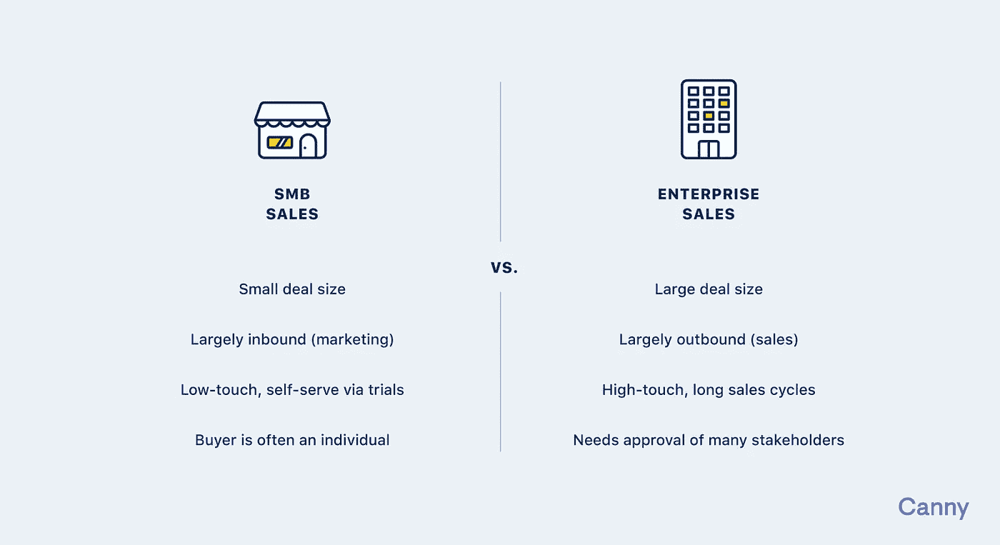

# 对大客户说不

> 原文：<https://medium.com/swlh/saying-no-to-big-customers-a1e37f7b6e49>

想象一下:

现在是早期。你有不到 100 个客户，但是事情看起来很有希望。在“办公室”里，当你听到熟悉的对讲机实时聊天的“叮”声时，这是很平常的一天。这是一条线索，他们来自大公司 x。

你的思维开始加速。无论如何，我们必须完成这笔交易。他们会付我们多少钱？我们能让他们付我们多少钱？所有人，停下你们的工作！就这样，我们成功了！

等一下。

当你开始创业时，任何机会都令人兴奋，尤其是大机会。让你的 MRR 翻倍的机会？真见鬼。很难退一步思考说“是”的含义。如果你像我们一样是一家低接触的 SaaS 公司，大公司 X 可能不是你的理想客户。

> *【初创公司】获得了一点点潜在利益，他们只是对这种潜在利益说是，而没有完全意识到你必须如何在企业游戏中取胜。*
> 
> *–*[*Steli Efti，启动聊天*](https://thestartupchat.com/ep236)

后果往往比看起来更有害。你可能会浪费时间，建造错误的东西，并在这个过程中迷失自己。

# 大公司有大公司的需求

发现一家大公司很容易。他们的网站看起来像这样，他们会问这样的问题:

*   你能和我们的员工一起做培训吗？(我猜是吧？)
*   我们能和您的销售团队一起安排一次演示吗？(什么销售团队？)
*   产品有报告吗？(试试我们的 API！)
*   你支持 IE 吗？(否)
*   你能分享一下你上次渗透测试的细节吗？(请问？)

这些都是企业公司，相对于卖 SMB 来说是高触达的。达成交易需要经历一个漫长的销售过程。这需要你的团队投入大量的时间和精力。它涉及到在公司的层级中与合适的人交谈。我们听说过这样的故事，创始人做了几次演示，却发现没人能买。

我们已经走上了销售企业客户的道路。我们已经拒绝了详细的安全审查、内部支持和冗长的数据保护问卷。

如果你的团队有数百人，也许你已经为流程中的每一步都安排了专人。如果不是，你的时间最好花在别的地方。

# 时间是我们最宝贵的资源

当然，大公司 X 经常要求新的特性。作为一个产品团队，我们天真地认为:我们可以处理这个。我们把东西搬来搬去吧！没什么大不了的。

停在那里。这是一件大事。

作为初创公司的创始人，我们知道在任何给定的时间里，我们都有一百万件事情可以做，但时间却有限。

功能请求通常属于以下两类之一:

1.  他们将使所有其他顾客受益
2.  他们只会让大公司 X 受益

当特性落入第一桶时，很好。这听起来像是一个全面改进产品的机会。然而，这是你正在做的最有影响力的事情吗？戴上产品经理的帽子，看看这些特性是否值得优先考虑。我们已经写了如何进行[特性优先级排序](https://canny.io/blog/roadmap-prioritization-guide/)。

当特性属于第二类时，不要构建它们。不要给你的产品添加很少有人会使用的功能。这是功能膨胀，它使你的产品更不集中，更令人困惑。制造错误的东西会给你的竞争对手带来优势。

时间是有限的资源。不仅要考虑构建功能所需的时间，还要考虑维护功能所需的时间。

# 不要忘记你为什么创办自己的公司

我们开始 Canny 的原因如下:

1.  我们认为反馈是所有软件公司的问题。
2.  我们希望建立一个伟大的、可持续发展的企业。
3.  我们想玩得开心！

别误会，卖给企业是有好处的。也就是说，他们付出更多，流失更少。

以下是我们不专注于向企业销售的原因:

1.  我们资源有限。向企业销售意味着不向大多数企业销售。
2.  我们宁愿许多小企业支付少量费用，也不愿少数企业支付大量费用。当你为几个大客户建立业务时，你很容易受到他们需求的影响。多样化的客户群意味着你可以在没有单一公司偏见的情况下做出决策。风险也更小。
3.  企业销售不好玩(对我们来说)。

我们团队的优势在于打造伟大的产品。我们知道，在建立以产品为导向的业务方面，我们会更成功(也更有乐趣)。以销售为导向的企业是可行的，但它们不适合我们。因此，我们决定 Canny 将是自助式的，专注于中小型公司。

Christoph Janz 的经典博客文章强调了[打造 1 亿美元业务](http://christophjanz.blogspot.com/2014/10/five-ways-to-build-100-million-business.html)的不同方法。在他的规模上，我们在兔子的地盘上茁壮成长。

这个答案对你来说可能不同，这完全没问题。只需知道 SMB 和企业销售有着根本的区别。

托马斯·东古兹也有一篇[的精彩文章](https://tomtunguz.com/optimal-path-smb-mid-ent/)，概述了每条道路之间的一些差异。问问你自己，向企业销售是否适合你的产品和团队。

答案改变也没关系。事实上，许多团队都是从 SMB 开始，然后发展到企业。如果你知道你将面临什么，这是一个可靠的策略。

# 我们如何说不

我们已经有几家大公司和 Canny 签约了。

我们考虑如何支持他们。我们考虑他们需要的功能。在某些情况下，说“是”，我们就变成了一家咨询公司。我们将为我们的产品添加定制功能，以满足单个客户的需求。

当没有合适的人选时，我们会说不。

坚持上面列出的理由，决定是容易的。我们绝不希望以牺牲我们的核心客户群为代价来满足巨头的需求。我们希望打造一款出色的产品，为许多企业增加价值。

> 当你不知道自己相信什么的时候，一切都变成了争论。一切都值得商榷。但是当你坚持某事时，决定是显而易见的。
> 
> *―* [*杰森炸，返工*](https://www.goodreads.com/book/show/6732019-rework)

我们按照这些思路说:

> *我们已经决定目前不能优先考虑功能 X 和 y。*
> 
> 我们是一个小团队，必须小心使用我们的时间。这些功能需要一个多月的全职工作。他们也不会增加我们现有客户的价值。
> 
> *我们知道这些功能可能会影响您的交易，但如果您仍有兴趣继续发展，请告诉我们。*

发送这些回复相当令人宽慰。我们可以专注于更大的影响，而不是改变我们为这个新客户打造产品的计划。

# 什么时候说好

当然，创业公司没有什么是硬性规定。有时是为了赢得你主页的标志或案例研究。有时候会有投资人这样的外部压力。

对你们这些风投支持的 SaaS 人来说，逆流而上是剧本的一部分。你可以比你的自举对手说“是”。尽管如此，还是要注意你获得每个客户的成本。

在许多情况下，大公司很乐意开始使用我们现有的产品。我们很高兴让他们上场。绝对是的。

在某些情况下，他们要求一些特定的功能。我们清楚地表明我们同意建造什么，不同意建造什么。这里的关键是设定期望值。弄清楚你提供的是什么，是你已经有的功能还是你将要开发的功能。我们设定了对支持、定价和新功能的期望。

我们非常喜欢这种方法，因为它仍然为我们将来扩展他们的帐户留有余地。

运用你最好的判断力。问问你自己，潜在客户是否值得你付出努力。

# 选择权在你！

与企业客户合作与中小型企业完全不同。幸运的是，作为一家自举式创业公司，我们可以决定是否要玩。投资者通常希望你尽可能快地建立起最大的公司。通常情况下，创业公司会被迫逆流而上。

> 今天的大多数公司在早期就失去了控制，让外人来决定他们的方向。这在某些情况下行得通，但在大多数情况下会悲惨地失败。外人根本不会像你一样关心你的使命、你的产品或你的员工。
> 
> *–*[*阿米尔·萨利赫芬迪奇，多伊斯特*](https://doist.com/blog/no-exit-strategy/)

目前，我们是一个小型的、专注于产品的团队。我们正致力于建立一个稳定、盈利的企业。我们自豪地以客户为导向，但我们仍然是这艘船的船长。知道你是谁。你会更开心，你的客户也会更开心。快乐大厦！

*原载于 2019 年 4 月 10 日*[*canny . io*](https://canny.io/blog/saying-no-big-customers/)*。*