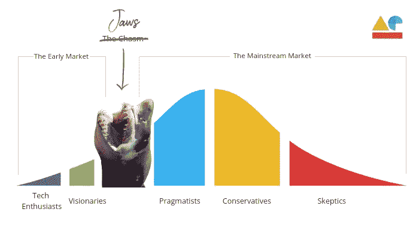

# 扩大我们的创业规模

> 原文：<https://medium.com/swlh/scaling-our-startup-1d835da898a7>

# 我们的科技公司如何跨越鸿沟而不掉进去(并流血)

杰弗里·摩尔和他 1991 年的著作《跨越鸿沟 》使科技产品的早期成功和持续市场接受度之间的鸿沟广为人知。

我喜欢从不同的角度来看待这个鸿沟。对我来说是大白鲨。是的，就像 1975 年的大片《T4》中的大鲨鱼一样。

My Version of the Technology Adoption Bell Curve