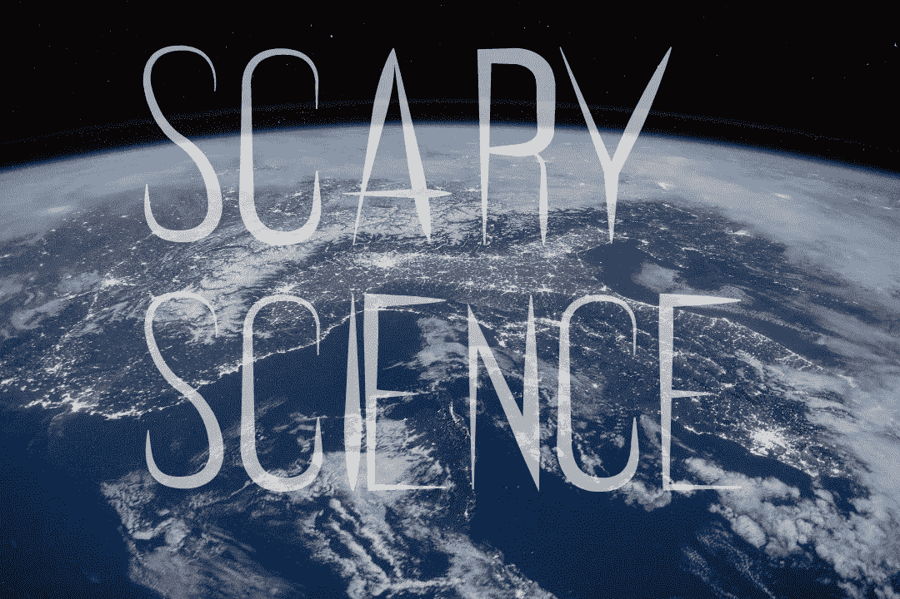

# 可怕的科学:太阳能把我们扔回到黑暗时代

> 原文：<https://medium.com/swlh/scary-science-the-sun-can-throw-us-back-to-the-dark-ages-e42fa8e57d4f>

大多数人生活在对他们所居住的世界一无所知的幸福中。无论是生命运作的生物构造，还是金融市场的复杂本质，一个人不可能精通所有领域。人的大半辈子都可以不了解自己汽车的工程，更不知道转基因作物的过程。