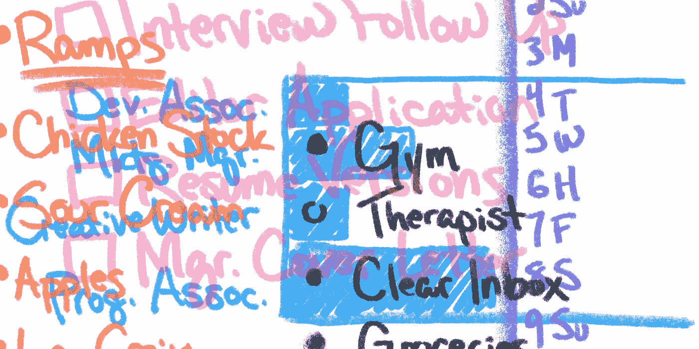

# 预定的幸福

> 原文：<https://medium.com/swlh/scheduled-happiness-2cb833ee314e>

我的日程表上有什么？让我看看我的 iPhone 提醒，子弹日记，看板，Asana 任务列表，便利贴，谷歌日历和公告板。

商学院是我人生中第一次被迫主动控制自己的日程。通常我依靠父母的指导，班级和俱乐部的时间表，以及我的兄弟会的义务清单(学习时间，必须参加的会议，慈善事业…