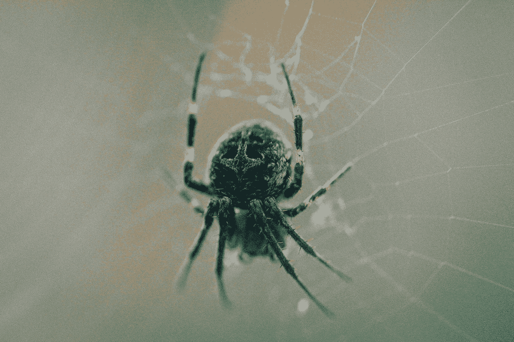

# 用 Node js 刮世界

> 原文：<https://medium.com/swlh/scrape-the-world-with-node-js-fd9ed5aa197a>

Photo by [Lee Agosila](https://unsplash.com/@leeagosila?utm_source=medium&utm_medium=referral) on [Unsplash](https://unsplash.com?utm_source=medium&utm_medium=referral)

# 目录:

1-灵感

2-什么是网页抓取？

3-需要什么工具？

4-我们来编码吧。

4-你可能面临的最常见的挑战

6-结论

# 灵感: