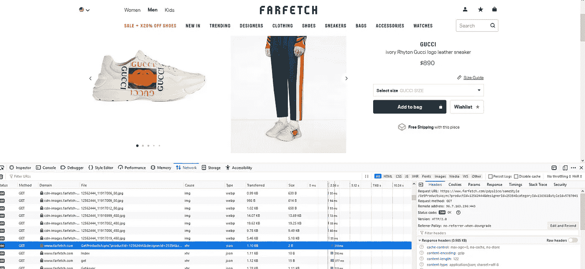

# 用 Python 刮 180k 奢华时尚产品

> 原文：<https://medium.com/swlh/scraping-180k-luxury-fashion-products-with-python-ba42fdd831d8>

## 如何在 FarFetch 上找到无证 API，用 3 个工具创建 Python 包；火狐网站开发者，请求和熊猫。

我决定采用更基本的方法，只用 Python 中的请求库，而不是使用 Scrapy 或 Selenium 等流行的 web 抓取包。这里的目标是…