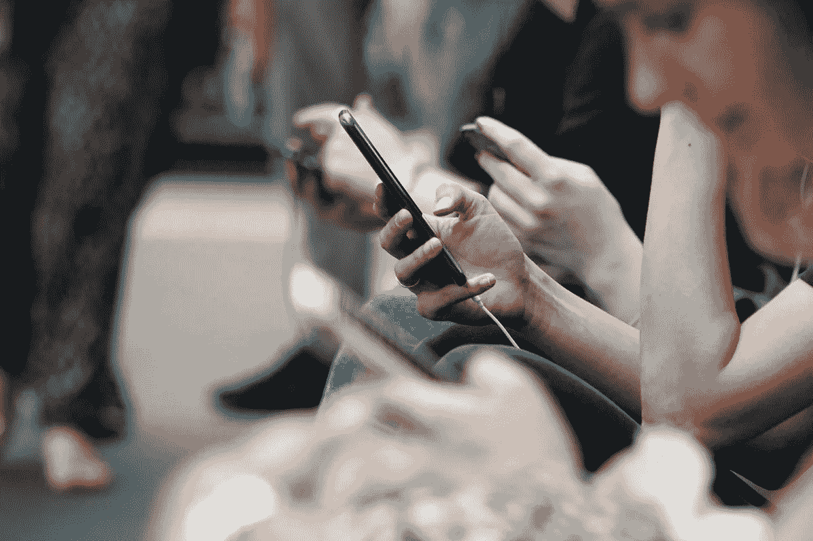
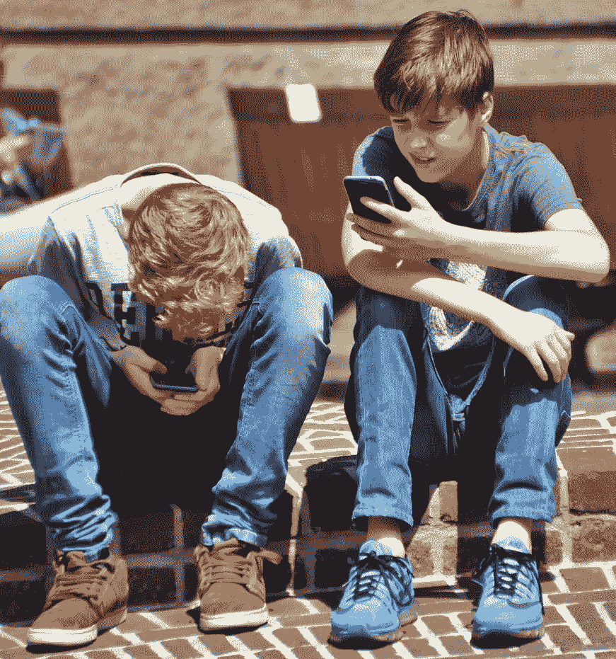
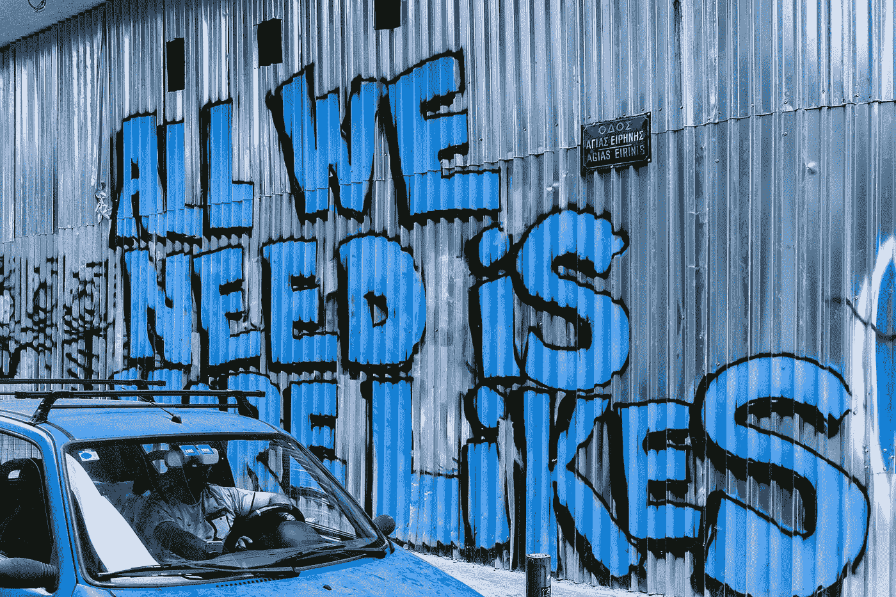
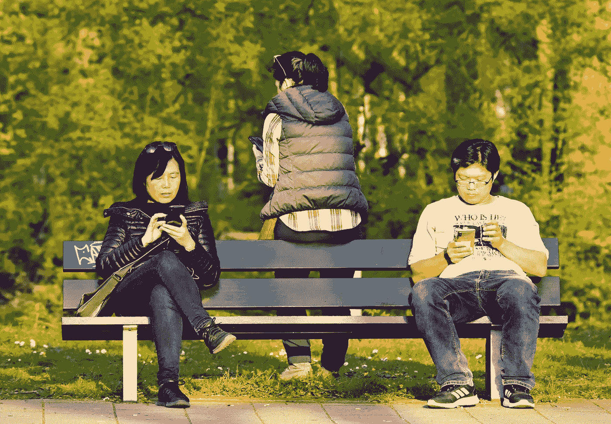

# 屏幕成瘾正在慢慢杀死我们和我们的关系

> 原文：<https://medium.com/swlh/screen-addiction-is-slowly-killing-us-and-our-relationships-509828082b50>

photo source: Unsplash

你还记得你的手机主要是用来和某人通话的设备吗？

在那些日子里，比如说 10 年前，我们依靠手机与他人进行实时的面对面交流。我们利用这些交流通过口语来传递和接收信息。

我们必须仔细聆听所传达的信息，但我们也必须依靠伴随的肢体语言和语调来理解更深层次的含义。通常表情或声音会透露出*没有说的话。*

如今，其中大部分已经丢失，或者至少更难吸收。通过减少个人互动的例子，无论是通过面对面交流还是通过现场直播，我们已经进入了一个纯交易对话的时代。我们依赖技术来进行严格的信息交流，这种交流通常是快速而肤浅的。

现在，一个表情符号有望表达一切。😲

# 依靠技术交流的缺点

当我们抛弃这种失落的艺术形式时，显然有太多被抛弃的东西。(我能把和其他人直接交谈称为一种失传的艺术形式吗？！).但是这种社会变革伴随着巨大的成本。尤其是在翻译过程中反复出现的东西丢失的风险。

但更有害的副作用是缺乏有意义的人际交往带来的精神健康后果。没有人需要确凿的统计数据来证明我们最年轻的一代正在努力应对更多的孤独、焦虑和抑郁。

根据圣地亚哥州立大学心理学教授、《T4:为什么今天超级互联的孩子在成长过程中变得更少叛逆、更宽容、更不快乐——并且完全没有为成年做好准备》一书的作者让·特温格的说法在 2010 年至 2015 年的短短五年间，在[大型全国调查中，报告感觉到典型抑郁症症状的美国青少年人数激增了 33%](https://journals.sagepub.com/doi/abs/10.1177/2167702617723376?journalCode=cpxa)。青少年自杀企图增加了 23%。但更令人不安的是，实际自杀的 13 至 18 岁青少年人数上升了 31%。

photo source: Unsplash

在这段时间里发生了什么事情，让这些数字发生了突然而显著的变化？特温格回顾了这些数据，并排除了失业率飙升、离婚率上升、收入不平等扩大甚至更大的学业压力等社会经济因素。相反，她认为这与智能手机的日益普及和使用有着完美的关联。

# 过度使用屏幕会影响我们的大脑

智能手机现在无处不在，我们对它们的依恋是永恒的。就像第五个附属物一样，我们的智能手机从来不会远离我们——在我们的手中，在我们的后口袋里，在晚上我们的床边(10%的人睡觉时把它放在枕头下)。

屏幕主宰了我们的注意力，我们对它们的依赖刺激了上瘾的倾向。痴迷地查看电子邮件、短信和社交媒体更新是由我们对多巴胺的渴望驱使的。多巴胺是我们大脑中调节动机的化学物质。当我们吃美味的食物、做爱、锻炼和进行积极的社会互动时，我们会有一股美好的兴奋感。所以我们真的渴望这种社会认可。

# 技术创造者密谋反对我们

脸书、Instagram、Snapchat 等的创造者有意利用了这种无意识但非常强大的驱动力。他们有目的地设计了一种在线体验，以引发类似可卡因成瘾的反应。

“我感到非常内疚，”脸书大学负责用户增长的前副总裁查马斯·帕里哈皮蒂亚(Chamath Palihapitiya)对一群斯坦福学生承认道。他在回答一个关于脸书参与利用用户行为的问题。“我们创造的短期多巴胺驱动的反馈回路正在破坏社会的运转，”他承认道。

技术的这种危险的负面影响是最早的发明者也意识到的。令人震惊的是(但也可能不是)，比尔·盖茨和史蒂夫·乔布斯都在一个没有高科技的家庭中养育了他们的孩子[。对于比尔·盖茨来说，他的禁令可以追溯到 2007 年，当时他发现他的女儿对视频游戏产生了不健康的依恋。](https://www.businessinsider.com/screen-time-limits-bill-gates-steve-jobs-red-flag-2017-10)

他甚至不让他们在 14 岁之前拥有手机(今天，孩子们拥有第一部手机的平均年龄是 10 岁)。甚至史蒂夫·乔布斯在 2011 年的一次采访中也表示，他不愿意让自己的孩子拥有 iPad。iPad 刚刚推出。

社交媒体公司有意设计他们的产品，以促进无止境的无止境的消费活动。他们从赌场学到了他们的最佳实践，赌场设计他们的物理空间，以确保你不认识你周围的世界。赌场既没有钟也没有窗户。

此外，社交媒体公司利用了我们对认可和接受的渴望。“喜欢”按钮不是偶然出现的。我们鼓励用户分享，这样就有了源源不断的内容，其他人可以通过社交反馈对其进行评估。作为不知情的受害者，我们精心制作了完美的信息，以帮助确保广泛认可的最佳参与。

但是当喜欢、评论和分享没有出现时，我们不禁感到失望、被忽视，甚至被回避。

photo source: Unsplash

# 我们的屏幕时间持续增长(以年计)

这些装置正在慢慢杀死我们。那么我们有问题吗？是的，我们有。

数据还表明，花在网上的时间越来越多，与社会孤独感越来越强之间存在关联，而社会孤独感是自杀的一个主要风险因素。

意识到我们使用了多少技术可能会令人震惊。大多数人低估了它们的使用量大约一半。截至 2017-2018 年，成年人平均每天使用技术(除了工作)的时间为 4 小时。对一些人来说，比如青少年，我们知道这要多得多。当你计算时，这可能会增加我们一生中盯着屏幕的 11-15 年。

因此，随着技术的使用越来越多，这些技术可以跨越我们生命的数年，我们有意地让自己陷入更加抑郁的状态。

# 技术正在损害我们的社会联系

更糟糕的是，上网时间过长会对我们的社会联系感造成双重打击。首先，它从有益的面对面交流中偷走了时间，而这种交流是我们人类幸福和包容感的基础。

看到情侣在约会时更多地盯着屏幕而不是对方，这是一种悲哀但并不罕见的景象。你让家长们全神贯注而忽略了他们的孩子。然后，反过来，你有孩子忽视他们的父母。每个人都带着他们的数字可卡因去他们各自的角落。

第二个缺点是，它把我们吸入了一个虚幻的世界，在这个世界里，头像和 Instagram 帖子呈现了一个虚假的现实。每个人都快乐，每个人都完美…除了我们。

这留给我们的是对我们社会群体的不充分的归属感。无论是我们自己的家庭、朋友、同事、邻居还是更广泛的人类。随着孤独感的蔓延，我们直接或下意识地问自己:*我们到底属于什么？*

# 决定管理我们生活中的科技

但是承认存在问题是重要的第一步。让我们放下手中的天平，看清这一切的真相。像金钱一样，技术是一种奇妙的资源，但如果滥用，可能会造成破坏。

我们不会也不应该放弃技术，但是我们应该重新审视它在我们生活中的作用。我们应该给它多大的能量？是否可以更好地管理它，在保护我们免受不良影响的同时提取好的方面？

以下是一些简单的建议，让我们重新掌控自己的数字生活。让你的屏幕成为仆人，而不是主人。

# 当心痴迷的技术使用

认识到技术对我们的强大吸引力是很重要的。75%的美国成年人一天 24 小时都在手机附近，经常每小时查看几次。在一项研究中，66%的英国智能手机用户自称患有“无手机恐惧症”，即害怕在任何特定时间丢失或没有手机。

认识到技术对我们行为的成瘾效应需要成为一个有意识的决定。作为第一步，只是承诺认识到无意识的冲动(为自己和他人)去抓住设备。很多时候，人们会把这种设备作为消除无聊的一种即时疗法。

观察餐馆里的人们，等公共汽车或电梯，或者填补谈话的间隙。你看到它是如何不断地被触及和盲目地被检查的吗？

photo source: Unsplash

当我在公共交通工具上时，我有时会看着别人强制性地检查他们的手机。快速浏览所有短信、电子邮件和社交媒体账户，不断刷新以寻找更新，这是一种常见的习惯。如果没有更新或任何新的东西让他们发布，他们会放下手机。他们看起来很失望。然后，在短短几秒钟内，他们又开始了整个过程。

# 将技术从你的个人空间中移走

如果你希望你的科技生活与众不同，那就为它制定一个计划。

社会心理学中的[接近度](https://en.wikipedia.org/wiki/Propinquity)概念表明，与你身体在物理上非常接近的事物会对你的生活产生更大的影响。婴儿的母亲通常把她的婴儿抱得很紧。

你随身携带钱包是有原因的。可能还有你的智能手机。因此，通过决定与智能手机保持距离，你是在告诉你的潜意识，它在你的生活中不那么重要。

通过行为架构在消费中创造有意识的停顿。预先确定你将如何与你的手机互动。如果你把手机放在离你比较远的地方比如锁着的抽屉里一段时间，你的习惯会有什么变化？

*疯狂的建议，我知道。*

相反，承诺在指定的时间不使用技术。决定不在早上第一件事或者晚上最后一件事看它。吃饭时或和爱人如你的配偶或孩子在一起时，不要看屏幕。

相反，把时间用在其他事情上，比如品尝你的食物，思考/梦想/规划未来，询问你所爱的人他们的生活。或者只是无聊。这是创造力和灵感迸发的时候。

# 衡量您对技术的使用

如果这是一个很大的步骤，请一个时间监督者进入你的生活。如果你想讽刺一下，你可以用一个类似 [Moment](https://inthemoment.io/) 的 app 来监控你的在线活动。

你也可以用老办法，预先确定开始时间和结束时间，以量化你的使用。决定严格的 30 分钟屏幕活动时间段，或者只看一集网飞电视剧。这种承诺迫使你离开体验，打破对技术的依赖。

其他常见的建议是定期将手机切换到飞行模式，并选择退出新闻和社交媒体通知。大胆一点，考虑一下把 app 一起删了。

# 寻找屏幕时间的替代品

睡觉！47%的成年人[由于使用互联网而失眠](http://consumers.ofcom.org.uk/news/digital-detoxers-ditching-devices/)。不要把手机带入你的就寝时间。入睡前至少一小时停止看屏幕。屏幕上的光线会扰乱你的生理节奏，有效地为你的身体制造时差。帮你自己(和你的身体)一个忙，把你的手机放在另一个房间或者在睡觉的时候关机。

如果你在进行这个没有屏幕的实验时感到焦虑无聊，提前计划这段时间要从事的其他活动。

*   走出去，融入大自然
*   锻炼
*   冥想或祈祷
*   做数独
*   烹调
*   画画还是画画
*   遛狗
*   玩棋盘游戏
*   从事低技术爱好
*   阅读一本书或杂志
*   写日记
*   和朋友喝咖啡
*   还有什么？？

photo source: Unsplash

显然，可能性是无限的，只要确保活动不需要一些屏幕交互来完成。

# 最后的想法

科技无处不在。它提供了很多好处，但也有可能带来很多坏处。与其盲目地放弃它，我们可以夺回我们的自主权，让*选择如何支配我们的时间和注意力。*

我们是自己思想的主人，有权力也有义务保护它。第一步是停下来，承认正在进行的游戏。真的认了。然后承诺另一个现实。在这里，真实世界的魅力及其有益的关系是最能吸引你注意力的东西。

# 行动起来！

指定一天客观地观察人们如何使用技术。不管是亲人还是陌生人。它们的使用是有意识的和有意的还是无意识的和习惯性的？也观察你自己对技术的使用。写下你的观察和你的想法。

如果你希望过上科技更平衡的生活，那就制定一个计划来衡量你的科技使用情况。为你何时以及如何使用技术制定一个计划。记录你对这个实验及其效果的感受。

*什么时候你发现技术成了你日常生活中的拐杖？*

ConvoConnection 为改善我们的现实社会关系提供了教育、灵感和动力。访问博客获取更多社会智慧。

*原载于 2019 年 6 月 19 日*[*【https://www.convoconnection.com】*](https://www.convoconnection.com/blog/Screen%20Addiction%20is%20Slowly%20Killing%20Us%20and%20Our%20Relationships)*。*