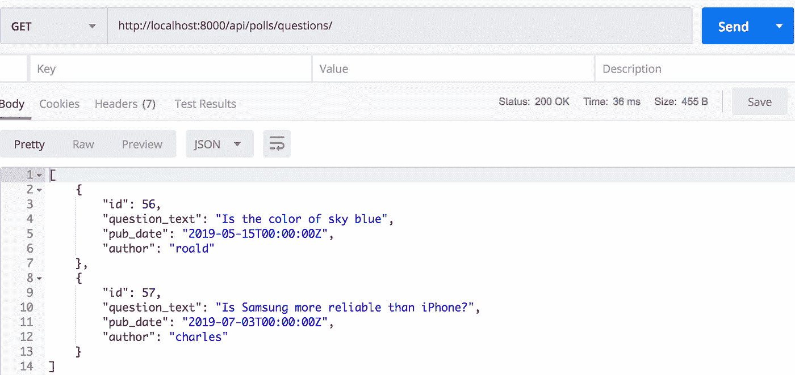
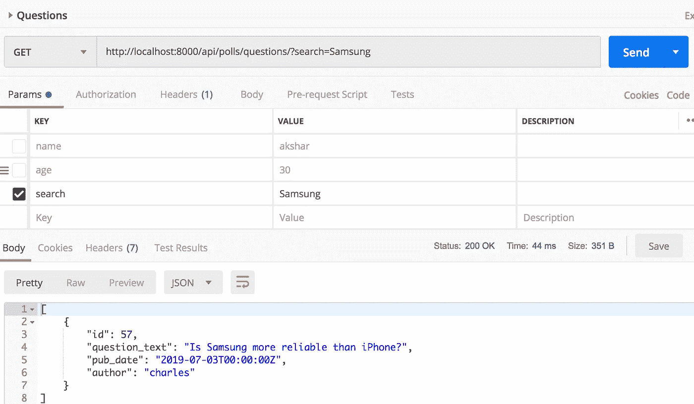
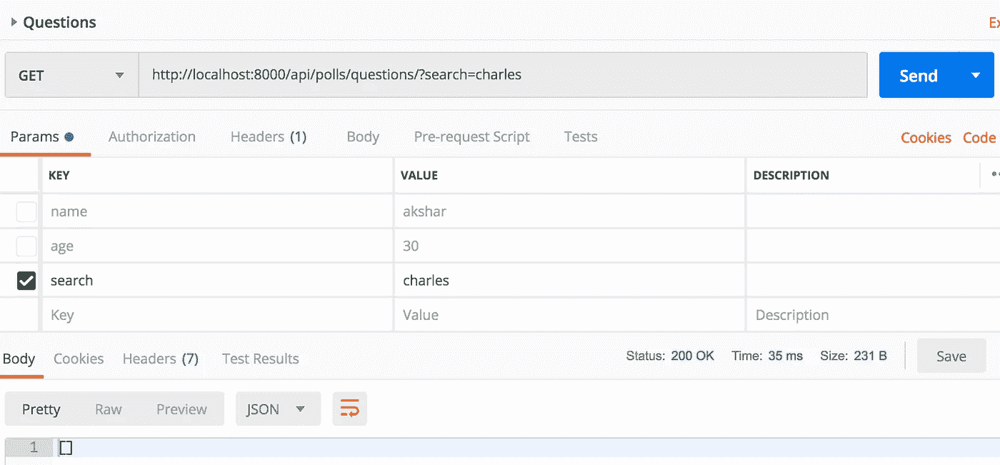
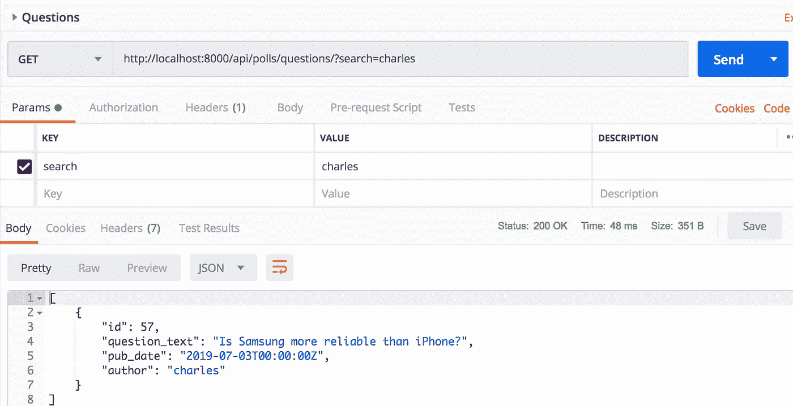
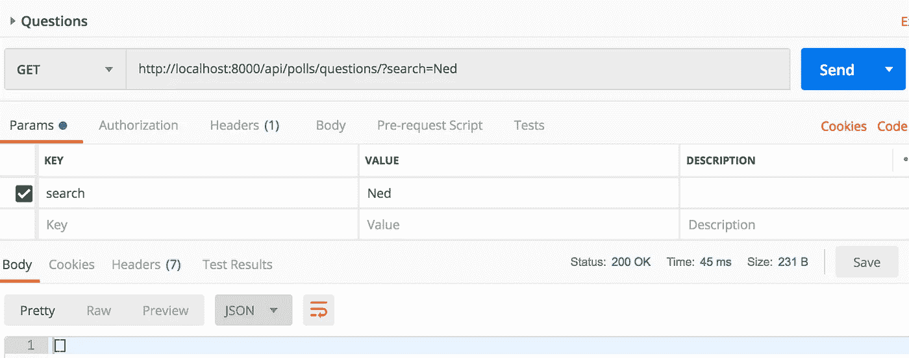
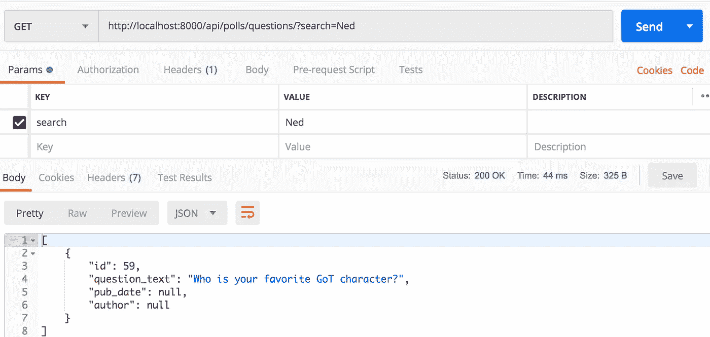
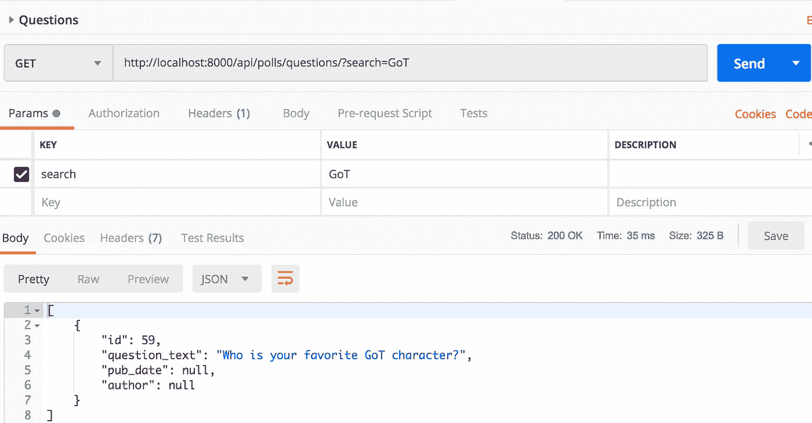
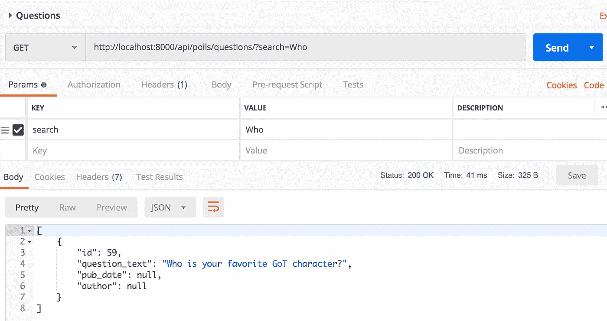
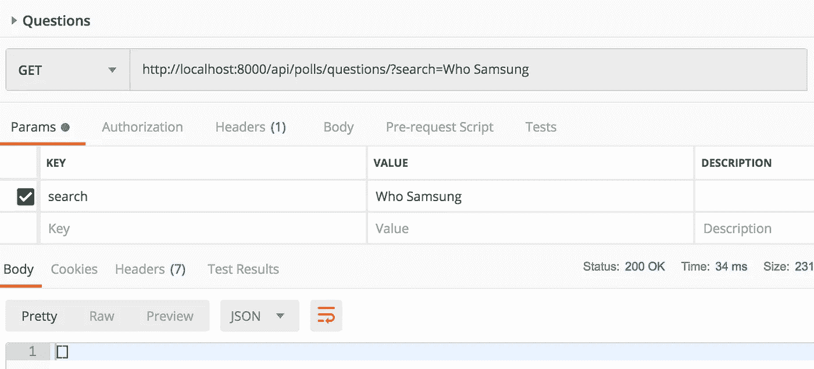

# 如何向 Django REST 框架支持的应用程序添加搜索功能

> 原文：<https://medium.com/swlh/searching-in-django-rest-framework-45aad62e7782>

# 议程

我们将讨论如何使用查询参数在 Django REST 框架中完成搜索。

# 设置

让我们用 Django 民调模型作为参考。

让我们添加以下序列化程序:

让我们添加以下视图:

让我们添加以下 urlpattern:

对`/api/polls/questions/`的 GET 请求返回一个包含所有问题的列表。



# 搜索

DRF 提供了一个名为`SearchFilter`的过滤器，它可以根据名为`search`的查询参数过滤查询集。

我们希望搜索在 question_text 中包含`Samsung`的问题。

这需要在 QuestionsAPIView 上添加两个属性。他们是`search_fields`和`filter_backends`。让我们添加这些属性。

用`search`查询参数`Samsung`发出 GET 请求。获取`/api/polls/questions/?search=Samsung`。



响应中会返回其 question_text 中包含术语`Samsung`的问题。

现在我们想找到由查尔斯撰写的问题。让我们用查询参数 *charles* 发出另一个请求。



我们没有得到由 *charles* 提出的问题，因为我们在`search_fields`中只有`question_text`。DRF 只是在寻找`question_text`中的搜索查询参数。

如果我们想将搜索查询参数添加到`author`中，我们也需要将`author`添加到`search_fields`中。修改`search_fields`。

```
search_fields = ['question_text', 'author']
```

再次发出 api 请求，您应该会看到`charles`编写的问题作为响应。



# 关系搜索

问题和选择有很大关系。让我们创建一个带有相关选项的问题。

```
In [1]: from polls.models import Question, ChoiceIn [2]: q = Question.objects.create(question_text='Who is your favorite GoT character?')In [3]: Choice.objects.create(question=q, choice_text='Ned')
Out[3]: <Choice: Ned>
```

当我们搜索一个特定的术语时，我们希望相关选项的 choice_text 也被考虑在内。在问题端点中搜索`Ned`。



我们没有得到任何结果。

因为我们希望考虑相关选项的 choice_text，所以我们需要将`choice__choice_text`添加到`search_fields`。

```
search_fields = ['question_text', 'author', 'choice__choice_text']
```

再次搜索`Ned`，你应该会在返回的回复中看到相关的问题。



# 更严格的搜索

让我们把`search_fields`还原回`[‘question_text', ‘author’]`。

在幕后，DRF 默认使用`icontains`。搜索`GoT`。



DRF 基本上应用了以下过滤器:

```
Q(question_text__icontains='GoT') | Q(author__icontains='GoT')
```

您可能希望强制一个对象只在它以搜索的文本开始时才返回。在这种情况下，所需的滤波将是`istartswith`而不是`icontains`。

DRF `SearchFilter`也支持`istartswith`。我们需要将`^`添加到`istartswith`的字段中。将`search_fields`改为:

```
search_fields = ['^question_text', 'author']
```

现在，搜索不会在响应中返回任何问题。

搜索`Who`，你会看到这个问题的回复。



引擎盖下的 DRF 在这种情况下执行以下过滤

```
Q(question_text__istartswith='Who') | Q(author__icontains='Who')
```

可以通过在属性名称中添加`@` 来执行精确搜索。例:`search_fields=['@question_text', ‘@author']`。

# 搜索多个术语

让我们把`search_fields`还原回`[‘question_text', ‘author']`。

DRF 在搜索查询参数中支持多个术语。正如 DRF 文件所述:

```
The search parameter may contain multiple search terms, which should be whitespace and/or comma separated. If multiple search terms are used then objects will be returned in the list only if all the provided terms are matched.
```

让我们在搜索参数中发送两个术语`Who`和`GoT`。


因为这两个词都在问题*中你最喜欢的 GoT 角色是谁？*，所以列表中返回这个对象。

搜索术语`Who`和`Samsung`。



因为这两个术语没有出现在任何问题中，所以我们在响应中得到一个空列表。

# 我的其他帖子

以下是一些你可能会发现非常有用的帖子:

DRF

*   在 DRF 如何让搜索字段动态:[https://better programming . pub/how-to-make-search-fields-dynamic-in-django-rest-framework-72922 BFA 1543](https://betterprogramming.pub/how-to-make-search-fields-dynamic-in-django-rest-framework-72922bfa1543)
*   从 DRF 序列化程序中获得更多:[https://better programming . pub/how-to-use-drf-serializer-effectively-DC 58 EDC 73998](https://betterprogramming.pub/how-to-use-drf-serializers-effectively-dc58edc73998)
*   在写操作期间有效地使用 DRF 序列化器:[https://medium . com/@ raaj . AK shar/how-to-effectively-use-django-rest-framework-serializer-during-write-operations-DD 73 b 62 c 26 b 5](/@raaj.akshar/how-to-effectively-use-django-rest-framework-serializers-during-write-operations-dd73b62c26b5)

姜戈

*   django annotations and aggregations cookbook:[https://better programming . pub/django-annotations-and-aggregations-48685994 d149](https://betterprogramming.pub/django-annotations-and-aggregations-48685994d149)
*   在 Django 应用程序中引入 Pytest:[https://better programming . pub/testing-a-Django-application-with-Pytest-3615 df 7 e 81 f 8](https://betterprogramming.pub/testing-a-django-application-with-pytest-3615df7e81f8)

熊猫

*   建立对熊猫系列的坚实了解:[https://towards data science . com/gaing-a-solid-understand-of-Pandas-series-893 fb8f 785 aa](https://towardsdatascience.com/gaining-a-solid-understanding-of-pandas-series-893fb8f785aa)

数据库

*   关于数据库死锁的推理:[https://level up . git connected . com/understanding-why-a-database-deadlock-occurs-8 bbd 32 be 8026](https://levelup.gitconnected.com/understanding-why-a-database-deadlock-occurs-8bbd32be8026)
*   关系数据库的 ACID 保证通过实际例子:[https://level up . git connected . com/understanding-ACID-guarantees-through-practical-example-3fe 806628580](https://levelup.gitconnected.com/understanding-acid-guarantees-through-practical-example-3fe806628580)
*   MySQL 数据库的存储容量规划:[https://medium . com/@ raaj . AK shar/MySQL-disk-usage-analysis-CBF 7597 b283](/@raaj.akshar/mysql-disk-usage-analysis-cbf7597b2836)6