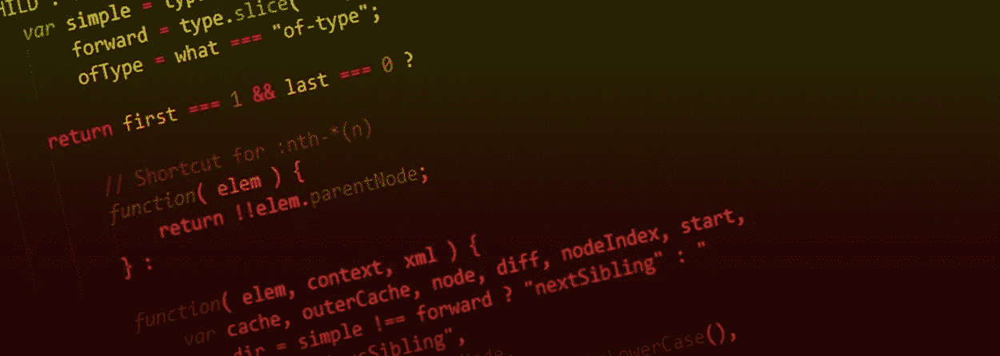

# Node.js 和 JavaScript 应用的安全代码审查和渗透测试

> 原文：<https://medium.com/swlh/secure-code-review-and-penetration-testing-of-node-js-and-javascript-apps-41485b1a9518>

## 或者系统失败的原因！

Credits: [https://www.bleepingcomputer.com/news/security/javascript-web-apps-and-servers-vulnerable-to-redos-attacks/](https://www.bleepingcomputer.com/news/security/javascript-web-apps-and-servers-vulnerable-to-redos-attacks/)

安全是一种幻觉，安全是相对的。这意味着您应该始终从任何角度关注您的安全:物理、人员、社会、企业和 IT 安全。因为任何系统，只要有足够的资源——知识、工具和时间，都可以被黑客攻击。

我写这篇文章的目的是向您展示如何进行系统的安全代码审查和渗透测试，以保护您的 Node.js 和 JavaScript 应用程序，这些应用程序现在非常普遍。这种丰富性使得攻击者能够拥有大量用这种语言编写并在 Node.js、browser 等上运行的系统。

在这方面有两种不同的方法:a)安全代码审查作为一种防御方法来发现系统中的缺陷并试图保护它。b)渗透测试作为一种攻击性的方法，用于发现实际系统中的漏洞和弱点。

# **A .安全代码审查**

> 安全代码审查是审核应用程序源代码的过程，以验证是否存在适当的安全控制，它们是否按预期工作，以及它们是否在所有正确的位置被调用。代码审查是一种确保应用程序在其给定环境中“自我保护”的方法。— [OWASP 代码评审简介](https://www.owasp.org/index.php/Code_Review_Introduction)

如您所见，这都是关于审计、验证和分析的。OWASP 社区提出了一个很好的起点来完成这项工作。它叫做“[OWASP 代码评审项目](https://www.owasp.org/index.php/Category:OWASP_Code_Review_Project)”。它是一个技术指南，帮助代码评审人员在一个统一的框架下找到最多的缺陷。

本技术指南发布了两个版本，最新版本 2.0 于 2017 年 7 月 14 日发布。第二个版本进行了彻底的更新，包括对主题的介绍、方法和一组技术参考，介绍了在审查代码时要注意的“OWASP 十大”事项。讨论了各种图表、方法、风险模型和技术。有人认为，代码审查过程应该被集成到软件开发生命周期(SDLC)中，从提交前到提交后的阶段。然后提出了一种基于风险的代码评审方法，试图用不同的技术来分析风险。一组代码评审准备步骤遵循一组静态分析工具。最后一部分将 S-SDLC 展示为一种“应用程序威胁建模”方法，包括三个步骤:

> 步骤 1:分解应用程序。
> 第二步:确定威胁并进行分级。
> 第三步:确定对策和缓解措施。

还讨论了一些用于威胁建模的工具。最后，显示了一组度量标准，可以帮助评审者了解代码库的质量和安全特性。随后简要介绍了代码爬行实践。

技术参考部分包括在评审代码时要考虑的 10 大主题:

> a1-注入
> A2-被破坏的认证和会话管理
> A3-跨站脚本(XSS)
> A4-不安全的直接对象引用
> A5-安全误配置
> A6-敏感数据暴露
> A7-缺失功能级访问控制
> A8-跨站请求伪造(CSRF)
> A9-使用具有已知漏洞的组件
> A10-未经验证的重定向和转发

这个列表在一定程度上与“OWASP 十大项目”相同，但有一些小的不同，我向任何想要系统地审查代码、发现缺陷并最终保护系统的人推荐这两个指南。

# **B .渗透测试**

在审查代码之后，第二部分是渗透测试，它也包括从攻击者的角度寻找和查明漏洞和弱点的一系列步骤。基本上，你黑客安全！

> 渗透测试，俗称 pen 测试，是一种对计算机系统的授权模拟网络攻击，用于评估系统的安全性。— [维基百科，渗透测试](https://en.wikipedia.org/wiki/Penetration_test)

在“ [OWASP 十大项目](https://www.owasp.org/index.php/Category:OWASP_Top_Ten_Project)”下，到目前为止已经发布了一套指南的三个不同版本，最新版本是 2017 版。

本指南包含测试应用程序/系统时要寻找的 10 大漏洞:

> a1:2017-注入
> A2:2017-破解认证
> A3:2017-敏感数据暴露
> A4:2017-XML 外部实体(XXE)
> A5:2017-破解访问控制
> A6:2017-安全误配置
> A7:2017-跨站脚本(XSS)
> A8:2017-不安全反序列化
> A9:2017-使用

所有这些安全风险可能不会同时出现在一个应用程序中，但一个可能会导致其他风险，并可能危及整个系统或网络。

OWASP 社区提供了一组备忘单，您可以阅读这些备忘单，了解在保护或测试系统时会遇到什么情况:

 [## OWASP/CheatSheetSeries

### OWASP 备忘单系列的创建是为了提供关于特定领域的高价值信息的简明集合

github.com](https://github.com/OWASP/CheatSheetSeries/tree/master/cheatsheets) 

## 推荐书籍:

 [## 防御性安全手册

### 尽管备受瞩目的黑客攻击、破纪录的数据泄露和勒索软件攻击不断增加，但许多组织…

www.oreilly.com](https://www.oreilly.com/library/view/defensive-security-handbook/9781491960370/)  [## 保护节点应用程序

### 安全事故确实在增加，但是根据一项权威分析，85%的成功利用…

www.oreilly.com](https://www.oreilly.com/library/view/securing-node-applications/9781491982426/)  [## getify/你不知道

### JavaScript 系列丛书。推特上的@YDKJS。为 getify/You-don-Know-JS 开发做出贡献，创建一个…

github.com](https://github.com/getify/You-Dont-Know-JS)  [## 探索 JS:程序员的 JavaScript 书籍

### Axel Rauschmayer 博士博客(2ality)，书籍作者，培训师

exploringjs.com](https://exploringjs.com/) 

# C.在哪里查找漏洞列表

有许多数据库列出了漏洞及其信息和关系。例如，如果它是一个开源项目，你需要访问 GitHub、GitLab 或其他地方的“问题”部分。

外面有很多 bug 追踪器。其中一些专注于安全性，例如[https://security-tracker.debian.org/tracker/](https://security-tracker.debian.org/tracker/)。

如果这是一个专有项目，你通常应该寻找公共数据库，如公司网站或以下网站:

 [## 攻击性安全利用数据库档案

### 漏洞数据库-漏洞、外壳代码、0 天、远程漏洞、本地漏洞、Web 应用、漏洞报告…

www.exploit-db.com](https://www.exploit-db.com/)  [## CVE -常见漏洞和暴露(CVE)

### 常见漏洞和暴露(CVE)是一个条目列表-每个条目包含一个标识号，一个…

cve.mitre.org](https://cve.mitre.org/)  [## CVE 安全漏洞数据库。安全漏洞、利用、参考等

### CVEdetails.com 是一个免费的 CVE 安全漏洞数据库/信息源。您可以查看 CVE 漏洞…

www.cvedetails.com](https://www.cvedetails.com/)  [## NVD -家

### NVD 是美国政府基于标准的漏洞管理数据存储库，使用安全…

nvd.nist.gov](https://nvd.nist.gov/) 

# D.编程知识和经验

不应该低估的是，对于优秀的代码评审，需要优秀的编程技能，或者至少理解项目中使用了什么。由于 JavaScript 生态系统已经发展了多年，开发了许多库、引擎和实践，人们很容易迷失在这些大量的信息中。

我建议你去看看这两座金矿:

 [## sorrycc/awesome-javascript

### 🐢一个很棒的浏览器端 JavaScript 库、资源和亮闪闪的东西的集合。- sorrycc/awesome-javascript

github.com](https://github.com/sorrycc/awesome-javascript)  [## sindresorhus/awesome-nodejs

### zap:令人愉快的 Node.js 包和资源。为 sindresorhus/awesome-nodejs 开发做出贡献，创建一个…

github.com](https://github.com/sindresorhus/awesome-nodejs) 

# E.贸易工具

既然我们在方法和知识方面有了坚实的基础，我们应该看看可以帮助评审者/攻击者完成工作的可用工具。

我只是列出了这些工具，我已经用它们测试了我的项目，这取决于你去阅读文档并弄清楚它们是如何工作的。在我看来，它们非常容易使用。

我偶然发现了 https://github.com/mre/awesome-static-analysis,、https://github.com/jesusprubio/awesome-nodejs-pentest 和 T2 以及 https://www.owasp.org/index.php/Source_Code_Analysis_Tools 这两个名字，并以此作为对代码进行静态分析的起点。列出了许多工具，有旧的，也有新的。我在项目中使用的方法如下:

## 要计算项目中的代码行数，请使用以下两种方法:

 [## @内在/本地

### 将应用程序中的金额代码与其“node_modules”文件夹中的金额代码进行比较

www.npmjs.com](https://www.npmjs.com/package/@intrinsic/loc)  [## 计算机化伐木搬运与储运损失控制（computerized logging and outage control）

### 一个用于分发时钟的 npm 模块由阿尔·丹尼尔·https://github.com/AlDanial/cloc 设计

www.npmjs.com](https://www.npmjs.com/package/cloc) 

## 要审核您的代码以查看是否有任何已知的漏洞，请尝试以下方法:

 [## 开源安全平台| Snyk

### Snyk 帮助您使用开放源代码并保持安全。不断为 npm、Maven、NuGet 寻找并修复漏洞…

snyk.io](https://snyk.io/)  [## OS index/audit js

### 审核 NPM package.json 文件以识别已知漏洞。-OS index/audit js

github.com](https://github.com/OSSIndex/auditjs)  [## ajinabraham/NodeJsScan

### NodeJsScan 是 Node.js 应用程序的静态安全代码扫描器。-ajinabraham/nodejscan

github.com](https://github.com/ajinabraham/NodeJsScan)  [## RetireJS/retire.js

### 检测 JavaScript 库使用的扫描程序存在已知漏洞- RetireJS/retire.js

github.com](https://github.com/RetireJS/retire.js)  [## 改善持续交付实践的工程指标|速度

### Code Climate 为您的应用程序提供自动化的代码审查，让您在质量和安全问题发生之前解决它们…

codeclimate.com](https://codeclimate.com/) 

## 要在编辑器中对代码进行林挺和静态分析，请看以下内容:

 [## Dustin pecker/awesome-eslint

### 令人敬畏的 ESLint 插件、配置等列表。通过创建一个……

github.com](https://github.com/dustinspecker/awesome-eslint)  [## 埃斯林/埃斯林

### 一个完全可插入的工具，用于识别和报告 JavaScript - eslint/eslint 中的模式

github.com](https://github.com/eslint/eslint)  [## nick deis/eslint-plugin-no-secrets

### 一个 eslint 插件，用于查找可能是秘密/凭证的字符串

github.com](https://github.com/nickdeis/eslint-plugin-no-secrets)  [## 节点安全性/eslint-plugin-security

### 节点安全的 ESLint 规则。在…上创建一个帐户，为 node security/eslint-plugin-security 开发做贡献

github.com](https://github.com/nodesecurity/eslint-plugin-security)  [## Rantanen/eslint-plugin-xss

### 用于 XSS 检测的 ESLint 插件。在 GitHub 上创建一个帐户，为 Rantanen/eslint-plugin-xss 开发做贡献。

github.com](https://github.com/Rantanen/eslint-plugin-xss)  [## sonar source/eslint-plugin-sonar js

### ESLint 的 SonarJS 规则。通过在 GitHub 上创建一个帐户，为 sonar source/eslint-plugin-sonar js 开发做出贡献。

github.com](https://github.com/SonarSource/eslint-plugin-sonarjs)  [## mozfreddyb/eslint-config-scan js

### 通过 eslint-mozfreddyb/eslint-config-scanjs 实现类似 scan js 的功能

github.com](https://github.com/mozfreddyb/eslint-config-scanjs) 

## 用于安全开发的有用 JavaScript 库:

 [## 防御性 JavaScript

### DJS 是 JavaScript 的防御性子集:这个子集中的代码独立于 JavaScript 的其他部分运行…

www.defensivejs.com](https://www.defensivejs.com/) 

## 有许多云服务提供安全即服务:

 [## Cloudflare -网络性能和安全公司| Cloudflare

### 注册参加 2018 年互联网峰会 Cloudflare 的 Anycast 网络让您的网站、应用程序或 API 保持在线和运行…

www.cloudflare.com](https://www.cloudflare.com/)  [## 应用安全管理平台| Sqreen

### Sqreen 的应用安全管理平台提供了一种现代化的方法来确保网络产品的安全性

www.sqreen.com](https://www.sqreen.com/)  [## 领先的网站漏洞扫描器|检测

### Detectify 是一个网站漏洞扫描器，它执行测试以识别网站上的安全问题。让我们…

detectify.com](https://detectify.com/)  [## 用于保护软件的 Semmle 代码分析平台

### 产品安全代码的自动化变体分析是一个代码分析引擎，用于产品安全团队快速…

semmle.com](https://semmle.com/) 

到目前为止，我推荐的大部分内容都是关于安全代码审查的。以下工具对渗透测试很有用:

 [## sqlmap:自动 SQL 注入和数据库接管工具

### sqlmap 是一个开源渗透测试工具，可以自动检测和利用 SQL 注入…

sqlmap.org](http://sqlmap.org/)  [## 打嗝套件扫描仪|端口触发器

### PortSwigger 提供了用于安全测试和扫描的 Burp 套件。从广泛的安全工具中选择并识别…

portswigger.net](https://portswigger.net/burp)  [## 攻击代理项目

### OWASP Zed 攻击代理(ZAP)是世界上最流行的免费安全工具之一，由…

www.owasp.org](https://www.owasp.org/index.php/OWASP_Zed_Attack_Proxy_Project)  [## 负载冲击/k6

### 现代负载测试工具，使用 Go 和 JavaScript-https://K6 . io-load impact/K6

github.com](https://github.com/loadimpact/k6)  [## Nmap:无网络映射器的安全扫描程序

### Nmap 免费安全扫描器，端口扫描器和网络探索工具。下载适用于 Linux 和 Windows 的开源软件…

nmap.org](https://nmap.org/)  [## Postman | API 开发环境

### Postman 是唯一完整的 API 开发环境，被 600 多万开发人员和 200，000 家公司使用…

www.getpostman.com](https://www.getpostman.com/) 

## **指南和最佳实践:**

 [## Checkmarx/JS-SCP

### JavaScript Web 应用安全编码实践可在线阅读或下载，有 pdf、MOBI 和 ePub 版本…

github.com](https://github.com/Checkmarx/JS-SCP)  [## OWASP 安全编码实践-快速参考指南

### 《安全编码实践快速参考指南》是一套与技术无关的通用软件安全编码…

owasp.org](https://owasp.org/www-project-secure-coding-practices-quick-reference-guide/migrated_content)  [## JavaScript 安全性

### JavaScript 是一种高级的解释型编程语言，自 1995 年发布以来一直被广泛使用…

www.veracode.com](https://www.veracode.com/security/javascript-security)  [## 安全编码实践指南

### 加州大学伯克利分校的安全政策要求遵守设备电子信息的最低安全标准…

security.berkeley.edu](https://security.berkeley.edu/secure-coding-practice-guidelines)  [## 防守 JavaScript - JavaScript 一月

### 这是一个很好的改变，但是您不应该删除检查输入的代码。TypeScript 做出务实的假设…

www.javascriptjanuary.com](https://www.javascriptjanuary.com/blog/defensive-javascript)  [## React 和 Angular 安全编码实践的比较| Snyk

### 欢迎来到 Snyk 的 2019 年 JavaScript 框架安全报告，报告的这一部分是关于 Angular 和…

snyk.io](https://snyk.io/blog/comparing-react-and-angular-secure-coding-practices/)  [## Li rantal/awesome-nodejs-security

### 牛逼的 Node.js 安全资源。通过创建帐户为 Li rantal/awesome-nodejs-security 开发做出贡献…

github.com](https://github.com/lirantal/awesome-nodejs-security) 

现在是你磨刀霍霍的时候了，⚔️，测试他们是否准备好进攻。一定不要割破手指。😉

虽然我已经介绍了在 JavaScript 和 Node.js 上审查代码和渗透测试的方法，但是同样的原则和实践也适用于其他语言。你只需要查找关于那种语言的信息。

最后，非常感谢您的意见和建议。

**穆斯塔法·莫拉迪安**
Sr. SWE @ [负载冲击](https://medium.com/u/7df2fe2c0bfd?source=post_page-----41485b1a9518--------------------------------)
[GitHub](http://github.com/mostafa)|[LinkedIn](https://www.linkedin.com/in/mostafa-moradian/)|[Twitter](https://twitter.com/MosiMoradian)