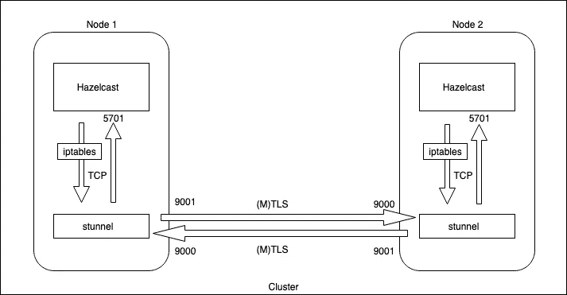

# 使用 Stunnel 保护 Hazelcast (tcp)流量

> 原文：<https://medium.com/swlh/securing-hazelcast-tcp-traffic-with-stunnel-ff2b4b93158a>

Hazelcast 是一个分布式内存数据网格，它允许在集群环境中的节点之间均匀地共享数据。Hazelcast 的开源版本不支持传输中的加密，甚至不支持缓存级别的加密。因此，为了保护 Hazelcast 集群中的流量，我们需要通过更改一些代码来扩展它，这可能并不总是一个选项。

然而，还有另一种方法可以通过使用 stunnel 来保护传输。正如官方文档所述，“Stunnel 是一个代理，旨在为现有的客户端和服务器添加 TLS 加密功能，而无需对程序代码进行任何更改”。在我们的情况下，这听起来是一个完美的选择，并允许我们将加密从我们的 Hazelcast 应用程序中分离出来。

下图说明了如何使用 stunnel 在双节点集群上使用相互 TLS 身份验证来启用传输加密。



如图所示，我们需要执行以下操作来设置它:

1.  创建一个证书来加密传输。
2.  在每个节点上设置两个隧道(入站和出站)。
3.  使用 iptables 将出站流量重定向到本地 stunnel。

> ***注意:*** *在本例中，Hazelcast 设置了 tcp-ip，并禁用了多播。这个方法可以用在云环境中，比如* ***AWS*** *，不允许多点传送。*
> 
> *还要确保安全组(或防火墙)允许给定端口上的入站和出站流量。*

## 创建证书

让我们首先创建一个用于加密的自签名证书。下面是创建根 ca 和证书的命令。

```
# Create a root CA
openssl req -new -x509 -sha256 -days 365 -key ca.key -out ca.crt# Create a rsa key file
openssl genrsa -out server.key 4096#Create a certificate request
openssl req -new -key server.key -sha256 -out server.csr# Create the cert
openssl x509 -req -days 365 -sha256 -in server.csr -CA ca.crt -CAkey ca.key -set_serial 1 -out server.crt
```

*(可选)*以下是为相互认证(MTLS/MASSL)创建客户端证书的步骤。

```
# Create key
openssl genrsa -out client.key 4096# Create a client csr
openssl req -new -key client.key -out client.csr# Create the client cert signed by the same root CA
openssl x509 -req -days 365 -sha256 -in client.csr -CA ca.crt -CAkey ca.key -set_serial 2 -out client.crt
```

将两个节点上的证书文件复制到 */opt/certs* 下。

## 设置 stunnel

Stunnel 在几乎所有的 linux 发行版中都有，下面的命令可以用来在 Centos 上安装它。

```
sudo yum install stunnel
```

现在，我们在每个节点上创建两个配置文件，让我们在 */etc/stunnel* 中将它们分别称为 *hc-client.conf* (用于出站流量)和 *hc-server.conf* (用于入站流量)。

> 以下示例假设**相互 TLS 认证**，但是可以通过从 hc-client.conf 文件中删除客户端证书和密钥，以及从 hc-server.conf 文件中删除客户端验证来禁用该认证。

**hc-client.conf**

```
[hazelcast-out]
client = yes
accept = 9001
connect = <remote-node-ip>:9000
verify = 3
CAfile = /opt/certs/ca.crt
cert = /opt/certs/client.crt
key = /opt/certs/client.key
```

客户端的上述配置将从端口 9001 上的*本地* Hazelcast 节点接收流量，并通过加密隧道将其代理到端口 9000 上侦听的*远程*节点。

**hc-server.conf**

```
[hazelcast-in]
accept = 9000
connect = <local-nodeip>:5701
verify = 2
CAfile = /opt/certs/ca.crt
cert = /opt/certs/server.crt
key = /opt/cert/server.key
```

服务器端配置将在端口 9000 上接收来自*远程*客户端节点的 TLS 流量，并在*卸载* TLS 加密后，将其重定向到在端口 5701 上运行的*本地* Hazelcast 实例。

stunnel 和 Hazelcast 之间的所有通信都将被加密。

下面是我们如何在两个节点上使用上述配置文件运行 stunnel:

```
sudo stunnel /etc/stunnel/hz-client.conf
sudo stunnel /etc/stunnel/hz-server.conf
```

## 将出站流量从本地 Hazelcast 实例重定向到 stunnel

既然隧道已经设置好了，我们需要将外出的 Hazelcast 流量重定向到 stunnel，以便它可以通过 TLS 加密通道。为此，我们将在两个节点上使用 **iptables** 设置以下路由规则。

```
sudo iptables -t nat -A OUTPUT -p tcp \
 -d <remote-node-ip> --dport 5701 -j DNAT --to-destination localhost:9001
```

一旦设置了路由规则，出站 Hazelcast 流量将流经加密隧道。

## 结论

上面的帖子解释了如何通过 TLS 加密隧道引导未加密的流量(入站和出站),将传输加密与 Hazelcast 应用程序分离。这种方法可用于加密应用程序之间的 TCP 流量，而不仅仅是 Hazelcast。