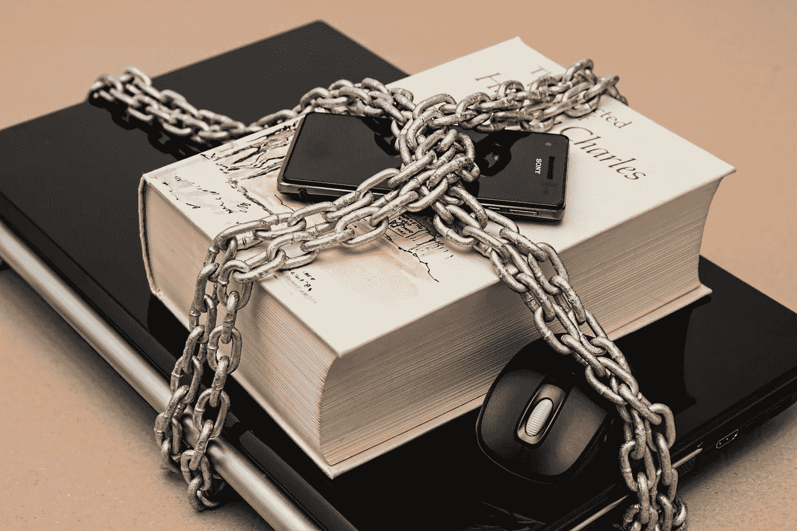

# 使用 SAML 身份验证保护您的 AWS 帐户

> 原文：<https://medium.com/swlh/securing-your-aws-accounts-with-saml-authentication-2c1435758d8c>

AWS 帐户的安全性非常重要，它不仅保护客户端数据，还会影响应用程序的可用性。尤其是当涉及到生产工作负载时，您需要绝对确定谁被授权访问一个帐户，他们拥有什么级别的权限，并且能够在组织级别而不是在每个独立的系统中管理用户。不…