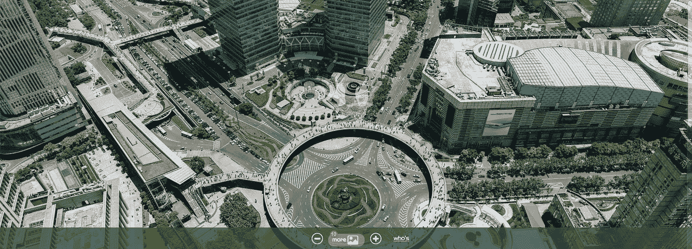

# 在这张 195 千兆像素的上海照片中，你可以看到几英里外人们的脸。

> 原文：<https://medium.com/swlh/see-peoples-faces-from-miles-away-in-the-195-gigapixel-photo-of-shanghai-2830c1f158ca>

## 作为一名工程师，这是惊人的，作为一个公民，隐私的影响是可怕的。

你的普通智能手机摄像头大约是 1200 万像素。这张上海的图片是 195 千兆像素。一百万像素等于一百万像素，一千兆像素等于一 ***十亿*** 像素。