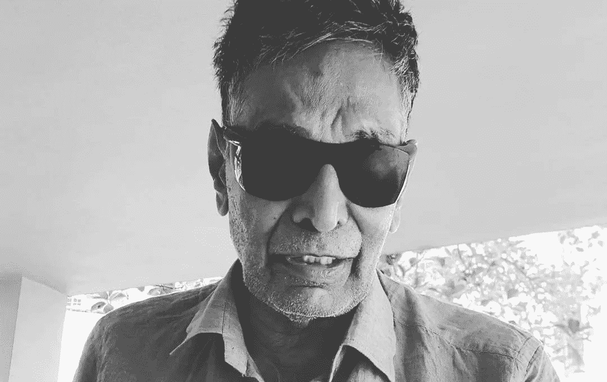

# 没有时间的世界中的正义

> 原文：<https://medium.com/swlh/seeing-the-world-without-time-90fce1cbdb01>

在灯光昏暗的客厅里，我的祖父正深深地盯着电视屏幕。在他的白内障过度成熟后，他把每天早上翻阅的报纸换成了一个新闻频道，这个频道的深度和它播放的平板电视一样。推迟手术的最大惩罚不是导致一只眼睛失明，而是 24 小时新闻循环——一种不同的失明。